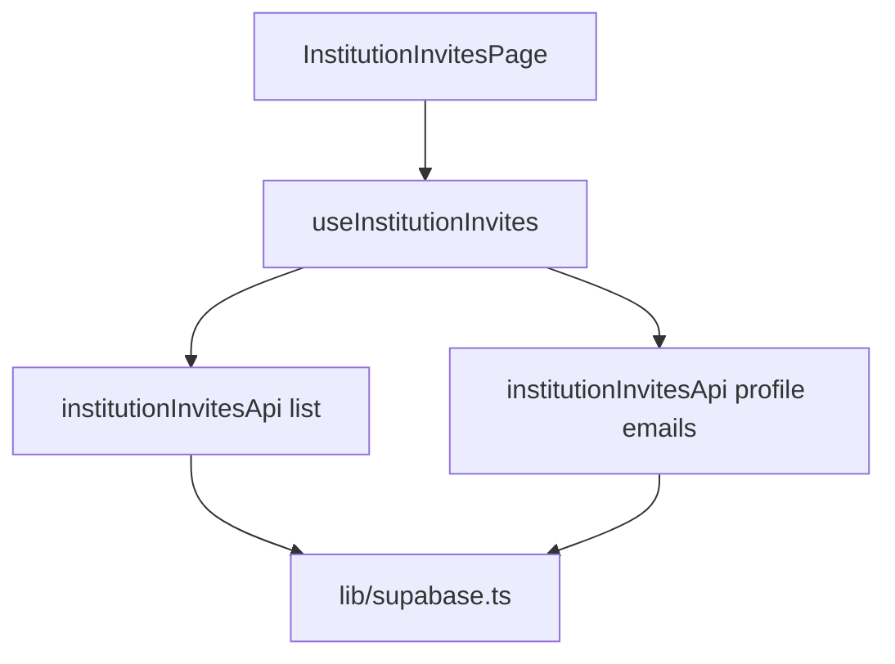

---
todos:
  - id: "nav-i18n-route"
    content: "Add SUPER_ADMIN sub-nav item, en/de keys, App.tsx route `institution/institution-invites`"
    status: pending
  - id: "types-api"
    content: "Add institutionInvites.types.ts + institutionInvitesApi.ts (list invites + batch profile emails)"
    status: pending
  - id: "hook-page-table"
    content: "Add useInstitutionInvites, InstitutionInvitesTable, InstitutionInvites page + admin index export"
    status: pending
isProject: false
---
# Institution invites (super admin)

## Scope and routing

- **Audience:** Super admin only, under the existing **Institutions** collapsible nav (same pattern as “Create institution”).
- **URL:** `/super_admin/institution/institution-invites` — matches how `SidebarPrimaryNav` concatenates parent `url` + sub `url` (see [`SidebarPrimaryNav.tsx`](src/components/shared/sidebar/SidebarPrimaryNav.tsx) `navigateToSubPath`).
- **Route wiring:** In [`App.tsx`](src/App.tsx), add a sibling route **before** the generic `institution` route (same ordering as `institution/new-institution`):
  - `path="institution/institution-invites"` → `RequireAuth` + new page component.

## Navigation config

- In [`adminWorkspaceNavigation.ts`](src/features/admin/config/adminWorkspaceNavigation.ts), extend `SUPER_ADMIN_NAVIGATION.navItems` entry for `nav.institutions` (`url: '/institution'`) `items` with a second sub-item, e.g. `titleKey: 'nav.institutionInvites'`, `url: '/institution-invites'`.
- **i18n:** Add `nav.institutionInvites` (and page copy) to [`src/locales/en/features/admin.json`](src/locales/en/features/admin.json) and [`src/locales/de/features/admin.json`](src/locales/de/features/de/features/admin.json).

## Data and RLS (no migration)

- Table [`institution_invites`](supabase/migrations/2026032100000202_institution_admin_02_tables.sql): columns needed for the UI: `id`, `email`, `membership_role`, `token`, `expires_at`, `invited_by`, `accepted_at`, `accepted_user_id` (plus `created_at` for stable `order`).
- **RLS:** Super admin has `FOR ALL` on `institution_invites`; institution admins have `SELECT` for their institutions only ([`institution_admin_07_rls_policies.sql`](supabase/migrations/2026032100000207_institution_admin_07_rls_policies.sql)). This page will be **super-admin-only in the nav**; the same API could later power an institution-admin route without policy changes.

## Architecture (per [`fe_principles.md`](docs/architecture/fe_principles.md))

1. **Types** — [`src/features/admin/types/institutionInvites.types.ts`](src/features/admin/types/institutionInvites.types.ts)  
   - `InstitutionInviteRow`: explicit snake_case fields matching the `select(...)` list.  
   - `InstitutionInvite` (model): same identifiers + normalized types if needed; map in the API module only.

2. **API** — [`src/features/admin/api/institutionInvitesApi.ts`](src/features/admin/api/institutionInvitesApi.ts) (only file importing `supabase` for this feature)  
   - `listInstitutionInvites()`: `.from('institution_invites').select('id, email, membership_role, token, expires_at, invited_by, accepted_at, accepted_user_id, created_at').order('created_at', { ascending: false })` — **no** `select('*')`.  
   - `fetchEmailsForUserIds(userIds: string[])`: `.from('profiles').select('user_id, email').in('user_id', userIds)` for **unique non-null** `invited_by` values (batch; optional chunking if `userIds.length` is large).  
   - Map rows → model before return.

3. **Hook** — [`src/features/admin/hooks/useInstitutionInvites.ts`](src/features/admin/hooks/useInstitutionInvites.ts)  
   - Load invites, derive inviter ids, fetch email map, expose `{ invites, inviterEmailByUserId, isLoading, error, refresh }`.  
   - Do **not** import `supabase`.

4. **UI**  
   - **Page** [`src/features/admin/pages/institutionInvites.tsx`](src/features/admin/pages/institutionInvites.tsx): `AdminWorkspaceShell`, page title/description, refresh button, loading/error/empty states — mirror structure of [`auditLogs.tsx`](src/features/admin/pages/auditLogs.tsx).  
   - **Table component** [`src/features/admin/components/InstitutionInvitesTable.tsx`](src/features/admin/components/InstitutionInvitesTable.tsx): dumb table; receives rows + `inviterEmailByUserId`; uses [`resolveActorEmail`](src/features/admin/utils/resolveActorEmail.ts) for the inviter column (same pattern as [`AdminAuditLogTable.tsx`](src/features/admin/components/AdminAuditLogTable.tsx)).

## Column behavior (your spec)

| Column | Implementation |
|--------|----------------|
| email | Plain text from model |
| membership_role | [`Badge`](src/components/ui/badge.tsx) (reuse variant pattern from [`institution.tsx`](src/features/admin/pages/institution.tsx) / audit badges) |
| token | Monospace snippet of full UUID + icon button with Lucide `Copy`; `navigator.clipboard.writeText` + toast (same idea as [`NewInstitutionWizard.tsx`](src/features/admin/components/NewInstitutionWizard.tsx) `handleCopyInviteToken`) |
| expires_at | Locale-aware display: reuse or mirror [`formatAuditOccurredAt`](src/features/admin/utils/formatAuditOccurredAt.ts) with `i18n.language` from `useTranslation` so DE/EN match admin audit logs |
| invited_by | Resolve via `inviterEmailByUserId` / `resolveActorEmail`; show email, else short id, else em dash |
| accepted | **One column** for acceptance: `accepted_at != null` → `Check` + accessible label; else `X` (Lucide `X` or `XCircle` — pick one and use consistently) |
| accepted_user_id | Display UUID string (or `—` if null); no email resolution required unless you extend scope later |

Use [`Table` / `TableHead` / `TableRow` …](src/components/ui/table.tsx) for markup.

## Barrel and exports

- Export the new page and any public types from [`src/features/admin/index.ts`](src/features/admin/index.ts) (same pattern as other admin pages).

## Conventions

- **Clean code:** Compute `isAccepted`, copy handler, column labels **above** `return`; props/callback naming per [`.cursor/rules/clean-code-convention.mdc`](.cursor/rules/clean-code-convention.mdc).  
- **i18n:** Table headers, empty state, copy toasts, and aria-labels via `t()` keys under e.g. `institutionInvites.*`.

## Out of scope (unless you want it next)

- Pagination (audit logs paginate client-side; can add similarly if the table grows).  
- Institution-admin sidebar entry (RLS already allows scoped reads; would need a new nav item + route under `/institution_admin/...`).