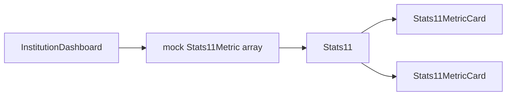

<!-- 1da2c8eb-f2c5-4f8e-b427-c0e4c1519ad8 -->
---
todos:
  - id: "refactor-stats11"
    content: "Refactor Stats-11.tsx: Stats11Metric type, progressVariant split/simple, Stats11MetricCard + Stats11, remove embedded BudgetDialog"
    status: pending
  - id: "barrel-test"
    content: "Export from shared/index.ts; update test.tsx to props-driven Stats11"
    status: pending
  - id: "dashboard-mock"
    content: "Add usage section + mock GB metrics + navigate callback on institution-admin dashboard.tsx"
    status: pending
  - id: "i18n"
    content: "Add EN/DE strings for dashboard usage section and metric labels"
    status: pending
isProject: false
---
# Reusable Stats-11 + institution dashboard usage (mock GB)

## Current state

- [`src/components/shared/Stats-11.tsx`](src/components/shared/Stats-11.tsx): `MetricCard` is internal; default export `Stats11` is hardcoded demo (Commands/Bandwidth/Storage/Cost). Progress bar uses a fragile `title === 'Commands'` branch for the split bar. `BudgetDialog` is coupled inside the default export.
- [`src/features/institution-admin/pages/dashboard.tsx`](src/features/institution-admin/pages/dashboard.tsx): uses [`Stats05`](src/components/shared/Stats05.tsx) only; no Stats-11 yet.
- [`src/components/shared/index.ts`](src/components/shared/index.ts): exports `Stats05` + types; **does not** export Stats-11 (only default import from file path).
- [`src/user/pages/test.tsx`](src/user/pages/test.tsx): imports default `Stats11` for the gallery.

## 1. Refactor `Stats-11.tsx` into a reusable API

**Types (exported):** e.g. `Stats11Metric` with fields matching today’s card needs:

- `title`, `value`, `limit`, `percentage`, `progressColor` (Tailwind segment class, same as now)
- Optional: `status`, `statusColor`, `details`, `warningMessage`, `actionLabel`, `actionIcon`, `onActionClick`
- Replace the `Commands` title hack with an explicit flag, e.g. `progressVariant?: 'simple' | 'split'` — when `'split'`, require `details` length ≥ 2 and parse numeric values like the current writes/reads logic (keep comma-stripping).

**Components (exported):**

- `Stats11MetricCard` — presentational card (today’s `MetricCard`, renamed for clarity).
- `Stats11` — grid container: props `metrics: readonly Stats11Metric[]`, optional `className` (use `cn` + same responsive grid as today: `grid-cols-1 md:grid-cols-2 lg:grid-cols-4`), maps `metrics` to cards and passes `onActionClick` through.

**Remove coupling:**

- Move `BudgetDialog` **out** of the reusable default story: delete from shared, or keep only in `test.tsx` behind local state if you still want a “Change budget” demo there.
- Replace default export with either:
  - **Named exports only** (`Stats11`, `Stats11MetricCard`, types), and update `test.tsx` to `import { Stats11 } from '@/components/shared'` after barrel export, **or**
  - a thin `export default function Stats11Pattern()` that renders `<Stats11 metrics={STATIC_DEMO_METRICS} />` for backward compatibility. Prefer **named + barrel** for consistency with `Stats05`.

## 2. Barrel export

In [`src/components/shared/index.ts`](src/components/shared/index.ts): export `Stats11`, `Stats11MetricCard`, and types (`Stats11Metric`, `Stats11Props`).

## 3. Institution admin dashboard

In [`src/features/institution-admin/pages/dashboard.tsx`](src/features/institution-admin/pages/dashboard.tsx):

- Keep existing `Stats05` block.
- Add a second section (heading + short description from i18n) for **usage / quotas**.
- Build a **mock** `readonly Stats11Metric[]` with **GB**-formatted `value` / `limit` (e.g. used vs cap, percentage for the bar). At least one card should be clearly “storage”; optionally a second mock card (e.g. backup / bandwidth) if you want a 2-card row on small screens — keep it minimal (1–2 cards) unless you want full four-card parity with the old demo.
- Wire **callbacks** meaningfully where it helps POV: e.g. `onActionClick` on storage card → `useNavigate` to `/institution_admin/cloud-storage` (path matches [`App.tsx`](src/App.tsx) institution_admin routes). Other cards can omit callback or use no-op.

## 4. i18n

Extend [`src/locales/en/features/institution-admin.json`](src/locales/en/features/institution-admin.json) (and `de` counterpart) under `dashboard.usage` (or similar): section title, subtitle, per-metric `title`, `actionLabel`, optional `status` / `warning` strings so the dashboard does not hardcode English.

## 5. Test gallery

Update [`src/user/pages/test.tsx`](src/user/pages/test.tsx): import `Stats11` from `@/components/shared`, pass a static `metrics` array (can mirror the old four-card demo, including `progressVariant: 'split'` for the first card) so the gallery still showcases the component.

## Data flow (high level)

## Out of scope (later)

- Real reads from `institution_quotas_usage` / `institution_subscriptions` — explicitly **mock only** per your request.
