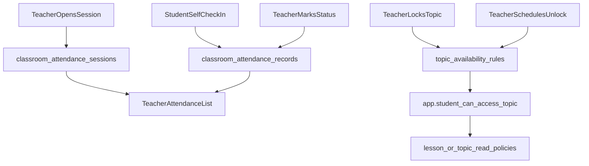

# Attendance and Topic Locking DB Plan

## Goal

Add database support for teacher attendance lists and topic progression gating (lock, manual unlock, scheduled unlock) without frontend changes.

## Scope (DB-only)

- New migrations under `supabase/migrations` for:
  - types/tables/indexes
  - functions/RPCs
  - triggers
  - RLS policies
- No UI/component implementation in this phase.

## Existing Schema to Reuse

- Classroom-course binding: `[/Users/willfryd/Documents/wq-health/supabase/migrations/20260323000002_classroom_course_links_lesson_progress_02_tables.sql](/Users/willfryd/Documents/wq-health/supabase/migrations/20260323000002_classroom_course_links_lesson_progress_02_tables.sql)`
- Membership/roster source: `[/Users/willfryd/Documents/wq-health/supabase/migrations/20260321000002_institution_admin_02_tables.sql](/Users/willfryd/Documents/wq-health/supabase/migrations/20260321000002_institution_admin_02_tables.sql)`
- Access helper patterns: `[/Users/willfryd/Documents/wq-health/supabase/migrations/20260323000002_classroom_course_links_lesson_progress_04_functions_rpcs.sql](/Users/willfryd/Documents/wq-health/supabase/migrations/20260323000002_classroom_course_links_lesson_progress_04_functions_rpcs.sql)`
- Course/topic/lesson visibility RLS: `[/Users/willfryd/Documents/wq-health/supabase/migrations/20260323000002_classroom_course_links_lesson_progress_07_rls_policies.sql](/Users/willfryd/Documents/wq-health/supabase/migrations/20260323000002_classroom_course_links_lesson_progress_07_rls_policies.sql)`

## Planned Data Model

1. **Attendance sessions**

- Add `public.classroom_attendance_sessions`:
  - `institution_id`, `classroom_id`, `course_id`, `title`
  - `session_date`, `starts_at`, `ends_at`
  - `created_by`, timestamps
- Purpose: represents one roll-call window for a class/course.

1. **Attendance records**

- Add `public.classroom_attendance_records`:
  - `session_id`, `student_id`, `institution_id`
  - `status` enum: `present | late | absent`
  - `check_in_time`, `check_out_time`
  - `source` enum: `manual | self_check_in | auto`
  - optional `note`, timestamps
- Add uniqueness on `(session_id, student_id)`.

1. **Topic progression gates**

- Add `public.topic_availability_rules`:
  - `institution_id`, `course_id`, `topic_id`
  - `is_locked` boolean
  - `unlock_at` timestamptz nullable
  - `unlocked_by`, `unlocked_at`, `created_by`, timestamps
- One row per `(course_id, topic_id)`.

## Planned Functions/RPC

1. **Attendance write helpers**

- Teacher RPC: open/close attendance session for classroom+course.
- Teacher RPC: mark student status (`present/late/absent`) and optional manual check-in/out.
- Student RPC: self-check-in (enforces classroom membership and open window).

1. **Attendance read helpers**

- RPC for teacher dashboard list:
  - “who is here now” for active session
  - date-range summary (weekly): present/late/absent counts
  - per-student trend fields (late/inactive counts)

1. **Topic lock helpers**

- Teacher RPC: lock topic.
- Teacher RPC: unlock topic now.
- Teacher RPC: schedule unlock (`unlock_at`).
- Access helper function `app.student_can_access_topic(topic_id)` updated to enforce rule + unlock time.

## Triggers and Integrity

- Trigger to auto-upsert attendance record on self-check-in transitions.
- Trigger/constraint to ensure session classroom/course is valid via `classroom_course_links`.
- Trigger to normalize topic rule state (e.g., `is_locked=false` with `unlock_at` in past => unlocked metadata update).

## RLS Plan

- Enable + force RLS on new attendance/topic-rule tables.
- Teacher/institution-admin full manage for rows in owned institutions/classrooms.
- Students:
  - read own attendance records and session context for their classrooms.
  - write only self-check-in path via constrained RPC (or strict insert policy if direct writes are allowed).
- Topic availability rules readable to enrolled/assigned users, mutable by teacher/admin only.

## Migration Layout

- Add one new domain migration split set (matching your SQL style):
  - `_01_types.sql`
  - `_02_tables.sql`
  - `_03_indexes_constraints.sql`
  - `_04_functions_rpcs.sql`
  - `_05_backfills_seed.sql` (if needed)
  - `_06_triggers.sql`
  - `_07_rls_policies.sql`
  - `_08_comments_docs.sql` (stub/comment ordering compatibility)

## Validation Checklist

- Attendance: create session, mark statuses, self-check-in, query current/weekly views.
- Topic locks: locked topic denied, manual unlock allowed, scheduled unlock activates by time.
- RLS: student cannot mark other students; teacher cannot cross-institution mutate.
- Performance: indexes on `session_id`, `student_id`, `classroom_id`, `course_id`, `session_date`, `status`, `unlock_at`.

## Data Flow

