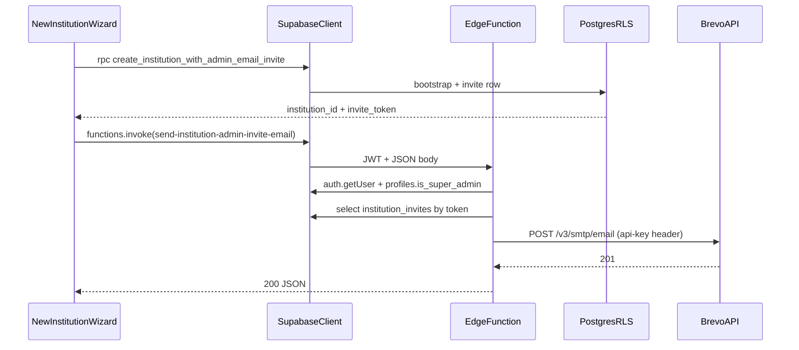

# Brevo transactional email for institution admin invites

## Context

- Bootstrap already returns `invite_token` from [`create_institution_with_admin_email_invite`](supabase/migrations/20260401120100_institution_admin_invite_default_30m.sql); the UI currently only shows/copies the token in [`NewInstitutionWizard.tsx`](src/features/admin/components/NewInstitutionWizard.tsx) after [`bootstrapInstitutionFromWizard`](src/features/admin/api/institutionApi.ts).
- There is **no** [`supabase/functions`](supabase/functions) tree yet; this will be new.
- **Do not** add `@getbrevo/brevo` to the Vite app or put the Brevo API key in `VITE_*`. The browser calls **only** `supabase.functions.invoke`.

## Architecture

## Edge Function (Deno)

- **Path:** [`supabase/functions/send-institution-admin-invite-email/index.ts`](supabase/functions/send-institution-admin-invite-email/index.ts) (name can be shortened if you prefer; keep `config.toml` in sync).
- **Auth:** `verify_jwt = true` in [`supabase/config.toml`](supabase/config.toml) for this function (explicit `[functions.send-institution-admin-invite-email]` block).
- **Secrets (hosted + local `.env` for `supabase functions serve`):**
  - `INSTITUTION_ADMIN_INVITE_KEY` — **Brevo transactional API key**; sent as header `api-key` per [Brevo sendTransacEmail](https://developers.brevo.com/reference/send-transac-email).
  - `BREVO_SENDER_EMAIL`, `BREVO_SENDER_NAME` — verified sender in Brevo (your choice).
  - `PUBLIC_SITE_URL` — absolute origin for invite links (e.g. `https://app.example.com`), **no** trailing slash; used to build `…/auth/signup?invite_token=<uuid>` (matches public route under [`App.tsx`](src/App.tsx) `path="/auth/signup"`).
- **Implementation detail:** Use `fetch('https://api.brevo.com/v3/smtp/email', …)` with JSON `{ sender, to, subject, htmlContent, textContent?, tags?, headers?: { "Idempotency-Key": "<invite_token>" } }` instead of `@getbrevo/brevo` in Deno (same contract as the SDK; avoids npm/Deno compatibility friction). Optionally add `textContent` mirroring the HTML for deliverability.
- **Authorization logic (server-side, before Brevo):**
  1. `createClient(SUPABASE_URL, SUPABASE_ANON_KEY, { global: { headers: { Authorization }}})` and `auth.getUser()`.
  2. Load caller profile: `.from('profiles').select('is_super_admin').eq('user_id', user.id).single()` — reject if not super admin.
  3. Validate invite: `.from('institution_invites').select('email, expires_at, accepted_at').eq('token', inviteToken).single()` — reject if missing/expired/accepted; normalize emails with `toLowerCase()` and compare to request `adminEmail`.
  4. Optionally load institution name from `institutions` if you want the email copy to match DB rather than trusting the client-only `institutionName` (slightly more robust).
- **Responses:** JSON `{ ok: true }` on success; 4xx with `{ error: string }` on validation/auth; 502 if Brevo returns non-201.

## Frontend workflow

- **API layer:** Add `sendInstitutionAdminInviteEmail(...)` in [`src/features/admin/api/institutionApi.ts`](src/features/admin/api/institutionApi.ts) (keeps Supabase calls out of the component per [fe_principles](docs/architecture/fe_principles.md)):
  - `supabase.functions.invoke('send-institution-admin-invite-email', { body: { inviteToken, adminEmail, institutionName? } })`
  - Map `error` / non-2xx function response to `throw new Error(...)`.
- **UI:** In [`NewInstitutionWizard.tsx`](src/features/admin/components/NewInstitutionWizard.tsx), after successful `bootstrapInstitutionFromWizard`:
  - Call the new API function (await).
  - On success: toast i18n “invite email sent” (add keys under [`src/locales/en/features/admin.json`](src/locales/en/features/admin.json) + DE mirror).
  - On failure: toast warning/error but **keep** the existing dialog with the raw token so ops are not blocked if Brevo misconfigured.
- **Env docs:** Document required Supabase secrets in a short comment in the function file or existing internal ops doc (avoid new markdown files unless you already maintain one for secrets).

## Security notes

- Brevo key and sender config live **only** in Edge secrets; JWT ensures only authenticated users hit the function; profile + `institution_invites` checks ensure only **super_admin** can trigger sends for a **valid** pending token.
- Using Brevo’s optional `Idempotency-Key` header (same as `invite_token`) reduces duplicate sends on retries.

## Verification

- Local: `supabase functions serve` with secrets file; create institution via wizard; confirm Brevo dashboard / inbox receives mail and link opens `/auth/signup?invite_token=…` (signup consuming the param can be a follow-up if not implemented yet).
- `npm run type-check` after TS changes.

## Out of scope (follow-ups)

- Teaching [`SignUpPage`](src/features/auth/pages/signUp.tsx) to read `invite_token` from the query string and call `redeem_institution_invite` after signup (if not already present).
- DB audit log of “email sent” events (optional).
