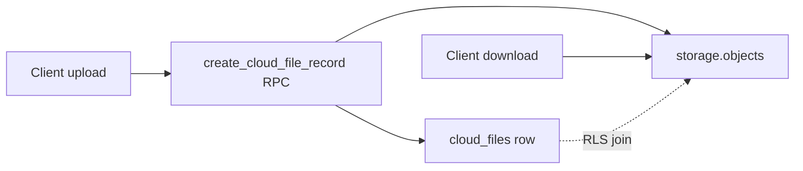

# Cloud infrastructure: database migration plan

## Goals and constraints

- **Postgres = meaning/access**; **Storage = bytes**. Metadata tables drive who may see or manage an object; paths stay dumb (no classroom/lesson semantics in the path string), per your product note.
- Follow [docs/architecture/db_design_principles.md](docs/architecture/db_design_principles.md): every tenant table has `**institution_id`**, standard timestamps, `**ENABLE` + `FORCE` RLS**, `COMMENT ON TABLE/COLUMN`, indexes for FKs/RLS filters, idempotent `DROP POLICY IF EXISTS` / `CREATE INDEX IF NOT EXISTS` where appropriate.
- Follow [docs/architecture/db_naming_convention.md](docs/architecture/db_naming_convention.md): plural tables, `idx_*`, `trg_*`, `fk_*`, `uq_*`, `chk_*`, policies `{table}_{action}_{role}`, RPCs `verb_entity_action`.
- **Naming path note:** `docs/db_naming_convention.md` is not at repo root; the canonical file is [docs/architecture/db_naming_convention.md](docs/architecture/db_naming_convention.md).

## Relationship to existing storage

Today, `[20260323000001_baseline_lms_rls_memberships_07_rls_policies.sql](supabase/migrations/20260323000001_baseline_lms_rls_memberships_07_rls_policies.sql)` defines `**cloud`** bucket policies using path segments `{institution_id}/{role}/{user_id}/...`, with **broad institution-wide SELECT** and **write limited to own user segment**. New tables do not replace that until you add a **follow-up migration** that narrows `storage.objects` using metadata (see “Storage phase” below).

## Proposed schema (single domain, split files like chat/attendance)

Use a **new prefix after current latest** (e.g. `20260328000001_cloud_assets_*` — adjust the date stamp when implementing so it sorts after `[20260326000005_attendance_recurrence](supabase/migrations/20260326000005_attendance_recurrence_06_rls_policies.sql)_*`). Mirror the repo’s existing **per-domain numbered parts** (`_01_types` … `_07_rls_policies`), with `_04` = functions, `_06` = triggers, `_05` = backfills stub.

### 01 — Types (enums)

Create idempotent `DO $$ … EXCEPTION WHEN duplicate_object` blocks (same pattern as `[20260323000005_chat_01_types.sql](supabase/migrations/20260323000005_chat_01_types.sql)`):

| Type                          | Values (initial)                                                                                                          | Notes                                                                                                                                                                                                                                                                                    |
| ----------------------------- | ------------------------------------------------------------------------------------------------------------------------- | ---------------------------------------------------------------------------------------------------------------------------------------------------------------------------------------------------------------------------------------------------------------------------------------- |
| `cloud_file_scope`            | `personal`, `classroom`, `course`, `lesson`, `task`, `game`, `chat`, `institution`                                        | Stable RLS axis; extend only with a new migration.                                                                                                                                                                                                                                       |
| `cloud_file_status`           | `active`, `deleted`, `archived`                                                                                           | Soft lifecycle; pair with retention jobs per design principles.                                                                                                                                                                                                                          |
| `cloud_file_link_entity_type` | Align to **actual PK tables**: `lesson`, `task`, `note`, `message`, `game_version`, `classroom`, `course`, `conversation` | Use `game_version` (not generic `game`) to match `[game_versions](supabase/migrations/20260326000003_game_versions_01_tables.sql)`. Chat attachment row targets `[messages](supabase/migrations/20260323000005_chat_02_tables.sql)`; room-level assets can use `conversation` if needed. |
| `cloud_file_link_purpose`     | `attachment`, `cover`, `inline_media`, `source_pdf`, …                                                                    | Keep small; expand via migration.                                                                                                                                                                                                                                                        |
| `cloud_file_share_permission` | `read`, `edit`                                                                                                            | Maps to your “read / edit” share model.                                                                                                                                                                                                                                                  |

Add `COMMENT ON TYPE` for each.

### 02 — Tables

`**cloud_folders`**

- `id`, `institution_id` → `institutions`, `owner_user_id` → `profiles(user_id)`
- `name` (text, not empty)
- `parent_folder_id` nullable self-FK → `cloud_folders(id)` **ON DELETE CASCADE** or **RESTRICT** (pick one explicitly; CASCADE simplifies subtree deletes)
- `scope` `cloud_file_scope` NOT NULL
- Optional scope anchors: `classroom_id`, `course_id` (nullable FKs to existing tables, composite-safe where the repo already uses `(id, institution_id)` — match patterns from e.g. `[classroom_attendance_sessions](supabase/migrations/20260326000004_attendance_topic_gates_02_tables.sql)`)
- `created_at`, `updated_at`; optional `created_by` / `updated_by` for audit alignment

`**cloud_files`**

- Core: `institution_id`, `owner_user_id`, `folder_id` nullable → `cloud_folders`
- `**bucket`** `text` NOT NULL DEFAULT `'cloud'` (supports future buckets without a migration emergency)
- `**storage_object_name**` (or `storage_path` if you prefer that name): **full object key within the bucket** (e.g. `{institution_uuid}/files/{file_uuid}`), **NOT NULL**, `**UNIQUE (bucket, storage_object_name)`** so one DB row maps to one object
- `scope` `cloud_file_scope` NOT NULL, `mime_type`, `size_bytes` (bigint ≥ 0 check), `original_name`, `status` `cloud_file_status` NOT NULL DEFAULT `active`
- Timestamps + optional `created_by` / `updated_by`

**Denormalized scope anchors on `cloud_files` (recommended for RLS performance):** nullable `classroom_id`, `course_id`, `lesson_id`, `task_id`, `conversation_id`, `game_version_id` — populated and kept consistent by triggers from `scope` + `folder_id` + optional explicit set on insert. This avoids recursive folder walks in every policy and matches how dense RLS is written elsewhere (e.g. attendance, tasks).

`**cloud_file_links`** (optional but in scope)

- `institution_id`, `cloud_file_id` → `cloud_files`
- `link_entity_type` `cloud_file_link_entity_type`, `entity_id` `uuid` NOT NULL
- `link_purpose` `cloud_file_link_purpose` NOT NULL
- `created_at` (and `updated_at` if you allow updates)
- Uniqueness: `UNIQUE (cloud_file_id, link_entity_type, entity_id, link_purpose)` unless product needs duplicates

`**cloud_file_shares`**

- `institution_id`, `cloud_file_id`, `shared_with_user_id`, `shared_by_user_id`, `permission` `cloud_file_share_permission`
- `created_at`, `updated_at`
- `UNIQUE (cloud_file_id, shared_with_user_id)` for active shares (or partial unique if you soft-revoke)

**CHECK constraints (`chk_*`):** enforce scope ↔ column presence, e.g. `scope = classroom` ⇒ `classroom_id IS NOT NULL` on folder/file; `personal` ⇒ classroom/course anchors null; institution scope ⇒ no classroom/course required but institution_id always set.

### 03 — Indexes and constraints

Per principles §13: index `**institution_id`** on all four tables; index `**owner_user_id`**, `**folder_id**`, `**cloud_file_id**`; composite indexes used by hot queries (e.g. `(institution_id, status)`, `(classroom_id)` partial where not null). Name with `idx_{table}_{columns}`.

### 04 — Functions / RPCs (SECURITY DEFINER where cross-table writes are needed)

- `**register_cloud_file_after_upload**` (or `create_cloud_file_record`): validates caller membership in `institution_id`, optional quota headroom (read `[institution_quotas_usage](supabase/migrations/20260321000002_institution_admin_02_tables.sql)`), inserts row with `**storage_object_name` chosen server-side** (e.g. `{institution_id}/files/{new_uuid}`) so clients cannot pick arbitrary paths. `SET search_path` safely (empty or `public` only per project rules).
- `**finalize_or_abort_cloud_file_upload`** (optional): mark `active` vs delete row if upload failed.
- `**app.user_can_select_cloud_file(uuid file_id) RETURNS boolean` STABLE**: central dispatcher used by **both** `cloud_files` RLS and (later) `**storage.objects`** policy. Implementation branches on `scope`, reusing existing helpers where they exist:
  - `personal`: `owner_user_id = auth.uid()` OR share OR institution admin
  - `institution`: `institution_id IN (SELECT app.member_institution_ids())` plus optional “institution-wide library” rule
  - `classroom`: active `[classroom_members](supabase/migrations/20260323000002_classroom_course_links_lesson_progress_02_tables.sql)` (mirror patterns from `[app.caller_can_manage_classroom](supabase/migrations/20260326000004_attendance_topic_gates_04_functions_rpcs.sql)`)
  - `course`: `app.caller_can_manage_course` OR `app.student_can_access_course` (`[classroom_course_links` migration](supabase/migrations/20260323000002_classroom_course_links_lesson_progress_04_functions_rpcs.sql))
  - `lesson`: `app.student_can_access_lesson` (post topic-gates migration)
  - `task`: teacher ownership OR student read policy equivalent (see `[tasks` RLS](supabase/migrations/20260323000004_tasks_notes_07_rls_policies.sql))
  - `game`: **add or reuse** a narrow helper for `game_versions` / published play access (today there is no single `student_can_access_game_version` in migrations—plan a small companion function in this same `_04` file or a prerequisite migration if you want strict correctness on day one)
  - `chat`: active `[conversation_members](supabase/migrations/20260323000005_chat_02_tables.sql)` with `left_at IS NULL` for the relevant `conversation_id` (derive via link row or denormalized column)

Use `COMMENT ON FUNCTION` for each.

### 05 — Backfills

Stub only (“no backfill”) unless you migrate legacy bucket objects into `cloud_files` (that would be a **separate data migration** file per principles §10).

### 06 — Triggers

- `trg_cloud_folders_set_updated_at`, `trg_cloud_files_set_updated_at`, `trg_cloud_file_shares_set_updated_at` → existing `[update_updated_at()](supabase/migrations)` pattern.
- `**validate_cloud_folder_tree`**: same `institution_id` as parent; prevent self-cycle (simple depth check or `parent_folder_id` walk with limit).
- `**normalize_cloud_file_from_folder`**: when `folder_id` set, copy scope + anchor FKs from folder; still validate final CHECKs.
- **Optional audit**: if you add `audit.log_`* for high-risk assets, wire here (align with principles §12 and existing audit patterns used on attendance).

### 07 — RLS policies

For each table: super admin ALL, institution admin ALL (or SELECT-only for admins if you want minimization—decide explicitly), then member policies.

Suggested policy names (examples):

- `cloud_files_select_scope`, `cloud_files_insert_owner`, `cloud_files_update_owner`, `cloud_files_delete_institution_admin` (or soft-delete via update only)
- `cloud_folders_*` parallel to ownership + classroom/course managers where `scope` requires it
- `cloud_file_links_*`: allow insert/delete if caller can manage the **target entity** or the **file** (SECURITY DEFINER RPC may be simpler than huge policies)
- `cloud_file_shares_`*: owner of file can share; recipient can read share row

**Performance:** wrap `auth.uid()` / `app.auth_uid()` in `(select …)` subqueries per Supabase guidance (already used across your migrations).

## Storage phase (separate migration, same epic)

After `cloud_files` RLS is correct, add policies on `**storage.objects`** so **SELECT** (and optionally INSERT) requires:

- `bucket_id = 'cloud'`
- `EXISTS (SELECT 1 FROM public.cloud_files cf WHERE cf.bucket = bucket_id AND cf.storage_object_name = name AND app.user_can_select_cloud_file(cf.id))`

This aligns bucket access with **metadata** and fixes the current “any institution member can read any object key they can guess” gap. **Upload path** can move to a deterministic pattern like `{institution_id}/files/{file_id}` with segment 3 no longer tied to legacy role folders—coordinate with mobile/web clients.

## Application / ops follow-ups (out of SQL scope but plan for them)

- **Quota**: increment/decrement `institution_quotas_usage.storage_used_bytes` on status transitions (trigger or job); respect `[plan_catalog` / institution limits](supabase/migrations/20260321000001_super_admin_02_tables.sql).
- **Docs**: add `docs/domain/XX_cloud.md` (principles §14) describing scopes, links, shares, and storage path convention.
- **GDPR**: clinical photo risk from design principles—treat high-sensitivity MIME types with stricter retention and audit.

## Implementation order

1. Land **types + tables + indexes + triggers + comments** (parts 01–03, 06) with constraints but **restrictive temporary RLS** (e.g. super_admin + institution_admin only) if you want incremental deploy.
2. Land **helpers + RPCs** (part 04) and **full RLS** (part 07).
3. Land **storage.objects** policy migration once end-to-end upload uses `cloud_files` rows.
4. Optionally **backfill** legacy objects in a dedicated data migration.

## Risk note (principles doc internal consistency)

[db_design_principles.md](docs/architecture/db_design_principles.md) states both “one migration file per domain change” and forbids splitting “tables vs RLS across files,” while the repo **does** use `_01`…`_07` splits per timestamp. **Follow the existing repository convention** (same timestamp prefix + numbered sections) for this domain.