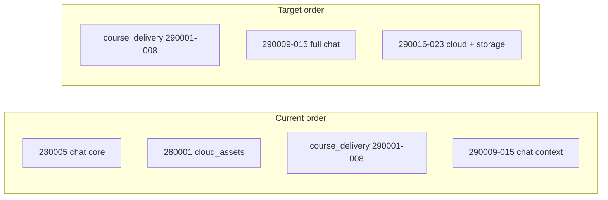

# Consolidate chat into 20260329 bundle

## Why cloud_assets must move

`[20260328000001_cloud_assets_02_tables.sql](supabase/migrations/20260328000001_cloud_assets_02_tables.sql)` defines `conversation_id` FKs to `public.conversations`. Lexicographic migration order is `20260328…` **before** `20260329000009…`, so if you **remove** `[20260323000005_chat_02_tables.sql](supabase/migrations/20260323000005_chat_02_tables.sql)` without other changes, cloud assets would run with **no** `conversations` table.

## 1. Merge content into existing `20260329000009`–`15` files

Keep the **same filenames** (`09`=`01_types` … `15`=`07_rls`) so course-delivery numbering (`290001`–`290008`) stays unchanged.

| Target file                                                                                                            | Action                                                                                                                                                                                                                                                                                                                                                                                                                                                                                                                                                                                                                                                                |
| ---------------------------------------------------------------------------------------------------------------------- | --------------------------------------------------------------------------------------------------------------------------------------------------------------------------------------------------------------------------------------------------------------------------------------------------------------------------------------------------------------------------------------------------------------------------------------------------------------------------------------------------------------------------------------------------------------------------------------------------------------------------------------------------------------------- |
| `[20260329000009_chat_01_types.sql](supabase/migrations/20260329000009_chat_01_types.sql)`                             | Prepend the two `DO $$ … CREATE TYPE` blocks from `[20260323000005_chat_01_types.sql](supabase/migrations/20260323000005_chat_01_types.sql)` (`conversation_type`, `conversation_membership_role`), then keep `conversation_context_type`. Update header `Requires:` to `20260329000008_course_delivery_08_attendance_functions.sql` and `20260321000002_institution_admin` (drop reference to `20260323000005_chat`).                                                                                                                                                                                                                                                |
| `[20260329000010_chat_02_tables.sql](supabase/migrations/20260329000010_chat_02_tables.sql)`                           | Prepend full `CREATE TABLE` + column comments for `conversations`, `conversation_members`, `messages` from `[20260323000005_chat_02_tables.sql](supabase/migrations/20260323000005_chat_02_tables.sql)`. Append existing `conversation_contexts` block **after** those tables. `Requires:` should list `09`, course delivery `02`, `[20260323000004_tasks_notes_02_tables.sql](supabase/migrations/20260323000004_tasks_notes_02_tables.sql)`, `[20260323000003_game_runtime_02_tables.sql](supabase/migrations/20260323000003_game_runtime_02_tables.sql)`.                                                                                                          |
| `[20260329000011_chat_03_indexes_constraints.sql](supabase/migrations/20260329000011_chat_03_indexes_constraints.sql)` | Prepend indexes from `[20260323000005_chat_03_indexes_constraints.sql](supabase/migrations/20260323000005_chat_03_indexes_constraints.sql)`, then keep context indexes.                                                                                                                                                                                                                                                                                                                                                                                                                                                                                               |
| `[20260329000012_chat_04_functions_rpcs.sql](supabase/migrations/20260329000012_chat_04_functions_rpcs.sql)`           | No merge needed: `[20260323000005_chat_04_functions_rpcs.sql](supabase/migrations/20260323000005_chat_04_functions_rpcs.sql)` is an empty placeholder. Optionally replace with a one-line comment that helpers live here.                                                                                                                                                                                                                                                                                                                                                                                                                                             |
| `[20260329000013_chat_05_backfills_seed.sql](supabase/migrations/20260329000013_chat_05_backfills_seed.sql)`           | Keep the `conversation_contexts` INSERT; `[20260323000005_chat_05_backfills_seed.sql](supabase/migrations/20260323000005_chat_05_backfills_seed.sql)` is header-only—drop or fold a short note into the header.                                                                                                                                                                                                                                                                                                                                                                                                                                                       |
| `[20260329000014_chat_06_triggers.sql](supabase/migrations/20260329000014_chat_06_triggers.sql)`                       | Already supersedes `[20260323000005_chat_06_triggers.sql](supabase/migrations/20260323000005_chat_06_triggers.sql)` (same `trg_conversations_set_updated_at` + context triggers). Update `Requires:` to `290010` only.                                                                                                                                                                                                                                                                                                                                                                                                                                                |
| `[20260329000015_chat_07_rls_policies.sql](supabase/migrations/20260329000015_chat_07_rls_policies.sql)`               | Replace the split model with **one** file: all policies from `[20260323000005_chat_07_rls_policies.sql](supabase/migrations/20260323000005_chat_07_rls_policies.sql)` **except** use the **context-aware** definitions from current `290015` for `conversations_select_participant`, `messages_select_participant`, and `messages_insert_member` (the ones that call `app.caller_eligible_for_conversation_context`). Then append the `conversation_contexts` RLS section from current `290015`. Order: enable/force RLS on `conversations` → members → messages → base policies → then the three stricter participant policies → then `conversation_contexts` block. |

## 2. Delete the old chat bundle

Remove these seven files:

- `20260323000005_chat_01_types.sql` … `20260323000005_chat_07_rls_policies.sql`

## 3. Renumber cloud_assets and storage after chat

Rename so they sort **after** `20260329000015_chat_07_rls_policies.sql` and **preserve internal order** (01→07, then storage):

| Current                                                    | New (example)                                              |
| ---------------------------------------------------------- | ---------------------------------------------------------- |
| `20260328000001_cloud_assets_01_types.sql`                 | `20260329000016_cloud_assets_01_types.sql`                 |
| `…_02_tables.sql`                                          | `20260329000017_cloud_assets_02_tables.sql`                |
| `…_03_indexes_constraints.sql`                             | `20260329000018_cloud_assets_03_indexes_constraints.sql`   |
| `…_04_functions_rpcs.sql`                                  | `20260329000019_cloud_assets_04_functions_rpcs.sql`        |
| `…_05_backfills_seed.sql`                                  | `20260329000020_cloud_assets_05_backfills_seed.sql`        |
| `…_06_triggers.sql`                                        | `20260329000021_cloud_assets_06_triggers.sql`              |
| `…_07_rls_policies.sql`                                    | `20260329000022_cloud_assets_07_rls_policies.sql`          |
| `20260328000002_storage_cloud_objects_rls_01_policies.sql` | `20260329000023_storage_cloud_objects_rls_01_policies.sql` |

Inside those files, update every `Requires:` header that still says `20260328000001_cloud_assets` or `20260323000005_chat` / `20260329000009_chat (context…)` to the new migration IDs and a single line like `**20260329000009_chat` (all parts)** where appropriate (`[20260328000001_cloud_assets_01_types.sql](supabase/migrations/20260328000001_cloud_assets_01_types.sql)` currently documents chat ordering).

## 4. Docs and cross-references

Update migration name tables/strings in:

- `[docs/domain/11_chat.md](docs/domain/11_chat.md)`
- `[docs/architecture/role_flow_diagrams.md](docs/architecture/role_flow_diagrams.md)`
- `[docs/domain/15_platform_roles_schema_map.md](docs/domain/15_platform_roles_schema_map.md)`
- `[docs/domain/16_cloud_storage.md](docs/domain/16_cloud_storage.md)`

Grep the repo for `20260323000005_chat` and `20260328000001_cloud` after edits to catch stragglers (including `.cursor/plans` if you want docs there consistent).

## 5. Verify

- `npm run lint:sql`
- `npm run format:sql` (note: repo may already report unfixable sqlfluff noise; ensure no new violations in touched files if your workflow checks that)

## Risk note

This is safe only while **no environment has applied** the old `20260323000005_chat_`* or `20260328000001_`* timestamps; renaming applied migrations breaks Supabase migration history. You confirmed unapplied state—good.