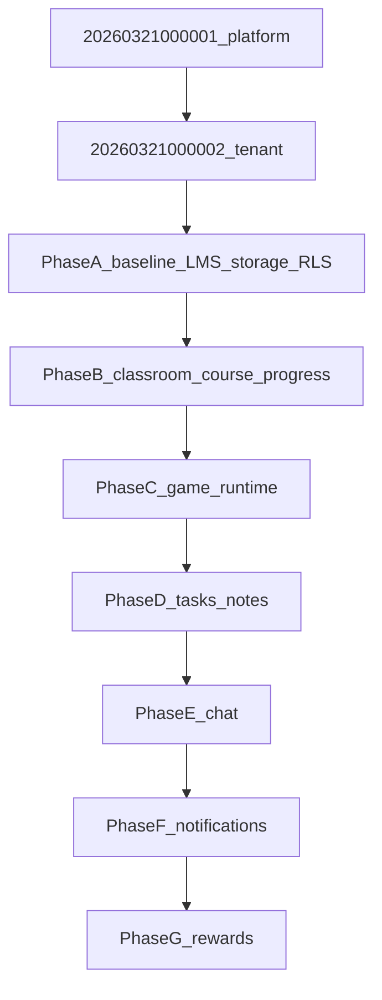

# Docs 03–12: phased Supabase migrations (MVP + membership RLS)

## Your choices (locked in)

- **Depth:** MVP — core tables + minimum viable RLS; defer high-volume `learning_events`, full moderation matrices, and heavy analytics until follow-up migrations.
- **Baseline RLS:** **First new migration** after the March files — retarget LMS + storage policies from `[user_institutions](supabase/migrations/20260209000001_baseline_schema.sql)` to `[institution_memberships](supabase/migrations/20260321000002_institution_admin.sql)` + existing `app.*` helpers, without waiting for all domain tables.

## Preconditions

- Migration order: [20260209000001_baseline_schema.sql](supabase/migrations/20260209000001_baseline_schema.sql) → [20260209000002_super_admin.sql](supabase/migrations/20260209000002_super_admin.sql) → March `20260321000001` → March `20260321000002`.
- Tenant column remains `**institution_id`** (same role as the guideline’s `tenant_id`) per multitenant plan.
- Every new table: `ENABLE ROW LEVEL SECURITY` + `**FORCE ROW LEVEL SECURITY**`, `COMMENT ON` for app-facing objects, indexes for FKs and RLS predicates, `(select app.is_super_admin())` / `(select app.auth_uid())` / `app.member_institution_ids()` / `app.admin_institution_ids()` as in March migrations ([docs/db_guide_line_en.md](docs/db_guide_line_en.md)).

## Doc inventory (what Postgres must gain — MVP)

| Docs                    | MVP entities (examples)                                                                                                                                                                                                                                                    |
| ----------------------- | -------------------------------------------------------------------------------------------------------------------------------------------------------------------------------------------------------------------------------------------------------------------------- |
| 03 Teacher / 04 Student | Mostly **RLS and joins** on shared tables; optional `classroom_student_membership` later — MVP can rely on institution membership + course enrollment until roster tables are required.                                                                                    |
| 05 Class Room           | `**classroom_course_links`** (or `classroom_courses`): `institution_id`, `classroom_id`, `course_id`, audit timestamps; optional `published_at`. Links teacher “delivery” in [classrooms](supabase/migrations/20260321000002_institution_admin.sql) to baseline `courses`. |
| 06 Note                 | `**notes**`: `institution_id`, `owner_user_id` OR `task_group_id` (nullable), `scope` enum personal | collaborative, `content` jsonb, `content_schema_version`, `deleted_at`; MVP single-row doc, **defer** normalized `note_blocks` unless you explicitly expand scope.   |
| 07 Course               | `**lesson_progress`**: `user_id`, `lesson_id`, `institution_id`, `last_position` jsonb or slide id, `completed_at`, `updated_at`; **defer** dedicated `learning_events` table. Optional `ALTER lessons ADD COLUMN IF NOT EXISTS content_schema_version`.                   |
| 08 Game Studio          | `**game_runs`**, `**game_sessions**` + `**game_session_participants**`: scores JSONB, mode enum, FK `game_id`, `institution_id`, optional `classroom_id`.                                                                                                                  |
| 09 Task                 | `**tasks**`, `**task_groups**`, `**task_group_members**`, `**task_submissions**`: state enum MVP (`draft`/`published`/`submitted`/`reviewed`), `due_at`, `institution_id`, `classroom_id`, FK to teacher.                                                                  |
| 10 Reward               | `**point_ledger**` (append-style), `**classroom_reward_settings**` JSONB or columns; **defer** full joker/redemption workflow tables or add single `joker_redemptions` stub with status.                                                                                   |
| 11 Chat                 | `**conversations`**, `**conversation_members**`, `**messages**`: `institution_id`, type direct | group MVP; attachment JSONB; **defer** moderation queue table (use `audit.log_event` for reports MVP).                                                                    |
| 12 Notification         | `**notifications`**, `**notification_preferences**` per user; optional read via `institution_id` for tenant-scoped rows.                                                                                                                                                   |

## Migration phases (new files, lexicographic order)

Use a single timestamp prefix after March, e.g. `20260323000001_...` through `20260323000007_...` (adjust to your convention).

### Phase A — `*_baseline_lms_rls_memberships.sql` (your “first wave”)

**Goal:** Align existing LMS + storage with the multitenant plan follow-up: `**institution_memberships` as the tenant join path**, not `user_institutions`.

Targets in [20260209000001_baseline_schema.sql](supabase/migrations/20260209000001_baseline_schema.sql) / patches in [20260209000002_super_admin.sql](supabase/migrations/20260209000002_super_admin.sql):

- `**storage.objects`** policies for `cloud`: replace `EXISTS (SELECT 1 FROM user_institutions ui WHERE …)` with `**app.member_institution_ids()**` or equivalent `EXISTS` on `institution_memberships` (active, not deleted).
- `**teacher_followers**`: same-institution check currently joins `user_institutions` → switch to `**institution_memberships**` (same composite logic).
- `**course_enrollments**`: replace “followed teacher” rule with **MVP rule you must document in SQL comments**, e.g. (a) same-institution as course via `courses.institution_id` + active student membership, and/or (b) keep teacher_followers as secondary until classroom links exist. Preserve `**(select app.is_super_admin())`** bypasses from Feb migration on every `DROP POLICY` / `CREATE POLICY` pair.
- `**list_searchable_profiles_in_my_institutions**`: redefine join from `user_institutions` to `**institution_memberships**`.
- `**courses` / `topics` / `lessons` / `games**`: tighten SELECT so published content is visible only to users with **membership in `courses.institution_id`** (and teacher manage still `teacher_id = auth.uid()`), handling **NULL `courses.institution_id`** (backfill or restrict INSERT going forward — document one rule).

**Db guide:** add `**FORCE ROW LEVEL SECURITY`** anywhere baseline only used `ENABLE`.

### Phase B — `*_classroom_course_links_lesson_progress.sql`

- Table linking `**classrooms**` → `**courses**` (doc 05 + 07 delivery).
- `**lesson_progress**` (doc 07 MVP).
- RLS: institution_admin + teacher (owner of classroom or course) + student member patterns; super_admin bypass.

### Phase C — `*_game_runtime.sql`

- `game_runs`, `game_sessions`, `game_session_participants` (doc 08 MVP).
- RLS: participants + teachers in institution; super_admin bypass.

### Phase D — `*_tasks_notes.sql`

- Task group model (doc 09).
- Notes JSONB MVP (doc 06).
- RLS: group members + owning teacher + institution_admin where applicable.

### Phase E — `*_chat.sql`

- Conversations + messages MVP (doc 11); institution-scoped only.
- RLS: membership-only access; **defer** safeguarding `SECURITY DEFINER` RPC to a small follow-up if policies get unwieldy.

### Phase F — `*_notifications.sql`

- `notifications` + `notification_preferences` (doc 12 MVP).
- RLS: users read/update own rows; service-role / edge function path documented for inserts.

### Phase G — `*_rewards_mvp.sql`

- `point_ledger` + minimal classroom settings (doc 10 MVP).
- RLS: students read self ledger; teachers/admins manage classroom settings.

## Audit (lightweight MVP)

- Use existing `[audit.log_event](supabase/migrations/20260321000001_super_admin.sql)` for: course publish/unpublish hooks (if added), task state transitions, chat report events — **only where** the doc explicitly requires accountability; avoid trigger spam on hot tables.

## After first apply

- **Append-only** new migrations for deferred items (`learning_events`, moderation queue, normalized note blocks, full joker model).
- Update a short **schema map** comment at the top of each new file: `Doc X § → tables`.

## Verification

- `supabase db reset` (or apply chain on clean DB).
- Smoke tests: two users in two institutions cannot read each other’s courses/messages; storage path still matches `{institution_id}/...`; super_admin bypass still works on LMS tables.

## Open product choices (resolve while authoring Phase A SQL)

These were not re-asked in the form; decide in implementation and document in comments:

- **Enrollment rule** without classroom links: institution-only vs keep teacher_followers until Phase B ships.
- `**courses.institution_id` NULL** legacy rows: backfill from teacher’s primary institution vs block new NULLs only.

