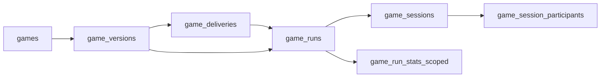

# Game and Analytics Alignment Migration Plan

## Goal

Implement delivery-first, version-safe game analytics with immutable run context, while preserving compatibility during rollout and following DB design/naming conventions.

## Scope Anchors (existing schema/docs)

- [supabase/migrations/20260323000003_game_runtime_02_tables.sql](/Users/willfryd/Documents/wq-health/supabase/migrations/20260323000003_game_runtime_02_tables.sql)
- [supabase/migrations/20260323000003_game_runtime_03_indexes_constraints.sql](/Users/willfryd/Documents/wq-health/supabase/migrations/20260323000003_game_runtime_03_indexes_constraints.sql)
- [supabase/migrations/20260326000003_game_versions_01_tables.sql](/Users/willfryd/Documents/wq-health/supabase/migrations/20260326000003_game_versions_01_tables.sql)
- [supabase/migrations/20260329000005_course_delivery_05_lesson_progress_learning_events.sql](/Users/willfryd/Documents/wq-health/supabase/migrations/20260329000005_course_delivery_05_lesson_progress_learning_events.sql)
- [supabase/migrations/20260329000007_course_delivery_07_rls_policies.sql](/Users/willfryd/Documents/wq-health/supabase/migrations/20260329000007_course_delivery_07_rls_policies.sql)
- [docs/architecture/db_design_principles.md](/Users/willfryd/Documents/wq-health/docs/architecture/db_design_principles.md)
- [docs/architecture/db_naming_convention.md](/Users/willfryd/Documents/wq-health/docs/architecture/db_naming_convention.md)
- [.sqlfluffignore](/Users/willfryd/Documents/wq-health/.sqlfluffignore)

## Target Data Model

- `games`: stable authoring identity.
- `game_versions`: immutable published artifact.
- `game_deliveries`: rollout container (classroom/course_delivery/lesson context).
- `game_runs`: concrete attempts pinned to `game_version_id` and optional `game_delivery_id`.
- Analytics rollups keyed by `game_version_id` and optionally `game_delivery_id`.

## Phased Migration Plan

## Phase 1: Enforce Version-Pinned Runs

Create a new domain migration set, e.g. `*_game_analytics_alignment_*`, split by conventions (`02_tables`, `03_indexes_constraints`, `04_functions_rpcs`, `05_backfill`, `07_rls_policies`).

- Add/confirm `game_runs.game_version_id UUID NOT NULL` as required for new writes.
- Keep existing composite integrity: `(game_id, game_version_id) -> game_versions(game_id, id)` with `ON DELETE RESTRICT`.
- Add/confirm index for `game_version_id` and composite analytics index on `(institution_id, game_id, game_version_id)`.
- Add guard function for inserts/updates to reject runs without a valid published/allowed version context.
- Backfill null historical runs deterministically (prefer `games.current_published_version_id`; fallback documented and audited).

Deliverable: all new runs are version-pinned, historical gaps minimized with explicit audit query/report.

## Phase 2: Introduce `game_deliveries`

- Create `public.game_deliveries` with:
  - `id`, `institution_id`, `game_id`, `game_version_id`
  - nullable context: `classroom_id`, `course_delivery_id`, `lesson_id` (future `lesson_version_id` migration-ready)
  - lifecycle: `status`, `published_at`, `archived_at`
  - audit: `created_at`, `updated_at`, optional `created_by`, `updated_by`
- Add constraints/checks:
  - tenant consistency checks through FK chain and helper function where needed.
  - optional uniqueness for active delivery by context (partial unique index, status-aware).
- Add indexes for all FKs and common filters:
  - `(institution_id, status)`
  - `(course_delivery_id, status)`
  - `(classroom_id, status)`
  - `(game_id, game_version_id)`

Deliverable: immutable game version is publish-bound to operational delivery context.

## Phase 3: Bind Runs to Deliveries + Context

- Add to `game_runs`:
  - `game_delivery_id UUID NULL` (required only for assigned runs)
  - `run_context TEXT NOT NULL` with check enum-like values:
    - `delivery_assigned`
    - `solo_library`
    - `versus_invite`
    - `teacher_launched_session`
- Add FK `game_runs.game_delivery_id -> game_deliveries.id`.
- Add consistency function/check:
  - if `run_context = 'delivery_assigned'`, then `game_delivery_id IS NOT NULL`.
  - if `game_delivery_id` present, `game_runs.game_version_id` must equal `game_deliveries.game_version_id`.
  - `institution_id` must match across run and delivery.
- Keep `classroom_id` on `game_runs` nullable as denormalized convenience only.

Deliverable: run semantics become explicit and unambiguous for analytics segmentation.

## Phase 4: Replace `is_personal_best` as Source of Truth

- Create scoped stats table (recommended): `public.game_run_stats_scoped`:
  - keys: `institution_id`, `user_id`, `game_id`, `game_version_id`, nullable `game_delivery_id`
  - metrics: `best_score`, `best_run_id`, `attempt_count`, `last_run_at`
  - timestamps and optional recompute markers.
- Define uniqueness:
  - per version scope: unique `(institution_id, user_id, game_id, game_version_id, game_delivery_id)` where `game_delivery_id` nullable handling is explicit.
- Add recompute/upsert function called from run/session finalization path.
- Keep `game_session_participants.is_personal_best` as derived/compatibility field during transition (not authoritative).

Deliverable: “best” logic is query-safe per version and per delivery context.

## Phase 5: Delivery-Scoped Analytics + RLS Alignment

- Extend analytics shape (if still missing on any environment):
  - `learning_events.course_delivery_id` required.
  - `lesson_progress.course_delivery_id` required.
- Introduce optional `game_delivery_id` analytics dimension where game events are emitted.
- Update RLS policies to authorize by delivery membership/assignment helpers, not only `course.teacher_id` ownership assumptions.
- Add teacher and institution-admin analytics policies aggregating by:
  - `course_delivery_id`
  - `game_delivery_id`
  - `classroom_id`
  - `game_version_id`

Deliverable: reporting is correct for multi-class, multi-year, and version-divergent usage.

## Rollout and Safety

- Use additive-first migrations, then tighten `NOT NULL`/checks after backfill verification.
- Keep compatibility windows for old reads, then deprecate broad game-level “best ever” endpoints.
- Include verification SQL in migration comments/PR notes:
  - null checks post-backfill
  - FK integrity checks
  - policy smoke checks by role
- Keep migration files atomic by responsibility and in canonical section order.

## Suggested Migration File Skeleton

Under `supabase/migrations/` create a new timestamped set (example domain `game_analytics_alignment`):

- `..._01_types.sql` (if introducing enums/types)
- `..._02_tables.sql` (`game_deliveries`, stats table)
- `..._03_indexes_constraints.sql`
- `..._04_functions_rpcs.sql`
- `..._05_backfill_game_runs_and_stats.sql`
- `..._06_triggers.sql` (only if needed)
- `..._07_rls_policies.sql`

## Acceptance Criteria

- Every new `game_runs` row has a valid `game_version_id`.
- Assigned runs have `game_delivery_id` and valid delivery/version/institution consistency.
- Teacher dashboards can segment by delivery and version without inferring from nullable classroom fields.
- Scoped best stats return deterministic results for both per-version and per-delivery queries.
- RLS prevents cross-delivery leakage while preserving intended teacher/admin visibility.

