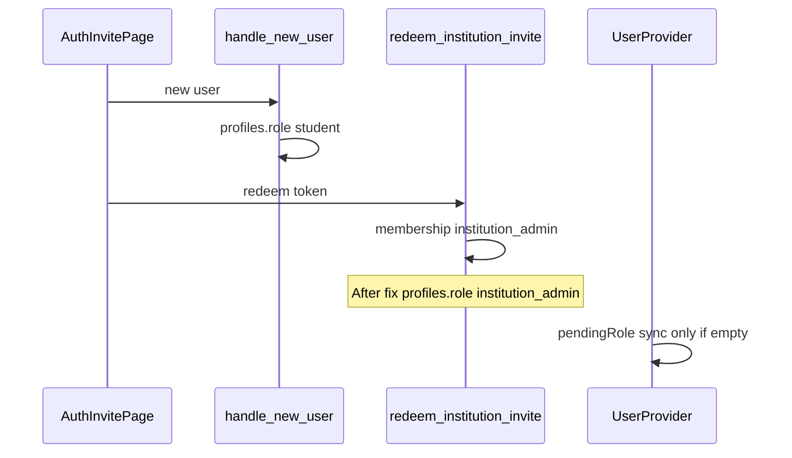

# Fix institution admin onboarding ending as `student` (DB-first)

## Principle

The database is the **canonical** source for `public.profiles.role` after invite redemption. Login and [`UserProvider`](src/contexts/user/UserProvider.tsx) already read `profile.role`; fixing SQL first aligns routing and auth state. Frontend `pendingRole` remains provisional for signup/onboarding but must not overwrite server truth during hydration.

## Root cause (summary)

1. [`handle_new_user()`](supabase/migrations/20260209000001_baseline_schema.sql) allowlists only `student` | `teacher` from signup metadata; `institution_admin` becomes `student` by design.
2. [`redeem_institution_invite`](supabase/migrations/20260410120000_institution_pending_status_on_redeem.sql) updated memberships but not `profiles.role`.
3. [`UserProvider`](src/contexts/user/UserProvider.tsx) overwrote `pendingRole` with `profile.role` whenever they differed.
4. [`StepFinish`](src/features/onboarding/components/StepFinish.tsx) / [`onboarding.tsx`](src/features/onboarding/pages/onboarding.tsx) used `profile?.role || pendingRole`, preferring the wrong DB row.



---

## 1. DB first — invite redeem authoritative

- New migration: `CREATE OR REPLACE` `public.redeem_institution_invite` from [20260410120000_institution_pending_status_on_redeem.sql](supabase/migrations/20260410120000_institution_pending_status_on_redeem.sql).
- Before the final `END;`, add:

```sql
UPDATE public.profiles
SET role = inv.membership_role::text,
    updated_at = now()
WHERE user_id = v_uid;
```

- Re-apply `REVOKE`, `GRANT`, `COMMENT` unchanged.

**Naming:** `profiles.role` and `membership_role` enum both use snake_case values (e.g. `institution_admin`); keep consistent with [`auth.types` / `UserRole`](src/features/auth/types/auth.types.ts) and route helpers.

---

## 2. Backfill existing bad data

- **Separate** one-off migration (not inside the RPC): `UPDATE public.profiles` from `institution_memberships` where `membership_role = institution_admin`, membership active, and `profiles.role` is wrong (e.g. still `student`).
- Keeps production repair explicit and auditable.

---

## 3. Frontend — stop overwriting DB truth

- [`UserProvider.tsx`](src/contexts/user/UserProvider.tsx): sync `profile.role` → `setPendingRole` **only** when `pendingRole` is null or empty (after trim). Never replace a non-empty `pendingRole` with profile during hydration.

---

## 4. Onboarding — `pendingRole || profile?.role`

- [`StepFinish.tsx`](src/features/onboarding/components/StepFinish.tsx): resolve onboarding role with **empty-string handling**: prefer trimmed `pendingRole`, then trimmed `profile?.role`.
- [`onboarding.tsx`](src/features/onboarding/pages/onboarding.tsx): same for post-success navigation.

Honors DB after redeem while keeping invite/signup flows that still rely on `pendingRole` before the next profile fetch.

---

## 5. Post-fix validation

- Super admin creates institution → invite → redeem → onboarding → `profiles.role` is `institution_admin` immediately after redeem; `pendingRole` does not downgrade it; onboarding completes without reverting role.
- **Separate issue:** any mismatch between `institutionadmin` naming in docs vs `institution_admin` in enums/routes should be tracked apart from this role bug.

---

## Suggested wording

- **Primary:** `redeem_institution_invite` updates `public.profiles.role` to the redeemed membership role.
- **Secondary:** `UserProvider` does not overwrite valid session `pendingRole` with profile during hydration when `pendingRole` is already set.
- **Tertiary:** Onboarding resolves role as `pendingRole || profile.role` with trim-safe handling.

References: [`docs/architecture/fe_principles.md`](docs/architecture/fe_principles.md), [`docs/architecture/db_design_principles.md`](docs/architecture/db_design_principles.md), clean-code conventions for small, focused changes.
