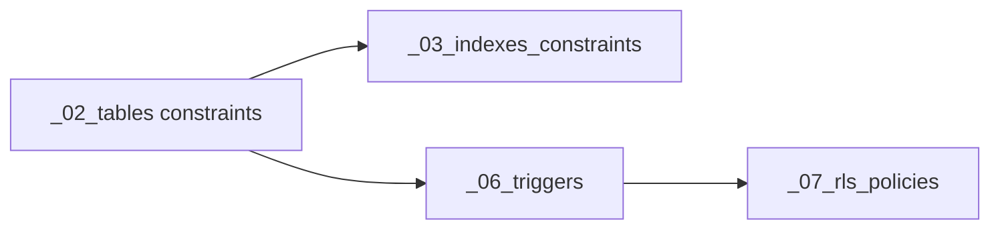

# March migrations: strict DB naming convention pass

## Spark

Rename and align **only** objects defined in `[supabase/migrations/202603*.sql](supabase/migrations/)` so indexes use full table names, triggers use the `trg_`* pattern, RLS policies use `{table}_{action}_{role}` without table abbreviations, and constraints use `fk_` / `uq_` / `chk_` — matching [docs/db_naming_convention.md](docs/db_naming_convention.md). **Do not** touch `[supabase/migrations/20260209000001_baseline_schema.sql](supabase/migrations/20260209000001_baseline_schema.sql)` or `[supabase/migrations/20260209000002_super_admin.sql](supabase/migrations/20260209000002_super_admin.sql)`.

## Scope

- **In scope:** all files matching `supabase/migrations/202603*.sql` (210k, 230k, 250k series splits).
- **Out of scope:** any `202602`* (including the two forbidden files above) and non-SQL code — unless you later add a tiny TS/types pass for renamed DB columns (see below).

## Convention gaps found (representative)

| Area            | Issue                                                                                                                                                                                                                                             | Doc rule                                                                                                                                             |
| --------------- | ------------------------------------------------------------------------------------------------------------------------------------------------------------------------------------------------------------------------------------------------- | ---------------------------------------------------------------------------------------------------------------------------------------------------- |
| **Indexes**     | Abbreviated table segments: `idx_ca_`*, `idx_coa_`*, `idx_cm_*`, `idx_ccl_*`, `idx_lp_*`, `idx_le_*`, `idx_ts_*`, `idx_tgm_*`, `idx_gsp_*`, `idx_gr_*`, `idx_gs_*`, `idx_np_*`, `idx_inst_subs_*`, `idx_dsr_*`                                    | `idx_{table}_{column}`; doc explicitly discourages `ca` / `coa` / `ccl` style abbreviations                                                          |
| **Triggers**    | Names like `ca_updated_at`, `ccl_updated_at`, `plan_catalog_updated_at`, `games_course_institution_trg`                                                                                                                                           | `trg_{table}_{purpose}` (e.g. `trg_classroom_announcements_set_updated_at`)                                                                          |
| **RLS**         | Policies such as `ca_`*, `coa_`*, `tg_*`, `gsp_*`, `conv_*`, `cm_*`, `tf_*`, `ce_*`, quoted titles on `storage.objects`                                                                                                                           | `{table}_{action}_{role}`; explicit verbs `select` / `insert` / `update` / `delete` (replace `_read` with `_select` where policies are `FOR SELECT`) |
| **Constraints** | e.g. `faculties_inst_unique`, `programmes_faculty_fk`, `institution_invites_role_chk`, `task_groups_note_fk`, `games_course_id_fkey`                                                                                                              | `uq_{table}_{column}`, `fk_{from_table}_{to_table}`, `chk_{table}_{rule}`                                                                            |
| **Columns**     | `data` jsonb on `[20260325000001_announcements_02_tables.sql](supabase/migrations/20260325000001_announcements_02_tables.sql)` and `[20260323000006_notifications_02_tables.sql](supabase/migrations/20260323000006_notifications_02_tables.sql)` | §10 forbids generic `data`; use a descriptive name (e.g. `link_payload` or `structured_payload`) and update `COMMENT ON COLUMN`                      |

## Execution order (avoid broken references)

Work **per migration chain** in dependency order (210 → 230 → 250), and within each chain in section order where renames cross files (`_02` tables before `_03` indexes that reference constraint names, etc.):

1. **Tables / constraints** — In `[20260321000002_institution_admin_02_tables.sql](supabase/migrations/20260321000002_institution_admin_02_tables.sql)`, `[20260321000001_super_admin_02_tables.sql](supabase/migrations/20260321000001_super_admin_02_tables.sql)`, `[20260323000001_baseline_lms_rls_memberships_02_tables.sql](supabase/migrations/20260323000001_baseline_lms_rls_memberships_02_tables.sql)`, `[20260323000004_tasks_notes_02_tables.sql](supabase/migrations/20260323000004_tasks_notes_02_tables.sql)`: rename inline `CONSTRAINT` names to `uq_`*, `fk_`*, `chk_*`. Any `ALTER TABLE ... ADD CONSTRAINT` in later files must use the same new names.
2. **Column rename (`data`)** — In announcements and notifications `_02_tables.sql`, rename `data` → chosen compliant name; update related `COMMENT ON COLUMN` and any `CHECK` / index / policy body that references the column (grep within `202603`* for that identifier).
3. **Indexes** — Update all `[*_03_indexes_constraints.sql](supabase/migrations/)` under `202603`*: use **full table names** in index names (e.g. `idx_classroom_announcements_institution_id`, `idx_conversation_members_conversation_id_user_id` for the unique composite). Keep `DROP INDEX IF EXISTS` / `CREATE INDEX` pairs consistent if you split drops across files.
4. **Triggers** — In every `[*_06_triggers.sql](supabase/migrations/)` under `202603`*: `DROP TRIGGER IF EXISTS <old>` then `CREATE TRIGGER trg_<table>_set_updated_at` (or `trg_<table>_set_updated_at` matching the doc examples). Update **trigger function** references if any trigger still calls `public.update_updated_at()` by name only (usually unchanged). For `[20260323000001_baseline_lms_rls_memberships_06_triggers.sql](supabase/migrations/20260323000001_baseline_lms_rls_memberships_06_triggers.sql)`, rename `games_course_institution_trg` → e.g. `trg_games_enforce_course_institution` and keep it wired to `public.games_enforce_course_institution_match()`.
5. **RLS policies** — In every `[*_07_rls_policies.sql](supabase/migrations/)` under `202603`*:
  - Replace abbreviated prefixes with **full table names** (e.g. `classroom_announcements_select_super_admin`, `course_announcements_select_member`, `task_groups_all_teacher` — tune the **role** segment to match doc examples: `super_admin`, `institution_admin`, `member`, `teacher`, `student`, `authenticated` as appropriate).
  - `[20260323000001_baseline_lms_rls_memberships_07_rls_policies.sql](supabase/migrations/20260323000001_baseline_lms_rls_memberships_07_rls_policies.sql)`: replace quoted `storage.objects` policy names with snake_case names such as `storage_objects_insert_authenticated_institution_folder` (and matching `DROP POLICY IF EXISTS`).
  - Where policies **replace** earlier names (`DROP POLICY ...` then `CREATE`), ensure the **dropped** name matches what the file previously created (after your renames, update drops accordingly).
6. **Functions / RPCs (strict pass)** — Secondary: in `[*_04_functions_rpcs.sql](supabase/migrations/)` files, align only clear violations with `verb_entity_action` (e.g. consider renaming `games_enforce_course_institution_match` → `enforce_games_course_institution_match` **only if** you also update the trigger definition and `COMMENT ON FUNCTION` in the same March tree). Skip deep renames of `app.`* helpers unless you want a large, coordinated rename across all references.
7. **Super-admin audit triggers** — `[20260321000001_super_admin_06_triggers.sql](supabase/migrations/20260321000001_super_admin_06_triggers.sql)`: `trg_audit`_* is close; optionally normalize to a single pattern (`trg_<table>_audit_<purpose>`) if it still reads ambiguous per §3-second rule.

## Verification

- Grep `202603*.sql` for forbidden abbreviations from the doc anti-pattern list (`\bca`_, `\bcoa_`, `\bccl_`, `\bidx_cm_`, etc.) until clean.
- Run `supabase db lint` / `supabase db reset` locally (when Docker is available) to catch ordering or duplicate policy names.

## Risk note

If any environment has **already applied** these migrations with old names, editing files in place will **not** rename objects on existing databases; you would need a **new** forward migration that `ALTER`s renames. If migrations are still pre-production, in-place edits are the right approach.

## Optional follow-up (not March SQL)

If you rename `notifications.data` (or announcements payload column), regenerate or adjust Supabase types / client queries when you start using those tables from the app (current grep shows no `notifications` usage yet).