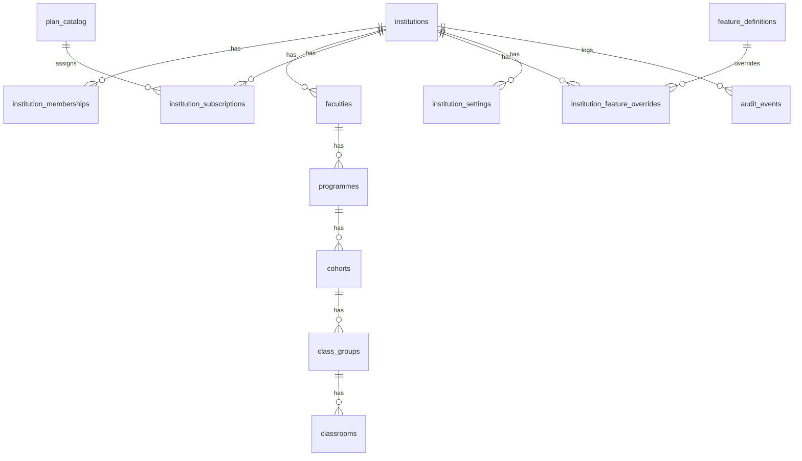

# Multitenant schema: `super_admin.sql` + `institution_admin.sql`

## Context

- **[Baseline](supabase/migrations/20260209000001_baseline_schema.sql)** already has `public.institutions`, `public.user_institutions` (no per-tenant role), `public.profiles` with a single `role` text, and RLS that is **not** yet “tenant firewall” grade (e.g. institutions SELECT is open to everyone; no `FORCE ROW LEVEL SECURITY`).
- **[Existing super_admin migration](supabase/migrations/20260209000002_super_admin.sql)** adds `is_super_admin` and super-admin bypasses on LMS tables; it does **not** model plan catalog, feature flags, or institution governance fields from the docs.
- **[DB guideline](docs/db_guide_line_en.md)** requires: tenant column on every tenant row, `created_at` / `updated_at` / optional `deleted_at`, RLS **enabled + forced**, `(select auth.uid())` / membership-based checks, `audit` schema for append-only security events, `SECURITY DEFINER` only with safe `search_path`, and comments on important objects.

**Naming / placement:** Supabase applies migrations in lexical order under `[supabase/migrations/](supabase/migrations/)`. Deliver as two new files so they run **after** existing migrations, e.g. `20260321000001_super_admin.sql` and `20260321000002_institution_admin.sql` (content matches your requested module names; literal `super_admin.sql` without a timestamp would not run in the standard CLI flow).

**Terminology:** Use `**institution_id`** everywhere as the tenant key (documented in comments as the tenant boundary) to avoid renaming the entire baseline; this matches [docs/01_Super_Admin.md](docs/01_Super_Admin.md) / [docs/02_Institution.md](docs/02_Institution.md).

---

## Design sketch

---

## File 1: `super_admin.sql` (platform / super-admin plane)

**Purpose:** Tables and policies for global governance from [01_Super_Admin.md](docs/01_Super_Admin.md): commercial templates, feature catalog + per-institution overrides with audit, and subscription/entitlement scaffolding. Centralize super-admin checks in **one helper** instead of repeating subqueries.

**Recommended contents:**

1. `**app` schema helpers** (stable, `SECURITY INVOKER`, fixed `search_path`):
  - `app.auth_uid()` → `(select auth.uid())`
  - `app.is_super_admin()` → reads `public.profiles.is_super_admin` for `app.auth_uid()` (compatible with existing column from `[20260209000002_super_admin.sql](supabase/migrations/20260209000002_super_admin.sql)`).
2. `**audit` schema** (minimal v1):
  - `audit.events` append-only table: `id`, `occurred_at`, `actor_user_id`, `event_type` (text or enum), `subject_type`, `subject_id`, `institution_id` nullable, `payload jsonb`, `metadata jsonb`.
  - Revoke direct writes from `authenticated`; inserts only via controlled triggers or `SECURITY DEFINER` functions owned by a safe role (pattern from guideline).
  - `COMMENT ON` for table/columns.
3. **Commercial / plan model** (super-admin managed):
  - `public.plan_catalog`: `code` unique, `name`, `seat_cap_default`, `storage_bytes_cap_default`, `metadata jsonb`, lifecycle timestamps + soft delete.
  - `public.institution_subscriptions`: `institution_id` FK → `institutions`, `plan_id` FK, `effective_from` / `effective_to`, `billing_status`, `renewal_at`, `grace_ends_at`, `seats_cap`, `storage_bytes_cap` (denormalized from plan for enforcement).
4. **Feature flags** (global + per-tenant overrides + immutable audit trail):
  - `public.feature_definitions`: `key` unique, `description`, `default_enabled`, timestamps.
  - `public.institution_feature_overrides`: `(institution_id, feature_key)` unique, `enabled`, `updated_at`; FK to `institutions` and to `feature_definitions.key` (or surrogate id if you prefer).
  - **Trigger** on overrides: `BEFORE INSERT OR UPDATE` → insert into `audit.events` capturing old/new enabled, actor `app.auth_uid()`, and institution.
5. **Extend `public.institutions`** (tenant governance from §1 of doc 01) with nullable columns such as:
  - `deleted_at`, `suspended_at`, `suspension_reason`
  - `data_region` / `primary_region` (text)
  - `email_domain_policy jsonb` (allowed domains / SSO hints — keep minimal)
  - `health_state` enum `healthy` / `warning` / `critical` (maps to blue/orange/red in product copy)
  - Optional: `default_retention_policy_code` text for linkage to institution settings.
6. **RLS** on all new `public` tables:
  - `ENABLE ROW LEVEL SECURITY` + `**FORCE ROW LEVEL SECURITY`**.
  - **Super admin:** full CRUD where appropriate using `(select app.is_super_admin()) is true`.
  - **Authenticated non–super-admin:** default deny on `plan_catalog`, `feature_definitions` (or read-only SELECT if product needs clients to list feature keys — your choice; guideline leans deny-by-default).
  - `**institution_subscriptions` / `institution_feature_overrides`:** institution admins read/write **only** their `institution_id` (see file 2 helper); super admin all.
7. **Do not** duplicate the large seed `DO $$` block from the old super_admin migration in the new file (avoid accidental re-seeding in prod). Keep promotion of super admins as a manual ops step or a separate seed snippet.

---

## File 2: `institution_admin.sql` (tenant plane for doc 02)

**Purpose:** Let an institution admin manage structure and operational data described in [02_Institution.md](docs/02_Institution.md), without cross-tenant access.

**Recommended contents:**

1. **More `app` helpers:**
  - `app.is_institution_admin(p_institution_id uuid)` → exists active `institution_memberships` row with role `institution_admin` for `app.auth_uid()`.
  - Optional (guideline-aligned): `app.current_institution_id()` reading `profiles.active_institution_id` (see below) for statement-scoped tenant context.
2. `**profiles.active_institution_id`** (nullable `UUID` FK → `institutions.id`, `ON DELETE SET NULL`):
  - Lets the API set “active tenant” without JWT claims; RLS uses **membership verification**, not trust of this column alone.
3. **Replace loose `user_institutions` usage for authorization** (optimized multitenant model):
  - New `public.institution_memberships`: `user_id`, `institution_id`, `membership_role` enum (`institution_admin`, `teacher`, `student`), `status` enum (`invited`, `active`, `suspended`), `created_at`, `updated_at`, `deleted_at`, unique `(user_id, institution_id)` where not deleted.
  - **Data migration:** `INSERT … SELECT` from `user_institutions` left join `profiles` to infer a provisional `membership_role` from `profiles.role` when it matches; default other rows to `student` or `teacher` per your product rule; mark all `active`.
  - Deprecation strategy: keep `user_institutions` for one release and sync via trigger **or** drop after backfill if greenfield — state explicitly in migration comments.
4. **Academic hierarchy** (§2 of doc 02), each with `institution_id`, soft delete, indexes on `(institution_id, …)`:
  - `faculties` → `programmes` → `cohorts` → `class_groups`
  - Uniqueness scoped per institution (e.g. slug or name + parent), `CHECK` constraints for tree integrity (child’s `institution_id` matches parent’s).
5. **Staff scope** (§4 teacher assignment):
  - `institution_staff_scopes`: `user_id`, `institution_id`, optional `faculty_id`, optional `programme_id`, timestamps; checks that referenced rows belong to the same `institution_id`.
6. **Minimal `classrooms`** (§3 oversight; detailed pedagogy stays for doc 05):
  - Columns: `institution_id`, `class_group_id` FK, `primary_teacher_id` FK `profiles`, `title`, `status` (`active` / `inactive`), `deactivated_at`, standard audit timestamps.
  - RLS: `institution_admin` read/update governance fields; teacher policies can be tightened in a later migration.
7. **Settings & compliance stubs** (§8–10):
  - `institution_settings`: one row per institution — `default_locale`, `timezone`, `retention_policy_code`, `notification_defaults jsonb`, `updated_at`.
  - `institution_quotas_usage`: `institution_id` PK or unique, `seats_used`, `storage_used_bytes`, `updated_at` (counters maintained by app/triggers later).
  - `institution_invoice_records`: append-only-ish business table for visibility (external id, amounts, dates, status) — institution_admin SELECT; super_admin ALL.
  - `data_subject_requests`: `institution_id`, `subject_user_id`, `request_type`, `status`, timestamps — institution_admin + super_admin policies.
8. **RLS patterns** (all tenant tables):
  - `FORCE ROW LEVEL SECURITY`.
  - **Institution admin:** `institution_id` in (select from memberships where user is `institution_admin` and `active`).
  - **Super admin:** `(select app.is_super_admin())`.
  - **Future teacher/student:** separate policies in later modules; for now default deny for non-admin on hierarchy tables if you want least privilege, or read-only for teachers where already assigned (optional stretch).
9. **Comments** on every table/column per guideline.

---

## Relationship to “optimized” structure

- **Normalized hierarchy** instead of JSON blobs for faculty/programme/cohort/class group (easier RLS, indexes, and integrity).
- **Composite indexes** on `(institution_id, foreign_parent_id)` and partial indexes on `deleted_at IS NULL`.
- **Optional optimistic concurrency:** add `bigint version` or use `updated_at` for hot rows (e.g. `institution_settings`) if you expect concurrent admin edits.

---

## What this intentionally defers

- LMS tables (`courses`, `games`, …) behavior refit to `institution_memberships` and `active_institution_id` (separate migration to avoid a mega-diff).
- Analytics materialized views / dashboard aggregates (doc 02 §1, §7) — can be views over these tables later.
- Full doc 05 classroom pedagogy fields.

---

## Implementation order

1. Land `**super_admin.sql`** first: `app` helpers, `audit.events`, plan + feature + subscription tables, institution governance columns, RLS.
2. Land `**institution_admin.sql`**: memberships, hierarchy, scopes, classrooms, settings/compliance stubs, `profiles.active_institution_id`, RLS + backfill from `user_institutions`.

After apply: regenerate types (if you use `supabase gen types`) and add API logic to set `active_institution_id` when switching tenants.