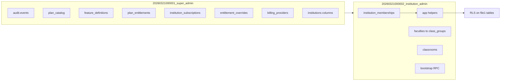

# Refactor March migrations (same filenames, docs 01 / 02 / 14)

## Preconditions

- Confirm **no** database has applied `20260321000001` / `20260321000002` (you already stated this). If that changes, stop: do not rewrite applied history.
- Baseline remains: [supabase/migrations/20260209000001_baseline_schema.sql](supabase/migrations/20260209000001_baseline_schema.sql) + [supabase/migrations/20260209000002_super_admin.sql](supabase/migrations/20260209000002_super_admin.sql) (`app` schema, `is_super_admin`, LMS RLS patches).

## File layout (your choice: keep names)

- `**[20260321000001_super_admin.sql](supabase/migrations/20260321000001_super_admin.sql)`** — platform plane: `audit`, commercial/entitlement schema (doc 14), global catalog, institution governance columns (doc 01), and **all triggers/functions that only depend on `public.institutions` + auth** (no `institution_memberships`).
- `**[20260321000002_institution_admin.sql](supabase/migrations/20260321000002_institution_admin.sql)`** — tenant plane: `profiles.active_institution_id`, `institution_memberships`, `app.admin_institution_ids` / `member_institution_ids` / `is_*`, hierarchy (02), classrooms, settings, quotas, invoices, DSR, institutions RLS replacement, bootstrap RPC, and **policies on tables created in file 1** that require membership helpers.

Dependency order is already correct: file 2 header must still say it requires file 1.

---

## Inventory by doc (what Postgres must represent)

### [docs/01_Super_Admin.md](docs/01_Super_Admin.md)

| Kind              | Objects (target)                                                                                                                                             |
| ----------------- | ------------------------------------------------------------------------------------------------------------------------------------------------------------ |
| Audit             | `audit` schema, `audit.events`, `audit.log_event`, RLS super-admin-only SELECT, revoke direct DML for `authenticated`/`anon`                                 |
| Tenant governance | `institutions` columns: soft delete, suspension, health, domain policy, region, retention code (already largely in file 1)                                   |
| Commercial        | Plan catalog + subscription state + entitlements (align with doc 14 below; not boolean-only)                                                                 |
| Global features   | Feature **catalog** with typed values at plan and override layers (doc 14)                                                                                   |
| Compliance        | Immutable audit for sensitive changes (override, plan assignment, subscription status — extend triggers beyond current `institution_feature_overrides` only) |

### [docs/02_Institution.md](docs/02_Institution.md)

| Kind               | Objects (already in file 2; keep / tighten)                                                                                                                                                                       |
| ------------------ | ----------------------------------------------------------------------------------------------------------------------------------------------------------------------------------------------------------------- |
| Membership         | `institution_memberships`, backfill from `user_institutions`, deprecate comment on legacy table                                                                                                                   |
| Hierarchy          | `faculties`, `programmes`, `cohorts`, `class_groups` — all `institution_id` + composite FKs                                                                                                                       |
| Staff scope        | `institution_staff_scopes`                                                                                                                                                                                        |
| Classrooms         | `classrooms` (link to hierarchy + owner teacher)                                                                                                                                                                  |
| Settings           | `institution_settings`                                                                                                                                                                                            |
| License / storage  | `institution_quotas_usage` — should remain the **usage counter** side; **limits** should come from effective entitlements (doc 14), not duplicate business logic in DDL beyond documenting intent in `COMMENT ON` |
| Billing visibility | `institution_invoice_records`                                                                                                                                                                                     |
| Compliance         | `data_subject_requests`                                                                                                                                                                                           |
| RLS                | `institutions` multitenant policies; per-table super_admin + institution_admin + member read patterns; **ENABLE + FORCE** on every new table ([db guide](docs/db_guide_line_en.md))                               |
| Helpers            | `app.*` membership functions; `public.create_institution_with_initial_admin`                                                                                                                                      |

### [docs/14_Subscription_and_Entitlements.md](docs/14_Subscription_and_Entitlements.md)

| Concept                 | Current SQL                                                                     | Target (single model — no parallel “boolean flags only”)                                                                                                                                                                                                                                                                                                                                                                                                                                                                                                 |
| ----------------------- | ------------------------------------------------------------------------------- | -------------------------------------------------------------------------------------------------------------------------------------------------------------------------------------------------------------------------------------------------------------------------------------------------------------------------------------------------------------------------------------------------------------------------------------------------------------------------------------------------------------------------------------------------------- |
| Plans                   | `plan_catalog` + seat/storage defaults + `metadata`                             | **Extend** `plan_catalog`: `price_amount`, `currency`, `billing_interval`, `is_active` (and keep `seat_cap_default` / `storage_bytes_cap_default` or map doc “quantitative” into `plan_entitlements`). Document in `COMMENT` that `metadata` is **not** the primary plan matrix once `plan_entitlements` exists.                                                                                                                                                                                                                                         |
| Feature catalog         | `feature_definitions` (key, `default_enabled` only)                             | **Extend** `feature_definitions`: `category`, `value_type` enum (`boolean`, `integer`, `bigint`, `text`) per §8.2; use `default_enabled` only when `value_type = boolean` **or** deprecate in favor of nullable value columns — **pick one**: recommended = add `value_type` + keep `default_enabled` for boolean features only; integer/text defaults live in `plan_entitlements`.                                                                                                                                                                      |
| Plan → feature defaults | Missing                                                                         | **Add** `plan_entitlements` (`plan_id` → `feature_definitions.id`, `boolean_value`, `integer_value`, `text_value`, timestamps) with UNIQUE (`plan_id`, `feature_id`).                                                                                                                                                                                                                                                                                                                                                                                    |
| Subscription row        | `institution_subscriptions`                                                     | **Extend** to match §8.4 / §9: e.g. `current_period_start`, `current_period_end`, `cancel_at_period_end`, `canceled_at`, keep `grace_ends_at` (maps `grace_until`), consider `trial_ends_at` for trialing.                                                                                                                                                                                                                                                                                                                                               |
| `billing_status` enum   | Missing `suspended`; `cancelled` spelling                                       | **Add** `suspended` to enum. Document US `canceled` vs UK `cancelled` in `COMMENT` (keep DB spelling consistent with existing `cancelled` to avoid breaking).                                                                                                                                                                                                                                                                                                                                                                                            |
| Institution overrides   | `institution_feature_overrides` (boolean only, FK to `feature_definitions.key`) | **Replace with one of:** (A) rename table to `institution_entitlement_overrides` + FK to `feature_definitions(id)` + `boolean_value` / `integer_value` / `text_value` + `reason` + `starts_at` / `ends_at` + `created_by` + adjust unique constraint (e.g. one row per institution+feature+non-overlapping window, or MVP: single row per pair with optional `ends_at`); **or** (B) **alter** same table in place: add columns + migrate FK from `key` to `id`. Recommended: **FK to `feature_definitions(id)`** for integrity with `plan_entitlements`. |
| Stripe / provider       | Missing                                                                         | **Add** `billing_providers` (minimal: `institution_id`, `provider`, `external_customer_id`, `external_subscription_id`, `external_price_id`, timestamps) + RLS super_admin all, institution_admin SELECT own institution.                                                                                                                                                                                                                                                                                                                                |
| Effective resolution    | Doc §7 order                                                                    | **Document** in SQL comments and optionally add a **read-only** `SECURITY DEFINER` view or function `app.effective_entitlements(institution_id)` in a later pass; MVP = schema supports resolution in app with one source of truth in DB.                                                                                                                                                                                                                                                                                                                |

**Audit events (doc 14 §14 + doc 01):** Add triggers calling `audit.log_event` for:

- `plan_catalog` INSERT/UPDATE/DELETE (or soft-delete)
- `plan_entitlements` INSERT/UPDATE/DELETE
- `institution_subscriptions` INSERT/UPDATE (status/cap/period changes)
- `institution_entitlement_overrides` (extend existing trigger payload to include numeric/text/reason/window)
- `billing_providers` INSERT/UPDATE/DELETE

Use stable `event_type` strings (e.g. `subscription.status_changed`, `plan_entitlement.updated`).

---

## Restructure inside existing files (clarity without renaming)

### File 1 — suggested section order

1. Header: maps to docs **01, 14** (+ references 02 for consumers only).
2. `audit` schema + `audit.events` + `audit.log_event` (unchanged idea; tighten `COMMENT` if needed).
3. **Enums:** `institution_health_state`, extend `billing_status`, **new** `entitlement_value_type` (or name aligned to doc).
4. `institutions` governance columns + `FORCE RLS` (already present).
5. **Plans:** extended `plan_catalog` + trigger `updated_at`.
6. **Features:** extended `feature_definitions` + seed `INSERT` for doc §5 catalog keys (optional but helps “queryable limits”) — idempotent `ON CONFLICT DO NOTHING` on `key` or `code`.
7. `**plan_entitlements`** + indexes + RLS (super_admin ALL; **authenticated SELECT** if clients resolve packs — or locked to super_admin + RPC only; decide minimal: super_admin writes, members read via policy “true” on definitions + plan rows is sensitive — **recommend** super_admin-only on `plan_catalog` / `plan_entitlements`; institution users read **effective** caps via `institution_subscriptions` + future view; aligns with “pricing not hardcoded” but plans are not secret from members if shown in UI — **MVP:** same as today: catalog super_admin only; institution_admin reads **subscription row** only in file 2).
8. `**institution_subscriptions`** extended columns + RLS super_admin; file 2 adds institution_admin SELECT.
9. **Overrides** table (evolved as above) + updated_at trigger + **audit trigger** (extend function body).
10. `**billing_providers`** + RLS + audit trigger.
11. Any **pure-platform** functions that do not need `institution_memberships` (if none, skip).

### File 2 — keep order mostly as-is

1. Enums `membership_role` / `membership_status`.
2. `profiles.active_institution_id`.
3. `institution_memberships` + backfill + RLS + triggers.
4. `app.*` helpers (depend on memberships).
5. `institutions` RLS policy replacement (current §5b).
6. Hierarchy → classrooms → settings → quotas → bootstrap RPC → invoices → DSR.
7. Final §16: policies on `institution_subscriptions`, `**institution_entitlement_overrides`** (rename if applied), `**plan_entitlements`** if any member-visible SELECT added, `**billing_providers`** institution_admin SELECT.

Update policy names and `DROP POLICY IF EXISTS` if table renames.

---

## db_guide_line_en.md checklist (apply while editing)

- Tenant-scoped tables: `institution_id NOT NULL` where applicable (already on hierarchy/classrooms).
- **FORCE ROW LEVEL SECURITY** on every table that has RLS (verify any gap in file 2).
- `**COMMENT ON`** for tables/columns touched or added.
- RLS: use `(select app.is_super_admin())`, `(select auth.uid())` / `app.auth_uid()` consistently per existing patterns.
- Avoid widening `audit.events` to anon/authenticated INSERT except via `audit.log_event` (`SECURITY DEFINER`, `search_path` pinned).

---

## Application / follow-up (out of scope for SQL-only pass)

- TypeScript and any RPC clients referencing `institution_feature_overrides.feature_key` must switch to `feature_id` if FK changes.
- Add a short **schema map** comment at top of file 1 listing doc→section→tables (you asked to avoid doc drift; optional one-line pointer in repo docs).

---

## Verification (after edits)

- `supabase db reset` or `supabase migration up` on a throwaway local DB.
- Spot-check: create institution via `create_institution_with_initial_admin`, insert plan + plan_entitlements, attach subscription, insert override; confirm RLS as super_admin vs institution_admin vs member.

