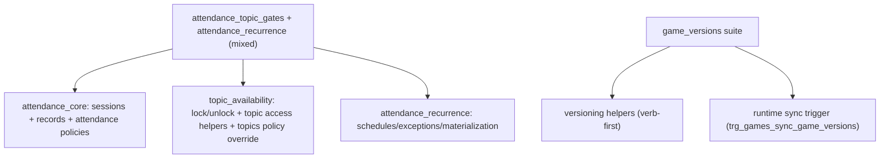

# Rewrite migrations by concern and naming rules

## Objectives

- Fix naming violations in `classroom_course_links_lesson_progress` and `game_versions` objects.
- Split mixed-concern migration suites so each suite owns one domain concern.
- Keep object behavior intact while improving migration readability and maintainability.

## Confirmed implementation mode

- Rewrite existing migration files directly (no new forward-only migration chain).

## Files and target outcomes

- `[/Users/willfryd/Documents/wq-health/supabase/migrations/20260323000002_classroom_course_links_lesson_progress_06_triggers.sql](/Users/willfryd/Documents/wq-health/supabase/migrations/20260323000002_classroom_course_links_lesson_progress_06_triggers.sql)`
  - Remove abbreviated legacy trigger drop aliases (`ccl_*`) and keep only descriptive names.
- `[/Users/willfryd/Documents/wq-health/supabase/migrations/20260323000002_classroom_course_links_lesson_progress_07_rls_policies.sql](/Users/willfryd/Documents/wq-health/supabase/migrations/20260323000002_classroom_course_links_lesson_progress_07_rls_policies.sql)`
  - Remove abbreviated policy drop aliases (`ccl_*`) and keep only descriptive policy names.
- `[/Users/willfryd/Documents/wq-health/supabase/migrations/20260326000003_game_versions_04_functions_rpcs.sql](/Users/willfryd/Documents/wq-health/supabase/migrations/20260326000003_game_versions_04_functions_rpcs.sql)`
  - Rename noun-first helpers to verb-first function names; update all internal callers.
- `[/Users/willfryd/Documents/wq-health/supabase/migrations/20260326000003_game_versions_05_triggers.sql](/Users/willfryd/Documents/wq-health/supabase/migrations/20260326000003_game_versions_05_triggers.sql)`
  - Rename non-conforming trigger name `aaa_games_sync_game_versions` to `trg_games_sync_game_versions` and align drop/create statements.
- `[/Users/willfryd/Documents/wq-health/supabase/migrations/20260326000004_attendance_topic_gates_02_tables.sql](/Users/willfryd/Documents/wq-health/supabase/migrations/20260326000004_attendance_topic_gates_02_tables.sql)`
- `[/Users/willfryd/Documents/wq-health/supabase/migrations/20260326000004_attendance_topic_gates_03_indexes_constraints.sql](/Users/willfryd/Documents/wq-health/supabase/migrations/20260326000004_attendance_topic_gates_03_indexes_constraints.sql)`
- `[/Users/willfryd/Documents/wq-health/supabase/migrations/20260326000004_attendance_topic_gates_04_functions_rpcs.sql](/Users/willfryd/Documents/wq-health/supabase/migrations/20260326000004_attendance_topic_gates_04_functions_rpcs.sql)`
- `[/Users/willfryd/Documents/wq-health/supabase/migrations/20260326000004_attendance_topic_gates_06_triggers.sql](/Users/willfryd/Documents/wq-health/supabase/migrations/20260326000004_attendance_topic_gates_06_triggers.sql)`
- `[/Users/willfryd/Documents/wq-health/supabase/migrations/20260326000004_attendance_topic_gates_07_rls_policies.sql](/Users/willfryd/Documents/wq-health/supabase/migrations/20260326000004_attendance_topic_gates_07_rls_policies.sql)`
  - Rewrite to keep only topic-availability concern in this suite.
- `[/Users/willfryd/Documents/wq-health/supabase/migrations/20260326000005_attendance_recurrence_01_tables.sql](/Users/willfryd/Documents/wq-health/supabase/migrations/20260326000005_attendance_recurrence_01_tables.sql)`
- `[/Users/willfryd/Documents/wq-health/supabase/migrations/20260326000005_attendance_recurrence_02_indexes_constraints.sql](/Users/willfryd/Documents/wq-health/supabase/migrations/20260326000005_attendance_recurrence_02_indexes_constraints.sql)`
- `[/Users/willfryd/Documents/wq-health/supabase/migrations/20260326000005_attendance_recurrence_03_functions_rpcs.sql](/Users/willfryd/Documents/wq-health/supabase/migrations/20260326000005_attendance_recurrence_03_functions_rpcs.sql)`
- `[/Users/willfryd/Documents/wq-health/supabase/migrations/20260326000005_attendance_recurrence_05_triggers.sql](/Users/willfryd/Documents/wq-health/supabase/migrations/20260326000005_attendance_recurrence_05_triggers.sql)`
- `[/Users/willfryd/Documents/wq-health/supabase/migrations/20260326000005_attendance_recurrence_06_rls_policies.sql](/Users/willfryd/Documents/wq-health/supabase/migrations/20260326000005_attendance_recurrence_06_rls_policies.sql)`
  - Rewrite as attendance-only suites: attendance core + attendance recurrence extension, with no topic gating objects.

## Concern split design

## Execution steps

1. Build an object relocation map from current files to target concern files and identify all cross-file references that must be updated.
2. Apply naming fixes first (ccl alias drops, game_versions helper names, trigger rename), then update all dependent SQL references in the same suite.
3. Rewrite `attendance_topic_gates` files to retain only topic-availability tables/indexes/functions/triggers/policies.
4. Rewrite `attendance_recurrence` files to retain attendance core + recurrence extension objects only; remove topic gating logic and avoid duplicate function-name collisions.
5. Re-run repository-wide searches for forbidden names and mixed-concern leftovers; validate trigger/policy/function naming conventions and internal consistency.

## Validation checklist

- No remaining `ccl_*` object names in policy/trigger definitions or drop statements.
- No `aaa_games_sync_game_versions` trigger name remains.
- No noun-first `game_versions_*` helper function names remain where verb-first naming is expected.
- `attendance_topic_gates` suite contains only topic-availability concern.
- `attendance_recurrence` suite contains only attendance core + recurrence concern.
- All rewritten files keep idempotent `DROP IF EXISTS` patterns and valid function/trigger dependencies.

