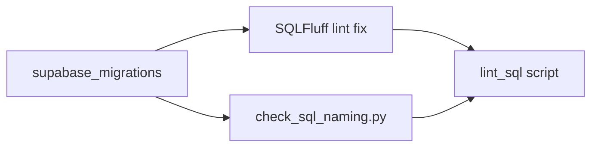

# SQLFluff + naming checks aligned with migrations

## Context

- Existing config: [.sqlfluff](.sqlfluff) — `dialect = postgres`, `max_line_length = 100`, `exclude_rules = LT05`, capitalisation (keywords upper, identifiers/functions lower, literals/types upper), 2-space indent, `indented_joins = True`.
- Existing ignore: [.sqlfluffignore](.sqlfluffignore) — `.supabase/`, `node_modules/`, `dist/` (does **not** ignore migrations; good).
- Existing script: [scripts/check_sql_naming.py](scripts/check_sql_naming.py) — regex checks for `CREATE TRIGGER` (`trg_`*), indexes (`idx_*`), functions (bans `fn_`/`do_`/`tmp_`), policies (min 3 `_` segments), and bad abbreviations (`ca_`, `ccl_`, …).
- **Naming doc path:** use [docs/architecture/db_naming_convention.md](docs/architecture/db_naming_convention.md) (there is no `docs/db_naming_convention.md` unless you add a stub link).
- **No Python dev deps** in repo today; [package.json](package.json) has no `sqlfluff` script. SQLFluff is normally installed via **pip** ([Getting started](https://docs.sqlfluff.com/en/stable/gettingstarted.html)).

## 1. Install and baseline SQLFluff

- Add `**requirements-dev.txt`** (pinning `sqlfluff` (e.g. `sqlfluff>=3,<5` — adjust after testing).
- Run once locally:
`sqlfluff lint supabase/migrations --dialect postgres`
- **Expect parser/limit noise** on some Supabase/Postgres-14+ forms (e.g. `EXECUTE FUNCTION` in triggers, heavy `DO $$` blocks, `storage.objects` policies). Use outcomes to tune `exclude_rules` or file-level `-- noqa` only where the dialect cannot parse cleanly (per [Ignoring errors & files](https://docs.sqlfluff.com/en/stable/configuration/ignoring_configuration.html)).

## 2. Update [.sqlfluff](.sqlfluff) (design + naming alignment)

Map **db_design_principles** and **naming** to SQLFluff where rules exist; avoid pretending SQLFluff enforces RLS or tenant rules (it does not).

| Intent (from docs)                        | SQLFluff lever                                                                                                                                                                                 |
| ----------------------------------------- | ---------------------------------------------------------------------------------------------------------------------------------------------------------------------------------------------- |
| Consistent layout / readability           | Keep indentation; adjust `max_line_length` if 100 fights migration banners (or keep and exclude LT05-related layout rules as needed).                                                          |
| Keywords vs identifiers (readable SQL)    | Keep current capitalisation blocks; verify `timestamptz` / `uuid` vs `TIMESTAMPTZ` — may need rule tweaks if CP rules fight Postgres idioms.                                                   |
| Explicit joins (anti implicit comma join) | Enable / keep structure rules that flag comma joins if not already (verify rule IDs for your SQLFluff version in [rules reference](https://docs.sqlfluff.com/en/stable/reference/rules.html)). |
| `SELECT `* discouraged                    | Enable **ST06** / star rules if available for dialect (optional: can be noisy in seed snippets—scope lint to `migrations/` only).                                                              |

Concrete edits:

- Document in a comment block at top of `.sqlfluff` (or in README) which **db_design** items SQLFluff covers vs `**check_sql_naming.py`** vs **manual review** (RLS, `institution_id`, GDPR).
- After baseline lint: set `**exclude_rules`** to a minimal stable set for known false positives (version-specific); avoid blanket disabling large bundles.

## 3. Update [.sqlfluffignore](.sqlfluffignore)

- **Keep** `.supabase/` (generated local stack).
- **Optionally add** `supabase/snippets/` if those SQL files are ad-hoc seeds and would create endless layout churn; migrations remain the **source of truth** for style. If snippets should match repo standards, **do not** ignore them—instead fix or noqa.
- **Do not** ignore `supabase/migrations/`.

## 4. Extend [scripts/check_sql_naming.py](scripts/check_sql_naming.py)

Align with [docs/architecture/db_naming_convention.md](docs/architecture/db_naming_convention.md) sections not yet covered:

| Convention                    | Proposed check                                                                                                                                                                                                                                                                      |
| ----------------------------- | ----------------------------------------------------------------------------------------------------------------------------------------------------------------------------------------------------------------------------------------------------------------------------------- |
| `fk_{from_table}_{to_table}`  | Regex `CONSTRAINT\s+(fk_[a-z0-9_]+)\s+FOREIGN KEY` — warn if name does not start with `fk`_ (optional: allow known legacy exceptions list).                                                                                                                                         |
| `uq_{table}_{column}`         | Same for `UNIQUE` / `CONSTRAINT uq_`.                                                                                                                                                                                                                                               |
| `chk_{table}_{rule}`          | Same for `CHECK` / `CONSTRAINT chk_`.                                                                                                                                                                                                                                               |
| RLS `{table}_{action}_{role}` | Extend `POLICY_RE` to strip quotes; optional allowlist for `*_all_super_admin` / `*_all_institution_admin` as valid `action` = `all`.                                                                                                                                               |
| Trigger length heuristic      | Current `len(name.split("_")) < 4` is brittle for short tables (e.g. `trg_tasks_set_updated_at`). Prefer: must match `^trg_[a-z0-9_]+_[a-z0-9_]+$` with at least **3** segments **after** `trg` **or** document minimum as `trg_<table>_<purpose>` with purpose multi-word allowed. |

Implementation notes:

- Use **one pass** per file; keep script **fast** and **dependency-free** (no SQL parse lib).
- Exit non-zero on violation; print `file:line` if easy (optional enhancement).
- Add `**if __name__ == "__main__"`** usage line in [README.md](README.md) or `docs/architecture` pointer (single paragraph).

## 5. Wire npm / CI

- Add `**lint:sql`** to [package.json](package.json) scripts, e.g.  
`"lint:sql": "sqlfluff lint supabase/migrations --dialect postgres && python3 scripts/check_sql_naming.py"`  
(assumes `sqlfluff` on PATH from venv or `python3 -m sqlfluff`).
- Optionally add `**format:sql`**: `sqlfluff fix supabase/migrations --dialect postgres` (use carefully: review diffs; migrations are append-only history—**fix** is still OK on working tree before commit).
- **lint-staged:** optionally `*.sql` in `supabase/migrations` → `sqlfluff lint` (only staged files) + naming script (full dir is simpler for naming).

## 6. Documentation touchpoints

- Short subsection under [docs/architecture/db_design_principles.md](docs/architecture/db_design_principles.md) “Tooling” or “Migrations”: SQLFluff scope + `check_sql_naming.py` + command to run.
- Optional: one-line stub `**docs/db_naming_convention.md`** linking to `architecture/db_naming_convention.md` so `@docs/db_naming_convention.md` resolves (only if you want that path to exist).

## 7. Verification checklist

- `sqlfluff lint supabase/migrations` exits 0 after tuning (or documented acceptable non-zero with ticket to fix).
- `python3 scripts/check_sql_naming.py` exits 0 on current tree (adjust regex before merge if new constraint checks flag intentional legacy).
- No accidental lint of `node_modules` / `.supabase` (confirm `.sqlfluffignore`).

## Risk / trade-off

- **SQLFluff is not a semantic validator** — it will not enforce `institution_id`, RLS, or migration ordering from db_design; the script only covers **naming patterns**. Semantic review stays in review + `supabase db reset` / tests.
- **First lint may be large**; prefer incremental `sqlfluff fix` + small PR or time-boxed exclude list, then tighten.

