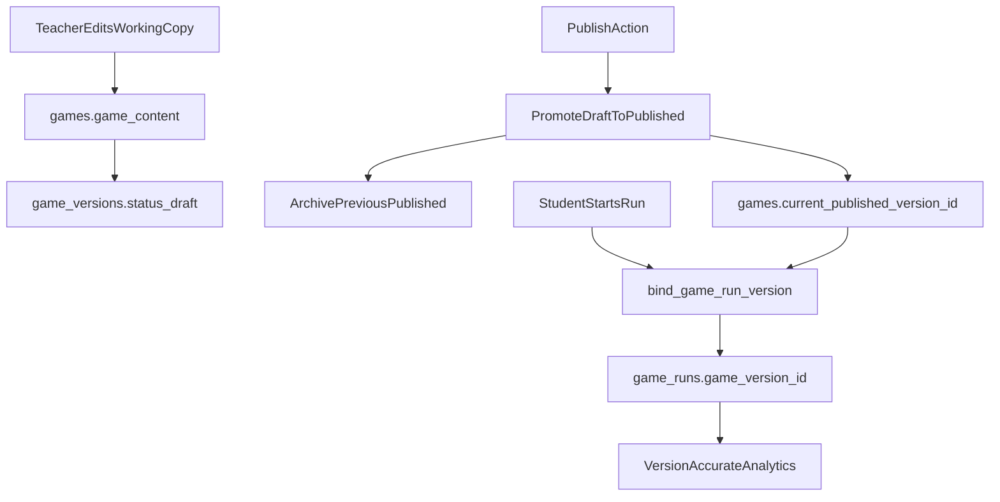

# Version Truth Hardening Plan

## Goal

Align DB behavior with the intended model: `games` is a container, `game_versions` owns publish lifecycle, `game_runs` remain permanently tied to the exact played version, and RLS reflects pointer/version truth only.

## Scope and Files

- Update versioning constraints in `[/Users/willfryd/Documents/wq-health/supabase/migrations/20260326000003_game_versions_02_indexes_constraints.sql](/Users/willfryd/Documents/wq-health/supabase/migrations/20260326000003_game_versions_02_indexes_constraints.sql)`.
- Refactor publish-state logic in `[/Users/willfryd/Documents/wq-health/supabase/migrations/20260326000003_game_versions_04_functions_rpcs.sql](/Users/willfryd/Documents/wq-health/supabase/migrations/20260326000003_game_versions_04_functions_rpcs.sql)`.
- Rebase published visibility policies in `[/Users/willfryd/Documents/wq-health/supabase/migrations/20260326000003_game_versions_06_rls_policies.sql](/Users/willfryd/Documents/wq-health/supabase/migrations/20260326000003_game_versions_06_rls_policies.sql)`.
- If needed for legacy compatibility, add follow-up policy cleanup migration after `[/Users/willfryd/Documents/wq-health/supabase/migrations/20260323000001_baseline_lms_rls_memberships_07_rls_policies.sql](/Users/willfryd/Documents/wq-health/supabase/migrations/20260323000001_baseline_lms_rls_memberships_07_rls_policies.sql)`.
- Validate choices against `[/Users/willfryd/Documents/wq-health/docs/architecture/db_guide_line_en.md](/Users/willfryd/Documents/wq-health/docs/architecture/db_guide_line_en.md)`.

## Planned Changes

1. **Preserve run history at FK level**

- Replace `fk_game_runs_game_version` delete action from `ON DELETE CASCADE` to `ON DELETE RESTRICT` (or `NO ACTION`) so deleting a referenced version is blocked instead of deleting historical runs.
- Keep composite FK `(game_id, game_version_id)` to preserve same-game integrity.

1. **Make pointer/version the only publish truth**

- Refactor `sync_games_game_versions()` so publish/unpublish behavior is driven by version rows and `games.current_published_version_id`, not `games.status` transitions.
- Keep `games.game_content` as mutable working copy mirror.
- Treat container lifecycle (`games.status` / `archived_at`) separately from publish lifecycle; publish lifecycle remains in `game_versions.status`.

1. **Add invariant guard for pointer correctness**

- Add a DB guard (trigger validation in existing lifecycle function or dedicated check trigger) enforcing that `games.current_published_version_id` points to:
  - a `game_versions` row with matching `game_id`, and
  - `game_versions.status = 'published'`.
- This prevents policy drift and simplifies auditing.

1. **Rework RLS to pointer/version-based checks**

- Update `games_select_authenticated_published` to drop dependency on `games.status = 'published'`.
- Base published visibility on `current_published_version_id IS NOT NULL` plus institution membership constraints; optionally verify linked version status is `published` via `EXISTS` join.
- Keep `game_versions` read policies so historical runs can still resolve exact versions.

1. **Compatibility mirrors and rollout safety**

- Keep `games.published_version`, `games.is_draft`, and `games.published_at` as compatibility mirrors only while app code transitions.
- Ensure backfill logic no longer infers publish truth from legacy `games.status` except as one-time bootstrap fallback.

## Validation Checklist

- Migration executes cleanly in order (tables → constraints → functions → triggers → policies).
- Existing runs remain after attempted deletion of referenced version row (expected FK block).
- New run inserts auto-bind to published pointer (or latest fallback when explicitly designed).
- Published game reads work with pointer-based policy even when `games.status` is non-publish container state.
- No policy regression for teacher/institution-admin/member access paths.

## Data Flow (Post-change)

## Notes

- If March migrations are already applied in shared/prod DBs, implement this as a new forward migration instead of editing applied files in place to avoid migration drift.
- This plan follows the DB guide’s explicit-FK and RLS-as-final-enforcement principles, and strengthens immutable auditability for game history.

