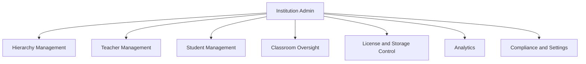
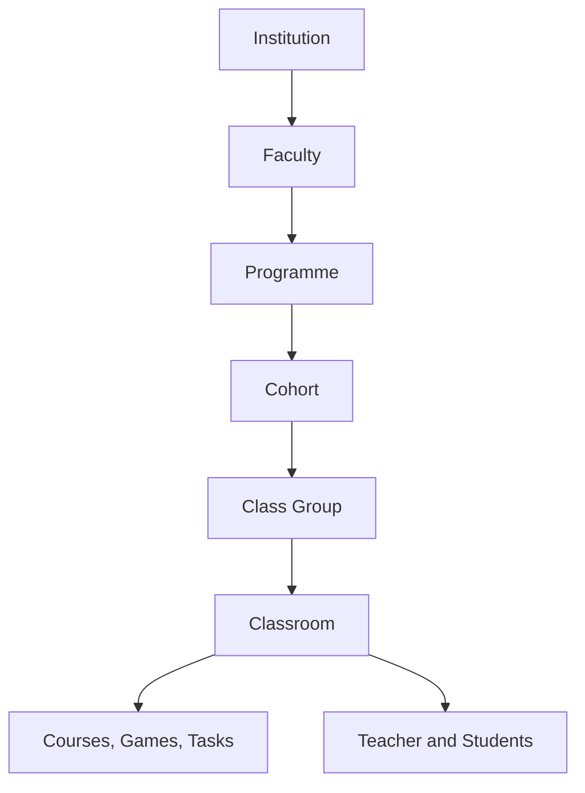

# Institution

## Functional feature map

This document defines what Institution Admin must implement for school operations:

1. Dashboard and institution health signals
2. Hierarchy management (faculty, programme, cohort, class group)
3. Class Room oversight
4. Teacher management
5. Student management
6. Course and game governance
7. Analytics and intervention signals
8. License and storage control
9. Billing operations
10. Settings and compliance

### Visual: institution admin control scope



---

## Functional areas

### 1) Dashboard

Purpose: fast health signal for the institution.

Must show:

- seat pressure
- storage pressure
- active/inactive users
- overdue classroom work signals
- expiry and renewal signals

Design principle: insight first, drill-down second.

### 2) Hierarchy management

Purpose: define the real-world school structure once, reuse everywhere.

Canonical visual to show users how structure works:

```text
Schule für Farbe und Gestaltung
└── Ausbildung (faculty)
    ├── Maler & Lackierer (programme, 3yr, year_group)
    │   ├── Jahrgang 2022 (cohort, archived)
    │   ├── Jahrgang 2023 (cohort, active)
    │   │   ├── ML-3A (class group, 28 students)
    │   │   └── ML-3B (class group, 26 students)
    │   └── Jahrgang 2024 (cohort, active)
    │       └── ML-1A (class group, 30 students)
    └── GVM (programme, 3yr, year_group)
        └── ...
└── Berufskolleg (faculty)
    ├── TBK I (programme, 1yr, stage)
    │   └── TBK1-A (class group, 22 students)
    └── TBK II (programme, 1yr, stage)
        └── TBK2-A (class group, 20 students)
```

Managed entities:

- faculty
- programme
- cohort / year group
- class group

Expected capabilities:

- create, edit, archive lifecycle
- clear assignment boundaries
- cohort progression handling
- class-group movement for students

This is the highest-priority area because every classroom and enrollment depends on it.

### Visual: structural hierarchy



### 3) Class Room oversight

Purpose: observe and govern classrooms created by teachers.

Must support:

- filter by teacher, faculty, programme, class group
- view activity and assignment signals
- reassign classroom ownership when staffing changes
- deactivate classroom while preserving history

Institution Admin visibility is broad; editing classroom pedagogy remains teacher-led.

### 4) Teacher management

Purpose: ensure teaching capacity and correct access scope.

Must support:

- teacher invite and activation
- faculty/programme assignment
- role deactivation without data loss
- safe ownership transfer of classrooms/content

### 5) Student management

Purpose: maintain accurate learner roster quality.

Must support:

- manual add
- bulk import workflow
- class-group reassignment
- account deactivation and reactivation
- personal-data export and deletion requests

### 6) Courses and games oversight

Purpose: governance and safety, not day-to-day editing.

Must support:

- visibility into published and draft content
- emergency unpublish actions
- institution-level highlighting or curation controls
- storage impact visibility by content area

### 7) Analytics

Purpose: institution decisions, not raw data browsing.

Focus signals:

- engagement health
- completion health
- teacher activity and output consistency
- risk clusters (drop-off, inactivity, overdue work)

Output should guide interventions (which class, which teacher support, which student cohort).

### 8) License and storage control

Purpose: keep operations within purchased capacity.

Rules:

- seats are finite and role-scoped
- storage is institution-pooled
- hard-stop on institution storage exhaustion
- warning-first behavior on user-level soft thresholds

Must include clear warning states and escalation path before hard blocks are reached.

### 9) Billing operations

Purpose: local financial transparency and renewal workflow.

Must support:

- current plan visibility
- invoice history
- payment status clarity
- upgrade and downgrade request flows

Institution Admin triggers flows; payment processing remains externalized.

### 10) Settings and compliance

Purpose: legal and operational control plane for the institution.

Must support:

- profile and locale configuration
- retention policy selection
- data export and deletion workflows
- notification policy defaults
- institution-level feature toggles from allowed global catalog

---

## Tenant security and compliance rules

1. All operations remain scoped to one institution.
2. Institution Admin cannot access other tenant data.
3. Auditability is required for role, policy, and visibility changes.
4. GDPR operations must be executable and traceable.
5. Classroom and learner history must survive deactivation events unless legally deleted.

---

## Build priority

1. Hierarchy management
2. Teacher lifecycle and assignment
3. Student import and reassignment
4. Classroom oversight
5. Seat and storage enforcement
6. Institution dashboard insights
7. Compliance workflows (export/delete/retention)

---
