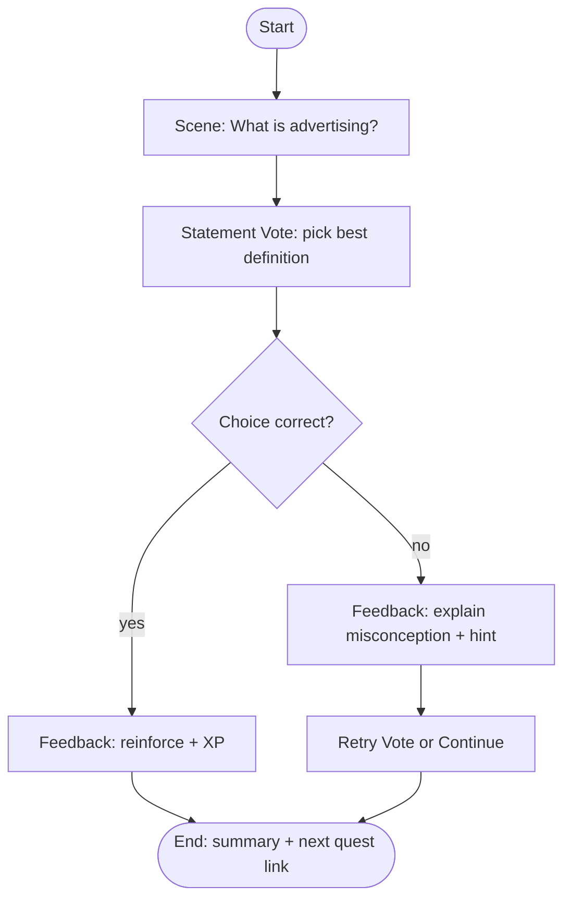
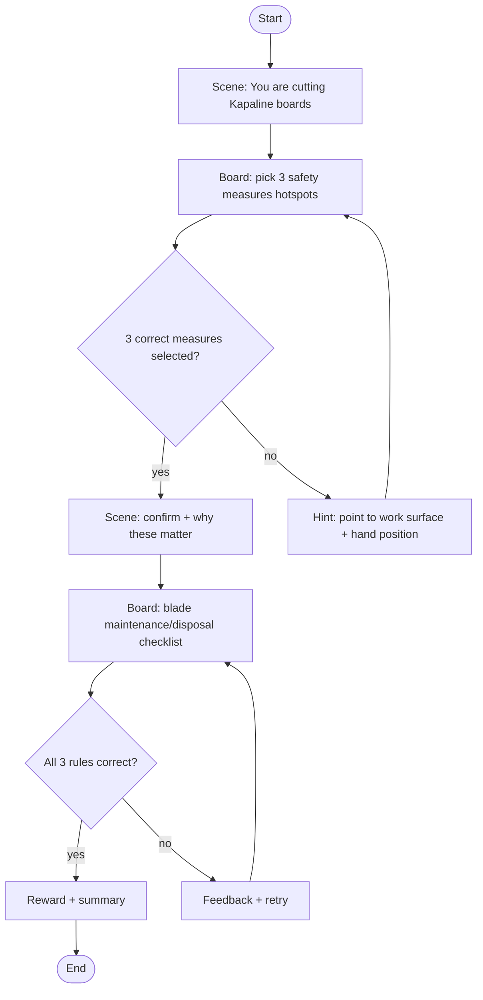
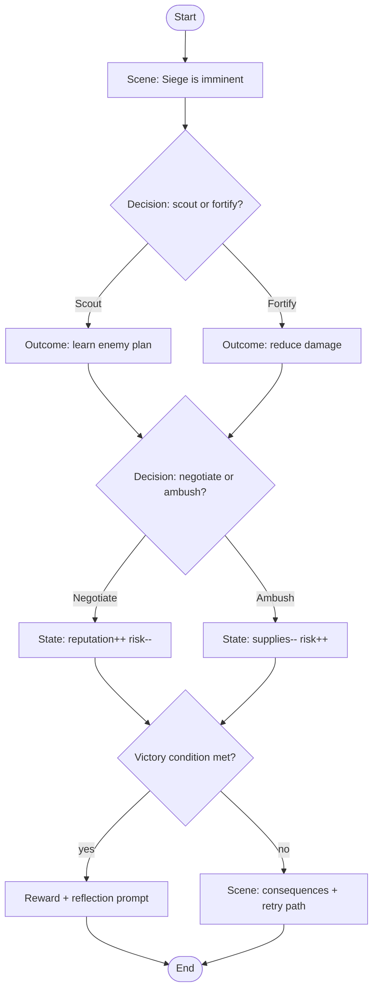

# WQ Game Design Instruction File for AI Agents

## Executive summary

WQ should treat “game design” as a **content + interaction spec** that compiles into a **runtime graph** (games) and a **home UI** (discovery). The highest-leverage decision is to standardize on a **directed node/edge graph** as the single source of truth (authoring), and allow multiple **runtime renderers** (chat, hotspot board, sort/drag, decision simulation, quest/story) to interpret that same graph. This mirrors how Duolingo used a linear “path” to guide learners step-by-step and reduce navigation ambiguity, explicitly motivated by learning science (spaced repetition, interleaving, guided sequencing).

From controlled research syntheses, gamification tends to show **small positive effects** on learning-related outcomes on average—helpful, but not magical—so WQ should prioritize mechanics that are tightly coupled to learning objectives (feedback, retrieval practice, spaced revisits) rather than “points-only” surface gamification.

For UI, the safest default home screen is a **Bento-style grid / Journey cards** (high discoverability, accessibility, and performance). A **2D Situation Board** (pan/zoom over a background with hotspots) should be the primary “map-like” learning surface because it is implementable with DOM/SVG and is friendlier to accessibility and reduced-motion modes than fully 3D globes. If you add 3D, treat it as an **optional mode** with a strong reduced-motion fallback and “render on demand” principles.

Security and privacy are requirements, not add-ons: WQ’s multi-tenant scope must be enforced “defense-in-depth” at the database layer (e.g., row-level policies) and the app layer must avoid cross-tenant IDOR-style mistakes. GDPR principles (purpose limitation, data minimization, security of processing, privacy by default) should shape event logging and analytics.

---

## Goals and constraints for WQ game design

### Learning outcomes and pedagogy constraints

WQ game designs should explicitly declare **what observable learning outcome** they target (e.g., “identify correct PPE steps,” “apply safety rules in context,” “choose a compliant action”). The game mechanic must _force retrieval_ or decision-making aligned to that outcome, not just recognition.

Key evidence-backed design constraints:

- Prefer **retrieval practice**: tests/quizzes (with feedback) can improve long-term retention compared with additional study alone.
- Prefer **spaced revisits** over massed practice: distributed practice shows robust benefits across many experiments; optimal spacing depends on the retention interval.
- Use gamification selectively: meta-analyses report **small positive effects** on cognitive/motivational/behavioral learning outcomes, with variability by context and implementation.
- When guidance matters, provide a **clear next step**: Duolingo’s redesign framed a path that guides learners step-by-step and intersperses review, grounded in spaced repetition/interleaving logic.

### Accessibility and inclusion constraints

WQ games must be playable with keyboard, screen readers (where feasible), and reduced-motion preferences.

Hard constraints to bake into every game spec:

- **Target sizes**: interactive targets should be at least **24×24 CSS pixels** (or meet spacing/equivalent exceptions). This is especially relevant for hotspot boards and dense “map” UIs.
- **Animation from interactions**: non-essential animations triggered by interaction must be avoidable/disabled for users who reduce motion.
- **Choice controls**: for single-choice votes/polls, use a radio-group semantic model (only one option checked).

### Performance constraints

WQ must feel fast in low-end devices and high-content courses. Use perceived-performance patterns:

- Skeleton screens reduce perceived wait by providing a wireframe-like placeholder and helping users build a mental model of the page structure.
- Use optimistic UI for actions like “submit answer,” “unlock node,” “claim reward,” where server confirmation can arrive slightly later. React 19 provides `useOptimistic` and Actions patterns for consistent optimistic updates with pending/error handling.

### GDPR/privacy and multi-tenant data scoping constraints

WQ should declare privacy constraints in every game spec (what events are logged, retention, pseudonymization). GDPR principles relevant to a gamified learning platform:

- **Purpose limitation + data minimisation**: collect only what is necessary for the learning/product purpose.
- **Security of processing**: implement appropriate technical/organizational measures, including testing/evaluating security controls.

For multi-tenancy:

- OWASP emphasizes tenant-context management and risks like cross-tenant leakage and IDOR.
- Enforce isolation at the database layer with row policies (enable row security, define policies, default deny when no policy applies).
- If using Supabase-style browser access, RLS “must always be enabled” on exposed schemas and provides defense-in-depth, with access blocked until policies exist.

---

## Game types and UI patterns for WQ

### Core game types WQ should standardize

WQ should support a small set of “primitives” that cover most learning tasks and can be composed into quests (graphs):

**Chat-based** (conversation loop)
Best for reflection, short reasoning, narrative, and “micro-lessons.” Use quick replies for controlled answers.

**Statement Vote / Poll** (single-choice, optionally timed)
Best for conceptual checks and opinion prompts before teaching. Must support “reveal rationale” and follow-up micro-explanations.

**Hotspot / Situation Board** (2D canvas-like board with interactive regions)
Best for safety tasks, procedural order, “spot the hazard,” and spatial reasoning.

**Sort/Drag** (categorize steps/items)
Best for procedural ordering (e.g., PPE sequence), classification, and “match with explanation.”

**Decision Simulation** (branching scenario with consequences)
Best for compliance training, customer scenarios, operational decision-making; should model state (risk, time, resources).

**Story/Quest** (macro wrapper)
A quest is a graph of scenes + games + rewards. Duolingo-like guided sequencing is beneficial when learners are uncertain where to go next.

### Home and navigation UI patterns

WQ has three candidate “world” metaphors. The recommendation is to **ship Bento + Journey cards first**, and treat 3D as optional.

#### Bento grid home

A grid of “worlds” (courses/chapters) and “cards” (quests/games). This is the most stable IA: it is searchable, scannable, and easy to make accessible.

#### Journey cards home

A vertical or paginated “path” of modules where each step is a card (like a mission). This aligns with “clear next best step.” Duolingo’s path design specifically aimed to reduce learner confusion and guide practice with spaced repetition.

#### 2D map-like home (optional)

A stylized 2D map (not geographic) with nodes and regions. This can be implemented as an image/SVG background + hotspots and pan/zoom. Leaflet explicitly supports non-geographical maps with `CRS.Simple` and overlays like `ImageOverlay` for a “game map” style.

#### 3D globe home (optional mode)

3D is high engagement but high complexity. If you choose it, treat it as a **secondary view** with a full 2D fallback. Apple’s guidance warns against gratuitous animation and requires minimized animations when Reduce Motion is enabled.
If implemented with a 3D engine, follow “render on demand” ideas (avoid continuous rendering when nothing changes to save power/battery).

### UI pattern comparison table

| Attribute       |      Bento grid home |                   2D “map” home (pan/zoom) |                      3D globe home (WebGL) |
| --------------- | -------------------: | -----------------------------------------: | -----------------------------------------: |
| Discoverability | High (scan + search) |                           Medium (explore) |               Medium (novelty can obscure) |
| Performance     |                 High |         Medium–High (DOM/SVG + transforms) | Variable; can be costly, especially mobile |
| Dev cost        |           Low–Medium |                                     Medium |                                       High |
| Accessibility   |                 High | Medium (hotspot density risk; target size) | Lowest by default; needs careful fallbacks |
| Engagement      |               Medium |                                       High |                 Very high (when done well) |

Target-size and motion constraints tend to be easiest to guarantee in Bento/Journey UIs, while dense maps/globes require stricter interaction sizing and reduced-motion alternatives.

### Interaction patterns WQ should standardize

- **Hotspots**: always provide a list-based alternative (“Hazard list”) for keyboard/screen-reader navigation, and ensure minimum target sizing or spacing exceptions.
- **Chat bubbles**: quick replies should map to radio-group semantics for single choice.
- **Optimistic UI**: submit → show “locked in” state immediately; rollback on error. React 19 supports optimistic patterns via `useOptimistic` and Actions.
- **Skeleton loading**: use for full-screen loads; avoid for <1s loads to prevent flashing.
- **Motion**: design micro-animations to be interruptible and reversible (don’t trap); treat motion as functional feedback, not decoration.
- **Animation timing**: prefer natural easing and short durations (~200–300ms for UI transitions) and keep motion consistent.

---

## Authoring vs runtime separation

### Why separation is critical

To be “AI-ready,” WQ needs a stable boundary:

- **Authoring (editor)**: people + AI create graphs, copy, assets, scoring logic, and conditions.
- **Runtime (player)**: a deterministic engine executes the graph, renders nodes, records events, and enforces tenant/privacy constraints.

This separation enables iteration: AI can generate graphs and content without touching runtime code, and engineers can harden runtime logic once.

### Recommended authoring mechanics with React Flow

Use React Flow for the authoring canvas:

- `Node` supports arbitrary `data` for custom node payloads and includes accessibility hooks like `ariaLabel`.
- React Flow provides `ReactFlowJsonObject` as a JSON-compatible representation of a flow (nodes, edges, viewport), explicitly intended to be saved/loaded from a database.

WQ should store **authoring graphs** as ReactFlowJsonObject plus WQ metadata (tenant, course, version, validation status).

### Runtime compilation concept

Define a compile step:

`ReactFlowJsonObject (authoring)` → `WQRuntimeGraph (validated)` → `Runtime Engine`

Compilation should:

- validate node schemas,
- normalize IDs,
- precompute adjacency lists,
- verify there is exactly one start node,
- ensure each choice edge has a resolvable condition,
- generate a “content manifest” for localization.

---

## Data model, schema, and runtime execution

### Runtime graph model

A minimal but extensible model for WQ games:

- **Nodes**: typed units of interaction (“chat prompt”, “poll”, “board”, “reward”, “end”).
- **Edges**: transitions with optional conditions, priority, and side effects.
- **State**: learner/session variables (score, inventory, flags, lastAnswer).
- **Rewards**: XP, items, unlocks.
- **Events**: analytics logs (view, answer, success/fail, time spent).

This maps well to decision simulations and quests, and also matches what React Flow naturally expresses (nodes + edges).

### Mapping from React Flow node types to WQ runtime JSON schema

React Flow’s `Node.type` supports built-in defaults and custom node types.
WQ should define a canonical set of node types:

| React Flow `node.type`   | WQ runtime `kind` | Primary UI renderer | Expected outputs         |
| ------------------------ | ----------------- | ------------------- | ------------------------ |
| `input` / custom `start` | `start`           | none                | none                     |
| custom `scene`           | `scene`           | SceneCard           | (optional) `ack`         |
| custom `chat`            | `chatPrompt`      | ChatThread          | `text` or `choiceId`     |
| custom `poll`            | `statementVote`   | PollCard / ChatPoll | `choiceId`               |
| custom `board`           | `situationBoard`  | Board2D             | `hotspotId[]`, `order[]` |
| custom `sort`            | `sortDrag`        | SortDrag            | `mapping` / `order`      |
| custom `decision`        | `decisionSim`     | DecisionHUD         | `choiceId`, state deltas |
| custom `reward`          | `reward`          | RewardToast         | none                     |
| `output` / custom `end`  | `end`             | Summary             | none                     |

### Suggested WQ runtime JSON (schema sketch)

```json
{
  "schemaVersion": "1.0",
  "tenantId": "t_123",
  "courseId": "c_wars_01",
  "gameId": "g_cutter_safety_001",
  "startNodeId": "n_start",
  "nodes": [
    {
      "id": "n_poll_1",
      "kind": "statementVote",
      "payload": {
        "prompt": "Which protective measures matter most when using a cutter?",
        "options": [
          { "id": "o1", "label": "Cut away from the body + stable cutting mat" },
          { "id": "o2", "label": "Work faster to reduce exposure time" },
          { "id": "o3", "label": "Hold material in the air for flexibility" }
        ],
        "singleChoice": true,
        "shuffleOptions": false
      },
      "scoring": {
        "correctOptionIds": ["o1"],
        "xpOnCorrect": 10,
        "xpOnWrong": 2
      }
    }
  ],
  "edges": [
    {
      "id": "e1",
      "from": "n_poll_1",
      "to": "n_feedback_1",
      "when": { "eq": [{ "var": "last.choiceId" }, "o1"] },
      "priority": 10
    }
  ],
  "privacy": {
    "analyticsLevel": "pseudonymous",
    "retentionDays": 365
  }
}
```

**Condition representation**: use a small JSON predicate format (`eq`, `and`, `or`, `var`) to keep evaluation deterministic and avoid arbitrary code execution.

### TypeScript runtime resolver example

The resolver:

1. renders current node,
2. records output into state,
3. selects the next edge whose `when` evaluates true (highest priority),
4. applies side effects/rewards,
5. emits analytics events.

```ts
type WQVarRef = { var: string }

type WQPredicate =
  | { eq: [WQVarRef | string | number | boolean, WQVarRef | string | number | boolean] }
  | { and: WQPredicate[] }
  | { or: WQPredicate[] }
  | { not: WQPredicate }
  | { always: true }

type WQEdge = {
  id: string
  from: string
  to: string
  when?: WQPredicate
  priority?: number
  effects?: Array<{ op: 'incXP'; amount: number } | { op: 'setFlag'; key: string; value: boolean }>
}

type WQNode =
  | { id: string; kind: 'start'; payload?: {} }
  | {
      id: string
      kind: 'statementVote'
      payload: { prompt: string; options: { id: string; label: string }[] }
    }
  | { id: string; kind: 'scene'; payload: { title: string; body: string } }
  | { id: string; kind: 'end'; payload?: { summary?: string } }

type WQGraph = { startNodeId: string; nodes: WQNode[]; edges: WQEdge[] }

type WQState = {
  xp: number
  flags: Record<string, boolean>
  last: { choiceId?: string; text?: string }
}

function getVar(state: WQState, ref: WQVarRef): unknown {
  const path = ref.var.split('.')
  let cur: any = state
  for (const p of path) cur = cur?.[p]
  return cur
}

function evalAtom(state: WQState, v: WQVarRef | string | number | boolean): unknown {
  return typeof v === 'object' && v !== null && 'var' in v ? getVar(state, v as WQVarRef) : v
}

function evalPred(state: WQState, pred?: WQPredicate): boolean {
  if (!pred) return true // default edge
  if ('always' in pred) return true
  if ('eq' in pred) {
    const [a, b] = pred.eq
    return evalAtom(state, a) === evalAtom(state, b)
  }
  if ('and' in pred) return pred.and.every((p) => evalPred(state, p))
  if ('or' in pred) return pred.or.some((p) => evalPred(state, p))
  if ('not' in pred) return !evalPred(state, pred.not)
  return false
}

function applyEffects(state: WQState, effects: WQEdge['effects']): WQState {
  if (!effects?.length) return state
  let next = { ...state, flags: { ...state.flags }, last: { ...state.last } }
  for (const e of effects) {
    if (e.op === 'incXP') next.xp += e.amount
    if (e.op === 'setFlag') next.flags[e.key] = e.value
  }
  return next
}

function nextNode(
  graph: WQGraph,
  state: WQState,
  currentNodeId: string,
): { nextId: string | null; state: WQState } {
  const outgoing = graph.edges
    .filter((e) => e.from === currentNodeId)
    .sort((a, b) => (b.priority ?? 0) - (a.priority ?? 0))

  const chosen = outgoing.find((e) => evalPred(state, e.when))
  if (!chosen) return { nextId: null, state }
  return { nextId: chosen.to, state: applyEffects(state, chosen.effects) }
}
```

### Security notes for the runtime

- Do **not** allow arbitrary JavaScript conditions in authored graphs; keep conditions declarative to avoid code injection.
- Tenant scoping must be enforced at DB level with row security policies and at service/API level by binding tenant context early and never trusting client-supplied tenant IDs.
- Apply least-privilege: grant only minimum permissions required for each service/role.
- Treat analytics as personal-data-adjacent: minimize, pseudonymize, and retain only as long as needed.

---

## AI one-page instruction template and concrete examples

### One-page template AI agents must follow

Use this as the **only required format** for “generate a new WQ game from a brief.”

```yaml
WQ_GAME_SPEC:
  meta:
    tenant_scope: "<tenantId or 'template'>"
    course_id: '<courseId>'
    game_id: '<unique-id>'
    title: '<short title>'
    theme: '<e.g., wars+sorcery | neutral>'
    difficulty: '<easy|medium|hard>'
    estimated_time_sec: <number>

  learning:
    objective: '<single measurable objective>'
    prerequisites: ['<concept1>', '<concept2>']
    mastery_criteria:
      - '<what must user do correctly to pass>'
    feedback_strategy:
      correct: '<1–2 sentence reinforcement>'
      incorrect: '<1–2 sentence correction + hint>'
    spacing_hooks:
      revisit_flags: ['<flag names to revisit later>'] # spaced repetition hooks

  accessibility:
    keyboard_path: '<how to complete without pointer>'
    reduced_motion: '<what animations are removed/replaced>'
    min_target_size_px: 24 # WCAG 2.5.8 baseline
    alt_paths:
      - '<list-based alternative to hotspots>'
      - '<text-only fallback for 3D/visual>'

  privacy_and_tenanting:
    data_minimization: '<what you log and why>'
    analytics_level: '<none|pseudonymous|identified>'
    retention_days: <number>
    tenant_isolation_notes: '<how scope is enforced>'

  runtime_graph:
    start_node_id: '<id>'
    nodes:
      - id: 'n1'
        kind: '<scene|chatPrompt|statementVote|situationBoard|sortDrag|decisionSim|reward|end>'
        payload: { ... }
        scoring: { ... } # optional
        emits_events: ['game.node_view', 'game.answer_submit'] # optional
    edges:
      - id: 'e1'
        from: 'n1'
        to: 'n2'
        when: { ... } # optional predicate
        priority: 0
        effects: [{ op: 'incXP', amount: 10 }]

  ui_rendering:
    primary_surface: '<chat|board|cards>'
    loading_states:
      skeleton: '<what skeleton looks like>'
      optimistic: '<what updates instantly>'
    motion:
      entrance_ms: 200
      exit_ms: 200
      easing: '<ease-out or spring-like>'
    assets:
      images: []
      audio: []
      svg: []
```

This template encodes: learning alignment, accessibility, GDPR-minimization, tenant scoping, and an implementable runtime graph. It also encourages spaced repetition hooks and controlled feedback loops.

---

### Example game design: Statement Vote

**Use case**: warm-up misconception check before teaching.

**Game spec excerpt**

- Objective: Learner identifies correct principle (e.g., “advertising in a market economy informs/differentiates, not ‘forces’ purchase”).
- Mechanic: single-choice vote + immediate reveal + rationale.
- Reward: small XP; larger XP if correct on first try.

**Mermaid flowchart**



**Accessibility notes**

- Render the poll using radio semantics (single choice).
- Ensure targets are large enough for touch and keyboard focus.

---

### Example game design: Cutter Safety 2D Situation Board

**Use case**: procedural safety + hazard spotting around “cutting rectangular plates with a cutter.”

**Task content (from your prompt)**

- 8.1: list three protective measures when handling the cutter
- 8.2: list three rules for maintenance/disposal of blades

**Mermaid flowchart**



**2D SVG wireframe asset**

Wireframe asset: the SVG below is the canonical reference (no separate file in-repo).

SVG markup (wireframe-level; safe to edit):

```svg
<svg xmlns="http://www.w3.org/2000/svg" width="1400" height="900" viewBox="0 0 1400 900">
  <defs>
    <style>
      .title { font: 700 34px Arial, sans-serif; fill: #1f2937; }
      .subtitle { font: 600 22px Arial, sans-serif; fill: #374151; }
      .body { font: 500 18px Arial, sans-serif; fill: #374151; }
      .small { font: 500 16px Arial, sans-serif; fill: #4b5563; }
      .label { font: 700 18px Arial, sans-serif; fill: #111827; }
      .pill { font: 700 16px Arial, sans-serif; fill: white; }
    </style>
    <filter id="shadow" x="-10%" y="-10%" width="130%" height="130%">
      <feDropShadow dx="0" dy="4" stdDeviation="8" flood-color="#000000" flood-opacity="0.12"/>
    </filter>
  </defs>

  <rect width="1400" height="900" fill="#f3f4f6"/>

  <rect x="70" y="50" width="1260" height="90" rx="18" fill="#ffffff" filter="url(#shadow)"/>
  <text x="110" y="105" class="title">Cutter Safety — Situation Board (2D)</text>
  <text x="110" y="132" class="small">Task 8.1 + 8.2 • Select hotspots / checklist items</text>

  <rect x="70" y="160" width="860" height="680" rx="24" fill="#ffffff" filter="url(#shadow)"/>
  <text x="110" y="210" class="subtitle">Workbench view</text>

  <rect x="120" y="250" width="760" height="520" rx="26" fill="#e5e7eb"/>
  <text x="140" y="285" class="label">Kapaline cutting area</text>

  <rect x="170" y="330" width="520" height="280" rx="20" fill="#d1d5db"/>
  <text x="190" y="365" class="body">Material: Kapaline board</text>

  <rect x="720" y="420" width="120" height="40" rx="10" fill="#9ca3af"/>
  <text x="735" y="447" class="body">Cutter</text>

  <circle cx="740" cy="440" r="18" fill="#10b981"/>
  <text x="765" y="446" class="pill">Hotspot</text>

  <circle cx="230" cy="380" r="18" fill="#10b981"/>
  <text x="255" y="386" class="pill">Hand position</text>

  <circle cx="650" cy="640" r="18" fill="#10b981"/>
  <text x="675" y="646" class="pill">Cutting mat</text>

  <rect x="960" y="160" width="370" height="680" rx="24" fill="#ffffff" filter="url(#shadow)"/>
  <text x="1000" y="210" class="subtitle">Tasks</text>

  <text x="1000" y="255" class="label">8.1 Protective measures (pick 3)</text>
  <rect x="1000" y="270" width="310" height="190" rx="16" fill="#f9fafb" stroke="#e5e7eb"/>
  <text x="1020" y="310" class="body">□ Use cutting mat</text>
  <text x="1020" y="345" class="body">□ Cut away from body</text>
  <text x="1020" y="380" class="body">□ Keep fingers clear / ruler</text>
  <text x="1020" y="415" class="body">□ Work fast (distractor)</text>

  <text x="1000" y="505" class="label">8.2 Blade maintenance/disposal (name 3)</text>
  <rect x="1000" y="520" width="310" height="220" rx="16" fill="#f9fafb" stroke="#e5e7eb"/>
  <text x="1020" y="560" class="body">□ Replace dull blades early</text>
  <text x="1020" y="595" class="body">□ Store blades safely</text>
  <text x="1020" y="630" class="body">□ Dispose in sharps container</text>
  <text x="1020" y="665" class="body">□ Throw in normal trash (distractor)</text>

  <rect x="960" y="765" width="170" height="55" rx="16" fill="#111827"/>
  <text x="1000" y="800" class="pill">Submit</text>

  <rect x="1140" y="765" width="190" height="55" rx="16" fill="#10b981"/>
  <text x="1185" y="800" class="pill">Next</text>
</svg>
```

**Implementation guidance**

- Implement the board as DOM/SVG with pan/zoom via `react-zoom-pan-pinch` (fast, dependency-light), or implement as a Leaflet `CRS.Simple` image overlay plus markers. Leaflet explicitly documents `CRS.Simple` for non-geographical “game maps.”
- Ensure hotspot sizing and spacing meets WCAG target-size minimum and provide a list alternative.

---

### Example game design: Decision Simulation

**Use case**: “wars and sorcery” theme, but teaches operational choices (risk vs reward).

**Mechanic**: branching decisions with state variables:

- `risk` (0–100),
- `supplies`,
- `reputation`,
- pass/fail conditions.

**Mermaid flowchart**



**Learning alignment**

- Each branch must include _explicit cause→effect feedback_ and end with a reflection question that prompts retrieval of the governing principle (why the choice worked/failed). This is consistent with using testing/feedback and reflection to support learning and transfer.

---

## Recommended tech stack, libraries, and React component architecture

### Library tradeoffs table

| Library                 | Best for in WQ                       | Pros                                                                                                                   | Cons                                                   | Accessibility notes                                                          | Performance notes                                              |
| ----------------------- | ------------------------------------ | ---------------------------------------------------------------------------------------------------------------------- | ------------------------------------------------------ | ---------------------------------------------------------------------------- | -------------------------------------------------------------- |
| `react-flow`            | Authoring graphs                     | Native node/edge editor; JSON save/load via `ReactFlowJsonObject`; arbitrary node `data`.                              | Runtime != editor; must compile/validate               | Nodes can carry ARIA props.                                                  | Editor can get heavy with huge graphs; paginate/cluster        |
| `react-zoom-pan-pinch`  | 2D boards/maps on DOM/SVG            | Small, “light, without external dependencies”; supports gestures and mouse.                                            | Needs careful focus handling + keyboard alternatives   | Provide list fallback for hotspots; ensure target sizing.                    | Transform-based pan/zoom is typically performant               |
| Leaflet `CRS.Simple`    | 2D “game map” with overlay + markers | Explicit non-geographical support; `ImageOverlay` includes `alt` and `interactive` options.                            | Coordinate quirks; more “map engine” than needed       | Use overlay `alt` for SR users; still need alternative interaction lists.    | Efficient for large backgrounds; beware dense markers          |
| `three.js`              | Optional 3D globe mode               | Powerful 3D; OrbitControls supports orbit/zoom/pan.                                                                    | High dev cost, GPU/battery, hardest to make accessible | Must provide reduced-motion + 2D fallback.                                   | Prefer render-on-demand where possible to save power.          |
| Motion (`motion/react`) | UI animation + transitions           | Layout animations via `transform`; `useReducedMotion` supports reduced-motion logic; performance guidance is explicit. | Needs disciplined design (don’t over-animate)          | Reduced-motion toggles should replace motion with opacity, disable parallax. | Avoid layout-jank; understand render vs hardware acceleration. |

### Recommended stack (baseline)

- React 19 + TypeScript
- Motion for animation and reduced-motion handling
- React Flow for authoring + compile step
- 2D situation boards via SVG/DOM (react-zoom-pan-pinch) or Leaflet CRS.Simple overlays
- React 19 Actions + `useOptimistic` for snappy submission flows
- Skeleton loaders for full screen loads and slow network conditions

### Recommended React component hierarchy (React 19 + TS)

**App shell**

- `<WQAppShell>`
  - props: `{ tenantId, userId, featureFlags }`
  - lazy-load: worlds/course pages per route

**Home**

- `<HomeScreen>` (Bento + “Continue quest” card as primary CTA)
  - `<ContinueCard>`
  - `<BentoGrid>`
    - `<WorldCard>` props `{ worldId, title, progress, art }`
    - `<QuestCard>` props `{ questId, title, stepsRemaining }`
  - `<BottomNav>`

**Quest**

- `<QuestPlayer>`
  - props: `{ runtimeGraph, initialState, onEvent }`
  - lazy-load: node renderers by kind (code-split per game type)

**Node renderers (runtime)**

- `<SceneNodeView>` props `{ title, body, nextLabel }`
- `<ChatNodeView>` props `{ messages, quickReplies, onReply }`
- `<StatementVoteNodeView>` props `{ prompt, options, value, onChange, onSubmit }`
- `<SituationBoardNodeView>` props `{ backgroundSvgOrImage, hotspots, selection, onSelect }`
- `<SortDragNodeView>` props `{ items, bins, onCommit }`
- `<DecisionSimNodeView>` props `{ stateHUD, choices, onChoose }`
- `<RewardToast>` props `{ xpDelta, itemsUnlocked }`

**Interaction and feedback**

- `<FeedbackPanel>` props `{ status, explanation, retryLabel }`
- `<ProgressHUD>` props `{ xp, streak, questProgress }`

**Loading**

- `<SkeletonScreen>` props `{ variant: "home" | "quest" | "board" }`

**Optimistic submit wrapper**

- `<OptimisticSubmit>` uses `useOptimistic` + Actions to submit answers and rollback on error.

---

## Testing, metrics, UX copy, and accessibility checklist

### Testing and measurement strategy

WQ should measure both “fun” and “learning”:

- **Learning efficacy**: pre/post checks, delayed retention checks, and transfer questions (apply concept in a new scenario). This aligns with evidence that testing and spacing influence retention and transfer.
- **Engagement**: completion rate, time-on-task, drop-off node, retries, hint usage.
- **Difficulty calibration**: wrong-answer distribution per item to flag ambiguous prompts.
- **UI performance**: time-to-interactive, frame drops on board interactions; use skeletons only when they reduce perceived cost.

Duolingo’s efficacy approach highlights formal evaluation across skills and comparing redesigns (path vs tree) for learning outcomes—use this as a product-level precedent for WQ’s experimentation culture.

### UX copy guidelines for WQ games

- Prefer **clear, action-oriented prompts** (“Select 3 protective measures”) over abstract wording.
- For wrong answers, respond with:
  1. what was wrong,
  2. why it matters in real-world terms,
  3. a single actionable hint.
- Keep feedback short; put “more detail” behind an expandable “Why?”.
- For decision sims, label consequences explicitly (“Risk increased because…”) to build mental models.

### Accessibility checklist (minimum bar)

- All interactive targets meet **24×24 CSS px** minimum or provide equivalent controls.
- Single-choice interactions use radio-group semantics (one selected).
- Reduced motion:
  - disable parallax/autoplay motion and replace x/y movement with opacity where possible.
- Hotspot boards always provide an alternative “list mode” and keyboard navigation.
- Animations are functional, consistent, and optional; avoid gratuitous motion.
- Loading states:
  - skeleton screens used for full-screen loads; avoid for ultra-fast loads.

### Privacy and multi-tenant checklist

- Tenant context established early; never trust client-supplied tenant IDs; prevent cross-tenant leakage and IDOR.
- Enforce database row security policies; enable security and define explicit policies.
- If browser-access DB APIs exist, require RLS and policies before data access.
- GDPR:
  - specify purpose for every analytics field,
  - minimize event payloads,
  - implement privacy by default and security controls.

---

## Prioritized sources used

Primary “preferred sites” (motion/interaction craft)

- animations.dev (animation as a product-development skill reference).
- jakub.kr — animation principles emphasizing clarity, interruptibility, and UX constraints.
- emilkowal.ski — practical animation guidance (easing, durations, “pop” without nausea).

Core product precedent

- Duolingo path redesign rationale + learning science claims.
- Duolingo efficacy approach and evidence culture.

Official / primary technical docs

- React Flow: `ReactFlowJsonObject`, `Node` model and properties.
- Leaflet: `CRS.Simple` non-geographical maps; overlays and `alt`/interactivity options.
- Motion: performance, layout animations via transforms, reduced-motion hook.
- React 19: Actions + `useOptimistic`.

Accessibility and privacy/security foundations

- W3C WCAG 2.2 target size and motion considerations; WAI radio-group pattern.
- OWASP Multi-Tenant Security Cheat Sheet.
- PostgreSQL Row Security Policies + CREATE POLICY semantics.
- GDPR Articles 5, 25, 32 (principles, privacy by design, security of processing).

Learning science and gamification evidence

- Deterding et al. definition of gamification.
- Hamari et al. review of empirical gamification studies.
- Sailer & Homner meta-analysis of gamification of learning.
- Roediger & Karpicke testing effect; Cepeda et al. spacing; Dunlosky et al. learning techniques.
