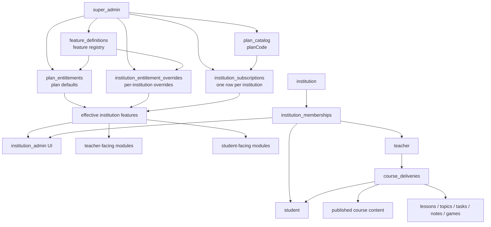

# Commercial Access Graph

```mermaid
graph TD
  SA["super_admin"] --> PC["plan_catalog<br/>planCode"]
  SA --> FD["feature_definitions<br/>feature registry"]
  SA --> PE["plan_entitlements<br/>plan defaults"]
  SA --> ISUB["institution_subscriptions<br/>one row per institution"]
  SA --> IOVR["institution_entitlement_overrides<br/>per-institution overrides"]

  PC --> ISUB
  FD --> PE
  FD --> IOVR
  PE --> EFFECTIVE["effective institution features"]
  IOVR --> EFFECTIVE
  ISUB --> EFFECTIVE

  EFFECTIVE --> IA["institution_admin UI"]
  EFFECTIVE --> TUI["teacher-facing modules"]
  EFFECTIVE --> SUI["student-facing modules"]

  INST["institution"] --> IM["institution_memberships"]
  IM --> IA
  IM --> T["teacher"]
  IM --> S["student"]

  T --> CD["course_deliveries"]
  CD --> S
  CD --> COURSE["published course content"]
  CD --> LESSON["lessons / topics / tasks / notes / games"]
```
