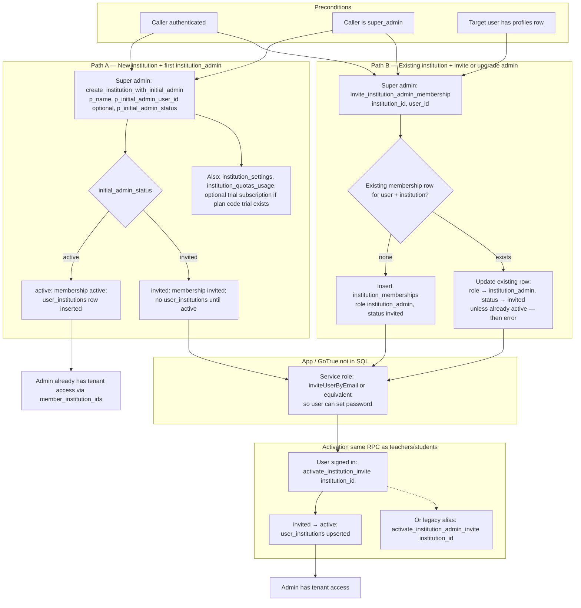

# Role flow diagrams (RLS-aligned)

ASCII flows for **super_admin**, **institution_admin**, **teacher**, and **student**, grounded in the current Supabase migration chain (`20260209*`, `20260321*`, `20260323*`, `20260325*` announcements, `20260326*` attendance / topic gates / game versions, `20260328*` cloud assets + storage RLS, `20260329*` course versions + `course_deliveries`). Policy names refer to Postgres RLS; behavior not listed here is default-deny for `authenticated` unless a policy applies. Diagrams assume the **full** migration chain has been applied (see migration table at the end).

**See also:** [15_platform_roles_schema_map.md](../domain/15_platform_roles_schema_map.md) (tables, helpers, domain trees).

---

## Shared helpers (quick reference)

| Helper                                                                            | Role                                                                                                                              |
| --------------------------------------------------------------------------------- | --------------------------------------------------------------------------------------------------------------------------------- |
| `app.is_super_admin()`                                                            | Platform bypass on `*_super_admin` policies                                                                                       |
| `app.member_institution_ids()`                                                    | Active `institution_memberships` (`left_institution_at IS NULL`, etc.)                                                            |
| `app.admin_institution_ids()`                                                     | Active institution_admin memberships                                                                                              |
| `app.auth_uid()`                                                                  | Current user id                                                                                                                   |
| `app.my_active_classroom_ids()`                                                   | Classrooms with active `classroom_members` (`withdrawn_at IS NULL`)                                                               |
| `app.student_can_access_course(uuid)`                                             | Published `course_deliveries` (`published_at` + `active`/`scheduled`) in an assigned classroom (**Variant A**; no enrollment row) |
| `app.student_can_access_course_delivery(uuid)`                                    | Same as above, scoped to one `course_deliveries.id` row                                                                           |
| `app.lesson_in_course_delivery_version(uuid, uuid)`                               | Canonical `lessons.id` exists in the delivery’s `course_version` snapshot (`source_lesson_id`)                                    |
| `app.student_can_access_lesson(uuid)`                                             | Published delivery access + lesson snapshot membership (`source_lesson_id`)                                                       |
| `app.caller_can_manage_attendance_schedule(uuid, uuid)`                           | Teacher-style manage for recurring schedule rows (`classroom_id`, `course_id`)                                                    |
| `app.student_can_access_topic(uuid)`                                              | Student topic visibility (locks / topic_availability_rules + course access)                                                       |
| `app.user_can_select_cloud_folder(uuid)` / `app.user_can_select_cloud_file(uuid)` | Cloud asset SELECT scope (folders/files/links)                                                                                    |
| `app.user_can_manage_cloud_folder(uuid)` / `app.user_can_manage_cloud_file(uuid)` | Primary teacher / co-teacher / admin-style manage for cloud rows                                                                  |

---

## Super admin

**Who:** `profiles.is_super_admin` → `app.is_super_admin()` is true.

```
Super admin logs in
│
├── PLATFORM GOVERNANCE (20260321000001_super_admin.sql)
│   ├── audit.events — SELECT (audit_events_select); writes via audit.log_event(), not client INSERT
│   ├── plan_catalog — FOR ALL (plan_catalog_super_admin)
│   ├── feature_definitions — FOR ALL super_admin (feature_defs_super_admin); any authenticated SELECT (feature_defs_authenticated_read)
│   ├── plan_entitlements — FOR ALL (plan_entitlements_super_admin)
│   ├── institution_subscriptions — FOR ALL (inst_subs_super_admin)
│   ├── institution_entitlement_overrides — FOR ALL (inst_entitlement_overrides_super_admin)
│   └── billing_providers — FOR ALL (billing_providers_super_admin)
│
├── USER LIFECYCLE (20260209000002_super_admin.sql)
│   ├── list_admin_users()
│   ├── admin_delete_user()
│   └── admin_set_user_active_status()
│
├── TENANT BOOTSTRAP
│   └── create_institution_with_initial_admin() — new institution + first admin membership (20260321000002)
│
└── EVERY TENANT / LMS / DOMAIN TABLE (except audit.events + public.profiles)
      └── *_super_admin → usually FOR ALL (full bypass)
            e.g. institutions, faculties…classrooms, classroom_members, courses, games,
                 game_runs, tasks, notes, conversations, notification_deliveries, point_ledger,
                 classroom_announcements, course_announcements,
                 classroom_attendance_schedules / _exceptions / _sessions / _records,
                 topic_availability_rules, game_versions,
                 cloud_folders, cloud_files, cloud_file_links, cloud_file_shares, …
      └── public.profiles — no *_super_admin policy (baseline user policies only)
```

---

## Institution admin

**Who:** `institution_memberships.membership_role = institution_admin` in tenant A → `institution_id IN (select app.admin_institution_ids())`.

```
Institution admin logs in (active membership, left_institution_at IS NULL)
│
├── ORG & ROSTER (20260321000002_institution_admin.sql)
│   ├── faculties, programmes, cohorts, class_groups — FOR ALL (*_institution_admin)
│   ├── classrooms — FOR ALL (classrooms_institution_admin) — creates / updates / deactivates
│   ├── classroom_members — FOR ALL (classroom_members_institution_admin) — assign students, co-teachers
│   └── institution_memberships — FOR ALL (memberships_institution_admin) — invite, suspend, left_institution_at
│
├── SETTINGS & COMPLIANCE
│   ├── institution_settings — FOR ALL (inst_settings_institution_admin)
│   ├── institution_quotas_usage — SELECT (quotas_institution_admin)
│   ├── institution_invoice_records — SELECT (invoice_records_institution_admin)
│   └── data_subject_requests — FOR ALL (dsr_institution_admin)
│
├── BILLING READ (institution_admin policies)
│   ├── institution_subscriptions — SELECT (inst_subs_institution_admin)
│   └── billing_providers — SELECT (billing_providers_institution_admin_select)
│
├── ENTITLEMENT OVERRIDES (all roles with active membership — not admin-only)
│   └── institution_entitlement_overrides — SELECT (inst_entitlement_overrides_member_read: institution_id ∈ member_institution_ids())
│
├── FEATURE CATALOG (any authenticated user, including institution_admin)
│   └── feature_definitions — SELECT (feature_defs_authenticated_read)
│
├── LMS OVERSIGHT (read-heavy)
│   ├── courses — SELECT published in tenant (courses_published_read: non-student profile branch = full catalog in tenant; student branch = classroom-delivered only)
│   ├── course_enrollments — SELECT (ce_institution_admin_read)
│   ├── lesson_progress — SELECT (lp_institution_admin_read)
│   ├── learning_events — SELECT (le_institution_admin_read)
│   └── games — SELECT (games_institution_admin_read)
│
├── DOMAIN OVERSIGHT / OPS
│   ├── tasks, task_groups, task_group_members, task_submissions — FOR ALL (tasks_institution_admin, …)
│   ├── notes — SELECT (notes_institution_admin_read)
│   ├── game_runs, game_sessions, game_session_participants — SELECT (gr/gs/gsp_institution_admin_read)
│   ├── game_versions — SELECT (game_versions_select_institution_admin)
│   ├── conversations — SELECT (conv_institution_admin); messages — SELECT (msg_institution_admin_read)
│   ├── notification_events, notification_deliveries, notification_preferences — SELECT (institution admin monitor paths)
│   ├── point_ledger — FOR ALL (pl_institution_admin)
│   ├── classroom_reward_settings — FOR ALL (crs_institution_admin)
│   ├── classroom_announcements — SELECT (classroom_announcements_select_institution_admin)
│   ├── course_announcements — SELECT (course_announcements_select_institution_admin)
│   ├── attendance — FOR ALL schedules/exceptions/sessions/records (*_all_institution_admin on each table)
│   └── topic_availability_rules — FOR ALL (topic_availability_rules_all_institution_admin)
│
├── CLOUD ASSETS (DB + bucket)
│   ├── cloud_folders, cloud_files, cloud_file_links, cloud_file_shares — FOR ALL (*_all_institution_admin)
│   └── storage.objects (cloud prefix) — institution path policies (20260329000023_storage_cloud_objects_rls)
│
└── STORAGE (legacy / avatars)
      └── cloud bucket — member_institution_ids() + path rules (same family as Phase A baseline)
```

**Note:** Institution admins **see all classrooms** in their tenant via `classrooms_institution_admin`. Students and teachers use **`classrooms_scoped_read`** (assigned / primary / co-teacher only).

---

## Teacher

**Who:** Owns rows via `teacher_id = auth.uid()` or leads classrooms via `primary_teacher_id` / `classroom_members` (`co_teacher`).

```
Teacher logs in (active institution membership)
│
├── AUTHORING — own resources
│   ├── courses — FOR ALL where teacher_id = self (courses_manage)
│   ├── topics — FOR ALL for own courses (topics_manage)
│   ├── lessons — FOR ALL for own courses (lessons_manage)
│   └── games — FOR ALL where teacher_id = self (games_manage)
│        └── Optional games.course_id → same institution as games.institution_id (trigger games_enforce_course_institution_match)
│
├── CLASSROOM DELIVERY
│   ├── classrooms — SELECT (classrooms_scoped_read): primary_teacher OR active classroom_members (incl. co_teacher)
│   ├── classroom_members — FOR ALL for own classrooms (classroom_members_primary_teacher_manage)
│   │     └── SELECT roster (classroom_members_teacher_roster_read) + co-teacher sees peers in same class
│   ├── classroom_course_links — FOR ALL (ccl_teacher_manage): primary OR co_teacher OR course author (legacy bridge)
│   ├── course_versions / course_version_topics / course_version_lessons — teacher + admin + student delivery reads (20260329*)
│   ├── course_deliveries — FOR ALL teacher paths + SELECT classroom members (20260329*)
│   └── classroom_reward_settings — FOR ALL for primary or co_teacher class (crs_teacher_manage)
│
├── ENTITLEMENTS / FEATURE CATALOG (any institution member)
│   ├── institution_entitlement_overrides — SELECT (inst_entitlement_overrides_member_read)
│   └── feature_definitions — SELECT (feature_defs_authenticated_read)
│
├── ROSTER & ANALYTICS (read)
│   ├── course_enrollments — SELECT for own courses (ce_teacher_read)
│   ├── lesson_progress — SELECT for own courses (lp_teacher_read)
│   ├── learning_events — SELECT for own courses (le_teacher_read)
│   └── game_session_participants — SELECT for own games (gsp_teacher_read)
│
├── TASKS & NOTES (Phase D)
│   ├── tasks — FOR ALL own (tasks_teacher_manage)
│   ├── task_groups / task_group_members / task_submissions — manage own tasks (tg_*, tgm_*, ts_teacher_manage)
│   └── collaborative notes — SELECT monitoring (notes_teacher_read)
│
├── GAME RUNTIME (Phase C)
│   ├── game_runs — FOR ALL if started_by = self OR game owned (gr_teacher_manage)
│   ├── game_sessions — FOR ALL on accessible runs (gs_run_access)
│   └── point_ledger — FOR ALL for primary or co_teacher classrooms (pl_teacher_manage)
│
├── ANNOUNCEMENTS (20260325000001)
│   ├── classroom_announcements — FOR ALL primary/co_teacher class (classroom_announcements_all_teacher)
│   └── course_announcements — FOR ALL own courses (course_announcements_all_teacher)
│
├── ATTENDANCE — schedules & live sessions (20260326000005 / 20260326000004)
│   ├── classroom_attendance_schedules (+ exceptions) — FOR ALL via caller_can_manage_attendance_schedule (…_all_teacher)
│   ├── classroom_attendance_sessions — FOR ALL classroom/course manager (…_all_teacher)
│   └── classroom_attendance_records — FOR ALL via parent session (…_all_teacher)
│
├── GAME VERSIONING (20260326000003)
│   └── game_versions — SELECT/INSERT/UPDATE own game’s draft versions (game_versions_*_teacher); published row reads via member policies
│
├── CHAT / NOTIFICATIONS / STORAGE
│   ├── conversations / conversation_contexts — INSERT (conversations_insert_member, conversation_contexts_insert_conversation_creator); participant SELECT + caller_eligible_for_conversation_context
│   ├── messages — INSERT (messages_insert_member); UPDATE own (messages_update_own)
│   ├── teacher_followers — SELECT self as teacher (tf_own_read)
│   ├── notification_deliveries — own read/update (notification_deliveries_select_own, notification_deliveries_update_own)
│   ├── cloud_folders / cloud_files / links / shares — manage via user_can_manage_* when primary/co_teacher scope applies
│   └── storage.objects — cloud path policies (20260329000023)
│
└── Teacher creates a classroom-scoped task (flow)
      │
      ├── INSERT tasks (classroom_id, teacher_id, status …) — tasks_teacher_manage
      │
      ├── INSERT task_groups (+ optional note row) — tg_teacher_manage
      │
      ├── INSERT task_group_members — tgm_teacher_manage
      │
      └── task_submissions + collaborative notes — ts_teacher_manage, notes_teacher_read
```

---

## Student

**Who:** Active `institution_memberships` in institution A; optional rows in `classroom_members` for specific classrooms.

**Important scope split (Variant A)**

- **`courses` SELECT:** for `profiles.role = student`, only courses that pass `student_can_access_course(id)` (published + `course_deliveries` with `published_at` and `active`/`scheduled` in an assigned classroom). Teachers and institution admins still use the broader published-in-tenant branch of `courses_published_read`.
- **Topics / lessons SELECT:** only if the course passes `student_can_access_course` / the lesson `student_can_access_lesson` (Variant A policies: `topics_select_member` / `lessons_select_member`).
- **Classrooms SELECT:** only **assigned** (or you appear as member/co-teacher) — `classrooms_scoped_read`, **not** all classrooms in the school.

```
Student logs in (active institution_memberships; left_institution_at IS NULL)
│
├── DISCOVER (metadata / lists)
│   │
│   ├── Classrooms — SELECT only where:
│   │     primary_teacher_id = auth.uid()  OR
│   │     EXISTS classroom_members (this user, withdrawn_at IS NULL)
│   │     (classrooms_scoped_read + institution ∈ member_institution_ids)
│   │
│   ├── Org shell — SELECT faculties, programmes, cohorts, class_groups (*_member_read)
│   │
│   ├── Courses — SELECT published courses **delivered to the student’s classes**
│   │     (courses_published_read: student branch uses student_can_access_course(id))
│   │
│   ├── classroom_course_links — SELECT only for classrooms in app.my_active_classroom_ids() (ccl_member_read; legacy)
│   ├── course_deliveries — SELECT for classroom members (course_deliveries_select_classroom_member)
│   │
│   ├── institution_entitlement_overrides — SELECT (inst_entitlement_overrides_member_read)
│   ├── feature_definitions — SELECT (feature_defs_authenticated_read)
│   │
│   └── Games — SELECT via `games_select_authenticated_published` (published version pointer) or legacy branch where applicable
│         (see game_versions + baseline LMS policies)
│
├── CLASSROOM DELIVERY (content access)
│   │
│   └── Operational delivery: `course_deliveries` (published + active/scheduled); legacy `classroom_course_links` backfilled
│         → student_can_access_course / student_can_access_lesson (no course_enrollments row required)
│
├── AFTER ACCESS TO COURSE
│   ├── topics — SELECT (topics_select_member): super_admin OR student_can_access_course(course_id) OR student_can_access_topic(id) — topic locks / availability enforced here
│   ├── lessons — SELECT (lessons_select_member + student_can_access_lesson)
│   ├── lesson_progress — UPSERT own rows (lesson_progress_all_own_student + `course_delivery_id` + snapshot helpers)
│   └── learning_events — INSERT own (learning_events_insert_student + `course_delivery_id`); SELECT own (learning_events_select_student_own)
│         └── App must send events; DB does not auto-log “open lesson”
│
├── ANNOUNCEMENTS
│   ├── classroom_announcements — SELECT published for my_active_classroom_ids (classroom_announcements_select_member)
│   └── course_announcements — SELECT published when student_can_access_course(course_id) (course_announcements_select_member)
│
├── ATTENDANCE
│   ├── classroom_attendance_sessions — SELECT if active classroom_members (classroom_attendance_sessions_select_member)
│   ├── classroom_attendance_records — SELECT own rows (classroom_attendance_records_select_own)
│   └── INSERT/UPDATE self check-in rows — classroom_attendance_records_insert_self_check_in / _update_self_check_in (source = self_check_in)
│
├── TOPIC AVAILABILITY (read)
│   └── topic_availability_rules — SELECT when student_can_access_course (topic_availability_rules_select_member)
│
├── PLAY GAMES
│   ├── game_runs — SELECT (gr_member_read):
│   │     classroom_id IS NULL → any member of institution for that run’s institution_id
│   │     classroom_id SET → only if active classroom_members for that classroom
│   ├── game_sessions — SELECT (gs_member_read) — same logic via parent run
│   ├── game_session_participants — FOR ALL own row (gsp_own); SELECT leaderboard (gsp_member_read) — scoped like run
│   ├── game_versions — SELECT published in institution (game_versions_select_member_published) + run-linked (game_versions_select_run_access)
│   ├── games SELECT — published pointer: games_select_authenticated_published (current_published_version_id → published game_version)
│   └── Solo/versus/classroom modes — see shared tree below
│
├── TASKS & NOTES
│   ├── tasks — SELECT published in my_active_classroom_ids() (tasks_student_read)
│   ├── task_groups — SELECT if task in those classrooms (tg_member_read)
│   ├── task_group_members — SELECT own (tgm_own_read)
│   ├── task_submissions — group member (ts_group_member)
│   ├── notes — personal (notes_own); collaborative group (notes_collaborative_access)
│   └── …
│
├── CHAT / NOTIFICATIONS / REWARDS
│   ├── conversations / conversation_contexts / messages — participant + caller_eligible_for_conversation_context (conversations_select_participant, messages_*)
│   ├── notification_deliveries / notification_events — inbox read + mark read (recipient policies)
│   ├── point_ledger — pl_own_read; classmates via pl_member_read (same classroom via my_active_classroom_ids)
│   └── classroom_reward_settings — crs_member_read (assigned classrooms)
│
├── STORAGE — cloud bucket paths + DB cloud tables
│   └── cloud_folders / cloud_files / links — SELECT via user_can_select_* when scope allows (member)
│
└── teacher_followers (optional, social only)
      ├── INSERT follow (tf_student_insert) — same institution via institution_memberships for both users
      ├── DELETE unfollow (tf_student_delete)
      └── Does NOT gate course delivery, topics, lessons, or games in current migrations
```

---

## Shared: `game_runs` modes (Phase C)

Applies across roles; **student visibility** of runs uses `gr_member_read` / `gs_member_read` / `gsp_member_read` as above.

```
game_runs
├── mode = 'solo'
│     ├── started_by = the student
│     ├── classroom_id = NULL
│     ├── invite_code = NULL
│     └── 1 game_session → 1 game_session_participant (the student)
│
├── mode = 'versus'
│     ├── started_by = challenger student
│     ├── classroom_id = NULL
│     ├── invite_code = short code for lobby join
│     └── 1 game_session → 2 game_session_participants
│           scores_detail JSONB — per-node results side-by-side
│
└── mode = 'classroom'
      ├── started_by = the teacher
      ├── classroom_id = the classroom (FK)
      ├── invite_code = NULL (notify via app)
      └── 1 game_session → N game_session_participants
            Teacher analytics via gsp_teacher_read / institution admin read policies

Status: lobby → active → completed | cancelled
```

---

## Shared: tasks → groups → submissions → notes (Phase D)

```
tasks (classroom_id, teacher_id, status, due_at, …)
│
├── task_groups (name, note_id → notes)
│   ├── task_group_members (user_id)
│   └── task_submissions (submitted_by, status, feedback, reviewed_by)
│
notes
├── personal — owner_user_id; scope = personal
└── collaborative — task_group_id; scope = collaborative; group members co-edit (RLS + Realtime in app)
```

Task status flow (audit trigger on tasks):  
`draft → published → not_started → in_progress → submitted → reviewed` (or `overdue`; `returned` for revision cycle) → `audit.log_task_state_change` → `audit.events`.

---

## Shared: chat, notifications, rewards (Phases E–G)

```
Chat (20260329)
  conversations → optional conversation_contexts (classroom / course_delivery / task / game_session)
  conversation_members → messages
  Helpers: app.user_in_active_conversation, app.caller_eligible_for_conversation_context
  RLS: participant read/send + contextual eligibility; institution_admin / super_admin paths; safeguarding matrix in docs/domain/11_chat.md mostly app-layer

Notifications (20260329000024–030)
  notification_events + notification_deliveries — fan-out via create_notification_event_with_deliveries; user read/update own deliveries; institution_admin read monitor
  notification_preferences — scoped base + overrides; user manages own

Rewards
  point_ledger — append-only; teacher/institution_admin manage per policies; student read own + class leaderboard scope
  classroom_reward_settings — teacher primary/co_teacher manage; student read assigned classrooms
```

---

## Shared: announcements (20260325)

```
classroom_announcements (per classroom)
  super_admin → FOR ALL
  institution_admin → SELECT all rows in tenant
  primary_teacher / co_teacher → FOR ALL (WITH CHECK created_by = auth.uid())
  member → SELECT published + deleted_at IS NULL + my_active_classroom_ids()

course_announcements (per course)
  super_admin → FOR ALL
  institution_admin → SELECT
  course teacher (courses.teacher_id) → FOR ALL (WITH CHECK created_by = auth.uid())
  member → SELECT published; students gated by student_can_access_course(course_id)
```

---

## Shared: attendance & topic gates (20260326)

```
Recurring schedules (20260326000005)
  classroom_attendance_schedules, classroom_attendance_schedule_exceptions
    super_admin / institution_admin / teacher (caller_can_manage_attendance_schedule) → FOR ALL

Live sessions & marks (20260326000004)
  classroom_attendance_sessions
    teacher (caller_can_manage_classroom OR caller_can_manage_course) → FOR ALL
    member → SELECT if active classroom_members for that classroom
  classroom_attendance_records
    teacher → FOR ALL via parent session
    student → SELECT own; INSERT/UPDATE self_check_in only (source = self_check_in)

topic_availability_rules
  super_admin / institution_admin → FOR ALL
  teacher (caller_can_manage_course) → FOR ALL
  member → SELECT if course manager OR (member + student_can_access_course)

topics (policy replaced)
  topics_select_member: super_admin OR caller_can_manage_course OR student_can_access_topic(id)
  → ties lesson/topic visibility to locks + rules (see app.student_can_access_topic)
```

---

## Shared: game versions & published pointer (20260326)

```
game_versions
  Teacher — draft-only INSERT/UPDATE on own games; SELECT own rows
  Institution admin — SELECT all versions in tenant
  Member — SELECT status = published + institution membership
  Anyone with run access — SELECT version attached to a game_run you can see (game_versions_select_run_access)

games
  games_select_authenticated_published — requires current_published_version_id → published game_versions row
  (replaces “any published game row” with versioned publish; see also games_schema_flex migration)
```

---

## Shared: cloud assets & storage (20260328)

```
cloud_folders, cloud_files, cloud_file_links, cloud_file_shares (public + RLS)
  super_admin / institution_admin → FOR ALL
  SELECT scope — user_can_select_cloud_folder / user_can_select_cloud_file / link helpers
  INSERT — owner_user_id = auth.uid() + member_institution_ids()
  UPDATE/DELETE — user_can_manage_* (primary teacher / co_teacher / manager paths in functions)

storage.objects (cloud bucket)
  storage_cloud_objects_rls — path + institution checks; aligns with DB file rows where applicable
```

---

## Product notes (not enforced by all RLS)

1. **Course catalog for students:** RLS aligns catalog with delivery — students only **see** courses linked to their classrooms (`courses_published_read` student branch). “My courses” in the app should match the same source (`course_deliveries` + `classroom_members`; `classroom_course_links` is legacy/backfill).
2. **Self-enroll:** Disabled for students (`ce_student_insert` / `ce_student_delete` removed in Phase A migration chain). Partial-class cohorts need another mechanism (extra class/group or reintroducing enrollments).
3. **Unpublish / draft courses:** Topic/lesson access for students follows `student_can_access_course` / `student_can_access_lesson` (Variant A). Decide product rules when `courses.is_published = false` but a classroom link still exists, or when the link is unpublished — policies may need tightening beyond current migrations.
4. **Telemetry:** No DB triggers on SELECT; `learning_events` rows require **client inserts**.

---

## Migration files referenced

| Area                                                                 | Files (split `_01`…`_08` in repo)                                                                            |
| -------------------------------------------------------------------- | ------------------------------------------------------------------------------------------------------------ |
| Baseline LMS                                                         | `20260209000001_baseline_schema.sql`, `20260209000002_super_admin.sql`                                       |
| Platform billing                                                     | `20260321000001_super_admin_*`                                                                               |
| Tenant org, memberships, classrooms                                  | `20260321000002_institution_admin_*`                                                                         |
| LMS RLS, games `institution_id` / `course_id`                        | `20260323000001_baseline_lms_rls_memberships_*`                                                              |
| Classroom links, progress, learning_events                           | `20260323000002_classroom_course_links_lesson_progress_*`                                                    |
| Course versions + deliveries + delivery-scoped progress/events       | `20260329000001_course_delivery_01_types.sql` … `20260329000008_course_delivery_08_attendance_functions.sql` |
| Game runtime                                                         | `20260323000003_game_runtime_*`                                                                              |
| Tasks / notes                                                        | `20260323000004_tasks_notes_*`                                                                               |
| Chat                                                                 | `20260329000009_chat_*` … `20260329000015_chat_*` (types, tables, indexes, helpers, backfill, triggers, RLS) |
| Notifications                                                        | `20260329000024_notifications_*` … `030`                                                                     |
| Rewards                                                              | `20260323000007_rewards_mvp_*`                                                                               |
| Announcements                                                        | `20260325000001_announcements_*`                                                                             |
| `games` JSON flexibility (optional)                                  | `20260326000002_games_schema_flex.sql`                                                                       |
| Lexical / content columns (tables)                                   | `20260326000001_lexical_content_*`                                                                           |
| Attendance topic gates + `topic_availability_rules`, `topics` policy | `20260326000004_attendance_topic_gates_*`                                                                    |
| Attendance recurrence (schedules, exceptions, materialization)       | `20260326000005_attendance_recurrence_*`                                                                     |
| Game versions + `games.current_published_version_id`                 | `20260326000003_game_versions_*`                                                                             |
| Cloud assets (folders, files, links, shares)                         | `20260329000016_cloud_assets_*` … `022`                                                                      |
| Storage `storage.objects` RLS for cloud                              | `20260329000023_storage_cloud_objects_rls_01_policies.sql`                                                   |

# Institution admin onboarding (DB / migrations)

Flow derived from `supabase/migrations/` — mainly `20260321000002_institution_admin_*` (`create_institution_with_initial_admin`, `invite_institution_admin_membership`, `activate_institution_invite`, alias `activate_institution_admin_invite`).

**Who can invite admins:** only **`super_admin`** (not a tenant `institution_admin`). **Email delivery and GoTrue user creation** are application responsibilities.

**No email-token table for admins:** `institution_invites` is constrained to **teacher / student** only (`institution_invites_role_chk`). Institution admins are always onboarded with a **known `user_id`** + `profiles` row, then optional GoTrue invite + `activate_institution_invite`.



# Teacher and student onboarding (DB / migrations)

Flow derived from `supabase/migrations/` — mainly `20260321000002_institution_admin_*` (RPCs `invite_institution_member`, `create_institution_invite_by_email`, `redeem_institution_invite`, `activate_institution_invite`, tables `institution_memberships`, `institution_invites`). **Email delivery and GoTrue user creation are application responsibilities**; the diagram shows where the SQL layer fits.

```mermaid
flowchart TB
  subgraph Preconditions
    A1[Caller is authenticated]
    A2["Caller is institution_admin for institution<br/>OR super_admin"]
    A3[Institution exists and not soft-deleted]
  end

  subgraph Path1["Path 1 — User already has Auth + profiles row"]
    B1[Admin: invite_institution_member<br/>institution_id, user_id, teacher|student]
    B2{Profile exists for user_id?}
    B3[Insert or update institution_memberships<br/>status = invited, role = teacher|student]
    B4[App / GoTrue: send invite or magic link<br/>not in SQL]
    B5[User completes Auth invite / sets password]
    B6[User or app: activate_institution_invite institution_id]
    B7[Membership → active;<br/>user_institutions upserted]
  end

  subgraph Path2["Path 2 — Email first no user yet"]
    C1[Admin: create_institution_invite_by_email<br/>institution_id, email, teacher|student]
    C2[Row in institution_invites + token returned]
    C3[App sends link with token<br/>not in SQL]
    C4[User signs up / signs in with Auth]
    C5[User: redeem_institution_invite token]
    C6{Profile email matches invite email?}
    C7[Create or activate institution_memberships active;<br/>mark invite accepted;<br/>user_institutions upserted]
    C8[Error: invalid / expired / email mismatch]
  end

  subgraph AfterTenantAccess["After tenant access — not automatic in institution_admin migration"]
    D1[Optional: classroom_members assignment]
    D2[Optional: classroom_course_links for course visibility]
  end

  A1 --> B1
  A2 --> B1
  A3 --> B1
  B1 --> B2
  B2 -->|no| BX[Raise: profile not found]
  B2 -->|yes| B3 --> B4 --> B5 --> B6 --> B7

  A1 --> C1
  A2 --> C1
  A3 --> C1
  C1 --> C2 --> C3 --> C4 --> C5 --> C6
  C6 -->|yes| C7
  C6 -->|no| C8

  B7 --> D1
  C7 --> D1
  D1 --> D2
```

## SQL mapping

| Step                            | Role in migrations                                                                                                                                |
| ------------------------------- | ------------------------------------------------------------------------------------------------------------------------------------------------- |
| Authorize admin                 | `invite_institution_member` / `create_institution_invite_by_email` require `app.is_institution_admin(p_institution_id)` or `app.is_super_admin()` |
| Invited membership (user known) | `invite_institution_member` → `institution_memberships` with `status = invited`                                                                   |
| Active membership               | `activate_institution_invite(institution_id)` → `active` + `user_institutions` insert on conflict                                                 |
| Email-first pending row         | `create_institution_invite_by_email` → `institution_invites` + returned token                                                                     |
| Redeem                          | `redeem_institution_invite(token)` validates email, expiry, acceptance; then membership + `user_institutions`                                     |

## Classroom / course access

Institution membership alone does not assign **classroom** or **published course** access; that uses later migrations (e.g. `classroom_members`, `classroom_course_links`, `app.student_can_access_*`).
