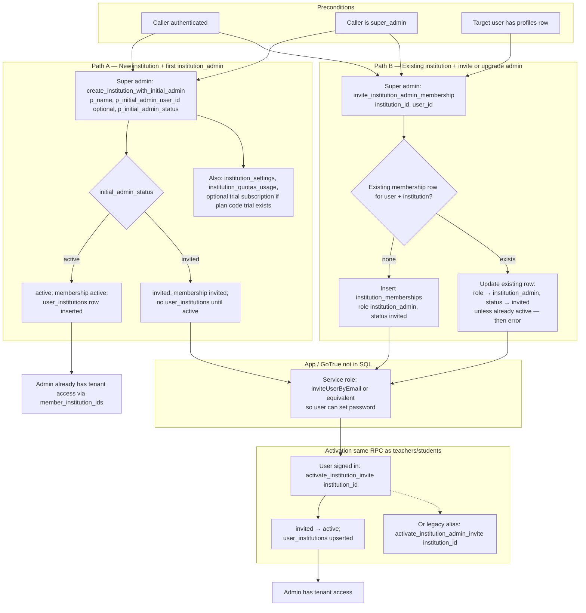

# Institution admin onboarding (DB / migrations)

Flow derived from `supabase/migrations/` — mainly `20260321000002_institution_admin_*` (`create_institution_with_initial_admin`, `invite_institution_admin_membership`, `activate_institution_invite`, alias `activate_institution_admin_invite`).

**Who can invite admins:** only **`super_admin`** (not a tenant `institution_admin`). **Email delivery and GoTrue user creation** are application responsibilities.

**No email-token table for admins:** `institution_invites` is constrained to **teacher / student** only (`institution_invites_role_chk`). Institution admins are always onboarded with a **known `user_id`** + `profiles` row, then optional GoTrue invite + `activate_institution_invite`.

