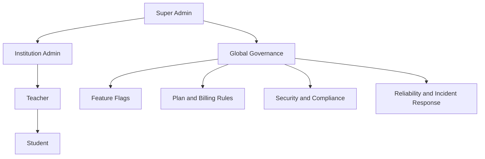

# Super Admin

Role: `super_admin`  
Scope: global platform governance across all institutions and modules.

## Mission and context

Super Admin is the only role with a platform-wide view. Every other role — Institution Admin, Teacher, Student — operates inside a single tenant and never crosses institution boundaries. Super Admin sits above all of them: creating and governing tenants, controlling what features and plans each institution gets, enforcing compliance, and acting as the last line of defence for data integrity and security.

Super Admin does not deliver learning. It makes delivery possible and safe at scale.

**Scope:** global — all institutions, all modules, no tenant restriction
**Accountability:** plan catalog, billing state, feature flags, user lifecycle, audit trail, GDPR oversight, incident response

**Role boundary:**

| Role              | Scope                       | Owns                                            |
| ----------------- | --------------------------- | ----------------------------------------------- |
| Super Admin       | Platform — all institutions | Governance, plans, compliance, tenant lifecycle |
| Institution Admin | One institution             | Hierarchy, teachers, students, licenses         |
| Teacher           | Assigned classrooms         | Courses, games, tasks, classroom delivery       |
| Student           | Assigned classrooms         | Learning, participation, personal progress      |



---

## Feature tree

### Institution lifecycle

**Create institution**

- Input: name, address, email_domain_policy, data_region, initial admin user_id
- Calls: `create_institution_with_initial_admin(name, initial_admin_user_id)`
- Creates: `institutions` row → `institution_settings` (locale, timezone, retention_policy_code) → `institution_quotas_usage` (zeroed) → trial `institution_subscriptions` row → `institution_memberships` row (status = active, role = institution_admin)
- Result: institution is live; admin can log in immediately

**Update institution**

- Update: `institutions` fields (name, data_region, email_domain_policy, default_retention_policy_code)
- Update: `institution_settings` (locale, timezone, retention_policy_code, notification_defaults)

**Suspend institution**

- Sets `institutions.suspended_at` + `suspension_reason`
- Effect: institution members lose access (RLS checks `suspended_at IS NULL`)
- Use when: billing failure past grace window, compliance violation, abuse

**Reactivate institution**

- Clears `institutions.suspended_at` + `suspension_reason`

**Soft-delete institution**

- Sets `institutions.deleted_at`
- Hard purge is a manual DBA operation following `retention_policy_code`

**View institution health**

- Derived from multiple tables — no single health table; signals pulled at query time:

| Signal category    | Source tables                                                                     | Health indicators                                                               |
| ------------------ | --------------------------------------------------------------------------------- | ------------------------------------------------------------------------------- |
| Access health      | `institution_memberships`, `institution_quotas_usage`                             | seats_used vs seats_cap, activated vs invited members, last login activity      |
| Learning health    | `lesson_progress`, `learning_events`, `task_submissions`, `game_run_stats_scoped` | course/game usage rate, task completion, overdue submissions, inactive students |
| Operational health | `institution_quotas_usage`, `institution_subscriptions`, `cloud_files`            | storage % used, renewal_at proximity, grace_ends_at, billing_status             |
| Compliance health  | `data_subject_requests`, `audit.events`                                           | pending DSRs, export/delete workflow readiness, audit trail completeness        |

- Health state model: **Blue** (healthy baseline) → **Orange** (approaching limits or engagement drop) → **Red** (critical, immediate action required)
- Cross-tenant isolation enforced: each query is scoped to one institution_id; no joins across tenants

---

### Commercial controls

**Create / edit plan**

- Table: `plan_catalog`
- Fields: code (unique), name, seat_cap_default, storage_bytes_cap_default, price_amount, currency, billing_interval, is_active
- Inactive plans hidden from new subscriptions; existing subscriptions unaffected

**Assign plan to institution**

- Table: `institution_subscriptions`
- Fields: plan_id, effective_from, effective_to, billing_status (active / suspended / trialing / past_due / canceled), seats_cap, storage_bytes_cap, renewal_at, grace_ends_at, trial_ends_at, cancel_at_period_end
- Grace window: `grace_ends_at` — institution keeps access after billing failure until this timestamp, then access is cut (billing_status → suspended)
- Read-only fallback on expiry: enforced at app layer when billing_status = suspended or effective_to has passed

**Override plan feature for institution**

- Table: `institution_entitlement_overrides`
- Fields: institution_id, feature_id, typed value (boolean / integer / bigint / text), reason, starts_at, ends_at
- Use for: custom enterprise contracts, temporary premium access, promotional periods
- Every override is written with `created_by` — auditable
- Readable by institution_admin (read-only); only super_admin can write

**Link billing provider**

- Table: `billing_providers`
- Fields: institution_id, provider (e.g. stripe), external_customer_id, external_subscription_id, external_price_id

---

### Feature management

**Define feature**

- Table: `feature_definitions`
- Fields: key (unique), name, description, default_enabled, category, value_type (boolean / integer / bigint / text)
- All authenticated users can read; only super_admin can write
- Covers major modules: Game Studio, Versus mode, Chat, advanced analytics, cloud storage, reward system

**Set plan default for feature**

- Table: `plan_entitlements`
- Fields: plan_id, feature_id, typed value columns
- One row per (plan_id, feature_id) pair
- Every change is audited via `audit.log_event()` — immutable record of who changed what and when

**Override feature for specific institution**

- Via `institution_entitlement_overrides` (see Commercial controls above)
- Secure default: plan default applies unless an override row exists and is active by date range

---

### User management (RPCs)

**List all users**

- `list_admin_users()` → all profiles platform-wide with institution counts, role, active status

**Delete user permanently**

- `admin_delete_user(user_id, reason)` → removes from `profiles` and `auth.users`
- Irreversible; logs to `audit.events` before deletion

**Ban / unban user**

- `admin_set_user_active_status(user_id, is_active)` → sets `auth.users.banned_until`
- Ban: far-future timestamp; Unban: clears it

---

### Security and compliance

**Read audit log**

- Table: `audit.events` (super_admin SELECT only — no other role can read)
- Written exclusively via `audit.log_event()` (SECURITY DEFINER) — no direct INSERT from clients
- Fields: occurred_at, actor_user_id, event_type, subject_type, subject_id, institution_id, payload, metadata
- Covers: feature-flag changes, task delivery state transitions, plan changes, entitlement overrides, user deletion

**GDPR / data subject request oversight**

- Table: `data_subject_requests` across all institutions
- Request types: access | erasure | portability | rectification
- Status lifecycle: pending → processing → completed | rejected
- Super admin approves/rejects; institution admin executes the export or deletion workflow
- 72-hour breach notification obligation tracked via `audit.events` + incident playbook (external)

**Reliability monitoring (manual — no dedicated table)**

- Monitor via: `institution_quotas_usage` (storage pressure), `institution_subscriptions` (expiry risk), `audit.events` (failed workflows, elevated actions)
- Backup and restore drills: external to Postgres schema (Supabase platform + Hetzner — see `13_hetzner_infra.md`)

---

## Schema visualization

```text
[Platform level — no institution boundary]
│
├── plan_catalog (code, name, seat_cap_default, storage_bytes_cap_default, price_amount, currency, billing_interval, is_active)
│   └── plan_entitlements (plan_id × feature_id → boolean_value | integer_value | bigint_value | text_value)
│
├── feature_definitions (key, name, value_type: boolean|integer|bigint|text, default_enabled, category)
│   └── [all authenticated users SELECT; only super_admin INSERT/UPDATE/DELETE]
│
├── audit.events (occurred_at, actor_user_id, event_type, subject_type, subject_id, institution_id, payload, metadata)
│   └── [append-only; SELECT super_admin only; INSERT via audit.log_event() SECURITY DEFINER]
│
└── profiles (user_id, role, is_super_admin, active_institution_id)
    └── auth.users  ← managed via admin RPCs only (ban/delete — no direct table access)

[Per institution — super_admin has full CRUD on all rows across all tenants]
│
└── institutions (name, data_region, email_domain_policy, health_state, suspended_at, suspension_reason, deleted_at)
    │
    ├── institution_subscriptions (plan_id, billing_status, seats_cap, storage_bytes_cap,
    │       effective_from, effective_to, renewal_at, grace_ends_at, trial_ends_at, cancel_at_period_end)
    │
    ├── institution_entitlement_overrides (feature_id, typed value, reason, starts_at, ends_at, created_by)
    │   └── [overrides plan_entitlements for this institution; readable by all institution members]
    │
    ├── billing_providers (provider, external_customer_id, external_subscription_id, external_price_id)
    │
    ├── institution_settings (default_locale, timezone, retention_policy_code, notification_defaults jsonb)
    │
    ├── institution_quotas_usage (seats_used, storage_used_bytes)  ← auto-updated by triggers
    │
    ├── institution_invoice_records (amount_cents, currency, issued_at, due_at, paid_at, status)
    │
    └── data_subject_requests (subject_user_id, request_type, status, completed_at)
        request_type: access | erasure | portability | rectification
        status: pending → processing → completed | rejected

[Institution health — derived at query time, no dedicated table]
│
├── Access health   → institution_memberships (seats_used, activated vs invited, left_institution_at)
├── Learning health → lesson_progress, learning_events, task_submissions, game_run_stats_scoped
├── Operational     → institution_quotas_usage (storage %), institution_subscriptions (renewal_at, billing_status)
└── Compliance      → data_subject_requests (pending count), audit.events (trail completeness)
    health state: Blue (healthy) → Orange (warning) → Red (critical)

[RPCs — super_admin only]
├── create_institution_with_initial_admin(name, admin_user_id)   → bootstrap new tenant
├── list_admin_users()                                           → all profiles platform-wide
├── admin_delete_user(user_id, reason)                          → permanent removal from profiles + auth.users
└── admin_set_user_active_status(user_id, is_active)            → ban (far-future banned_until) / unban
```

### CRUD surface by role

| Operation                                     | Super Admin           | Institution Admin | Teacher   | Student   |
| --------------------------------------------- | --------------------- | ----------------- | --------- | --------- |
| plan_catalog — full CRUD                      | yes                   | —                 | —         | —         |
| feature_definitions — full CRUD               | yes                   | —                 | —         | —         |
| feature_definitions — read                    | yes                   | yes               | yes       | yes       |
| institution_subscriptions — full CRUD         | yes                   | read-only         | —         | —         |
| institution_entitlement_overrides — full CRUD | yes                   | read-only         | read-only | read-only |
| billing_providers — full CRUD                 | yes                   | read-only         | —         | —         |
| audit.events — read                           | yes                   | —                 | —         | —         |
| audit.log_event() — insert                    | SECURITY DEFINER only | —                 | —         | —         |
| create_institution_with_initial_admin         | yes                   | —                 | —         | —         |
| admin_delete_user                             | yes                   | —                 | —         | —         |
| admin_set_user_active_status                  | yes                   | —                 | —         | —         |

## Rules that every module must respect

1. Tenant-first access

- Every row with user data must carry `institution_id`.
- No cross-tenant joins in product APIs.

2. Principle of least privilege

- Students: own data + assigned classroom resources.
- Teachers: own classrooms/content + assigned rosters.
- Institution admins: full tenant view, no global view.
- Super admins: global operational view, with audited elevated actions.

3. Data lifecycle

- Soft delete first, hard purge by policy.
- Export and delete flows must be scriptable and auditable.

4. Secure-by-default communications

- In-app + controlled email only.
- No unmanaged third-party messaging channels.

5. Analytics boundaries

- Institution analytics never expose raw personal data outside tenant.
- Global analytics are aggregated and anonymized for platform-level decisions.

---

### What is missing

Super admin has **no notification inbox**. The notification system (`notification_events`, `notification_deliveries`) is institution-scoped — every event requires an `institution_id`. No platform-level event types are defined for super admin operational signals.

**What super admin currently must monitor manually:**

- `audit.events` — security and state-change events
- `institution_subscriptions` — billing status, grace windows, renewal risk
- `institution_quotas_usage` — seat and storage pressure per institution
- `data_subject_requests` — pending GDPR requests

**Not yet built (open design decision):**

- Platform-level alert channel for super admin (quota threshold exceeded, billing failure, institution health critical, security incident)
- Cannot use `notification_events` for this — it is tenant-scoped and enforces a non-null `institution_id`
- Would require a separate platform alerting mechanism or a super-admin-specific event store
