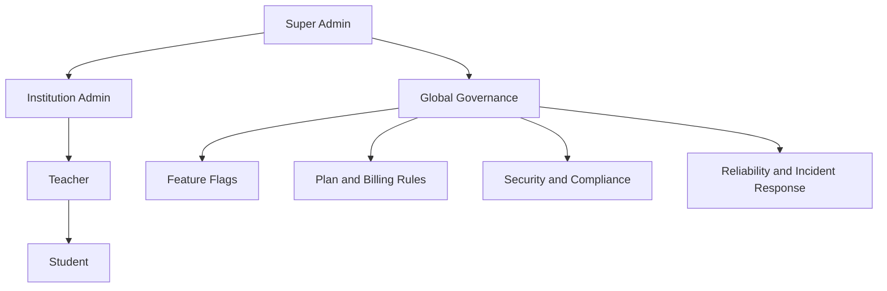
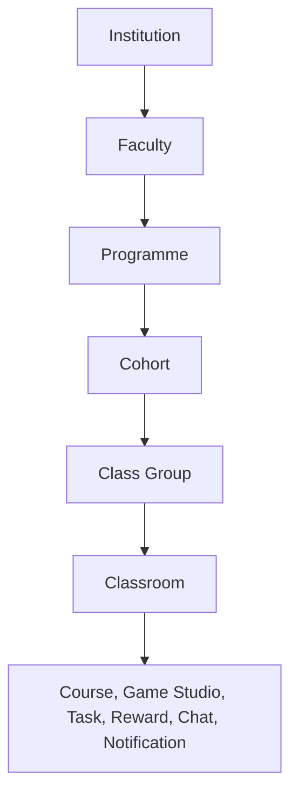

# Super Admin

Role: `super_admin`  
Scope: global platform governance across all institutions and modules.

## Mission

Super Admin owns platform structure, compliance, commercial controls, and tenant safety.  
Institution Admin and Teacher own delivery. Student owns participation.

This file is the top-level control plane for all module docs:

- `02_institution.md`
- `03_teacher.md`
- `04_student.md`
- `05_classroom.md`
- `06_note.md`
- `07_course.md`
- `08_game_studio.md`
- `09_task.md`
- `10_reward_system.md`
- `11_chat.md`
- `12_notification.md`
- `13_hetzner_infra.md`

---

## Platform ownership map (source of truth)

1. Super Admin

- Creates/suspends institutions, controls global feature flags, enforces GDPR and security baseline.
- Owns plan catalog, seat model, billing guardrails, and incident response.

2. Institution Admin

- Manages faculty/programme/cohort/class-group tree, teachers, students, licenses inside one tenant.
- Never accesses data from other institutions.

3. Teacher

- Creates classrooms, courses, games, tasks, and reviews progress inside assigned institution scope.

4. Student

- Consumes content, submits tasks, plays games, collaborates, and tracks personal progress.

### Visual: role and governance hierarchy



---

## Cross-module dependencies (must stay consistent)

1. Institution (`02`) is the tenant boundary for everything else.
2. Class Room (`05`) is the operational container linking Course (`07`), Game Studio (`08`), Task (`09`), Reward (`10`), Chat (`11`), and Notification (`12`).
3. Notes (`06`) can be personal or collaborative, but always inherit institution and role access rules.
4. Infrastructure (`13`) must enforce RLS, backups, encryption, logging, and recovery for all modules.

---

## Hierarchy ownership

Detailed academic hierarchy design is institution logic and is defined in `02_institution.md`.
`01_super_admin.md` stays at governance and cross-module policy level.

### Visual: academic structure hierarchy



---

## Super Admin functional areas

### 1) Tenant governance

- Create, update, suspend, and reactivate institutions.
- Enforce domain policy, region policy, and retention defaults.
- View institution health and growth trends without cross-tenant data leakage.

Institution health should be tracked with these platform-level signals:

- Access health: seat usage, account activation, login activity
- Learning health: course/game usage, task completion, overdue work, inactivity
- Operational health: storage pressure, license expiry risk, failed workflows
- Compliance health: export/delete workflow readiness, audit trail completeness

State model for institution health:

- Blue: healthy baseline, no immediate risk
- Orange: warning state, approaching limits or engagement drop
- Red: critical state, immediate action required

### 2) Commercial controls

- Manage plan definitions (EDU Basic, EDU Plus, etc.).
- Set seat and storage policy templates consumed by `02_institution.md`.
- Configure renewal, grace windows, and read-only fallback on expiry.

### 3) Global feature management

- Control rollout of major modules (Game Studio, Versus, Chat, advanced analytics).
- Support per-institution overrides while keeping secure defaults.
- Keep an immutable audit log for every feature-flag change.

### 4) Security and compliance

- Enforce GDPR Art. 32 TOM baseline platform-wide.
- Validate RLS isolation and privileged-access controls.
- Approve data export, deletion, and retention workflows for institution admins.

### 5) Reliability and operations

- Track uptime/SLO, queue health, webhook failures, and storage pressure.
- Ensure encrypted backups + tested restore drills.
- Maintain incident playbooks and 72-hour breach notification process.

---

## Guardrails that every module must respect

1. Tenant-first access

- Every row with user data must carry `institution_id`.
- No cross-tenant joins in product APIs.

2. Principle of least privilege

- Students: own data + assigned classroom resources.
- Teachers: own classrooms/content + assigned rosters.
- Institution admins: full tenant view, no global view.
- Super admins: global operational view, with audited elevated actions.

3. Data lifecycle

- Soft delete first, hard purge by policy.
- Export and delete flows must be scriptable and auditable.

4. Secure-by-default communications

- In-app + controlled email only.
- No unmanaged third-party messaging channels.

5. Analytics boundaries

- Institution analytics never expose raw personal data outside tenant.
- Global analytics are aggregated and anonymized for platform-level decisions.

---

## Module contract checklist (for docs review)

Use this checklist whenever updating `02` to `13`:

1. Role scope is explicit (who can read/write/delete).
2. Tenant scope is explicit (what `institution_id` gates).
3. Classroom interaction is explicit (how module binds to class context).
4. Compliance note is explicit (retention/export/deletion/logging).

---

## MVP rollout order (platform level)

1. Institution hierarchy and seat/storage enforcement (`02`).
2. Classroom lifecycle and assignment model (`05`).
3. Course + Game Studio publish flow to classroom (`07`, `08`).
4. Task collaboration and review loop (`09`).
5. Reward + notification loops (`10`, `12`).
6. Chat guardrails and moderation (`11`).
7. Harden infra and compliance evidence (`13`).

---

## Definition of done for structure consistency

The docs are considered structurally aligned when:

1. All module docs reference classroom scope and tenant scope consistently.
2. Terminology is unified: "Class Room" (file), "classroom" (product UI).
3. No module implies cross-tenant access.
4. Security and compliance responsibilities map cleanly from Super Admin to Institution Admin.

---

## Concrete feature tree

### Institution lifecycle

**Create institution**

- Input: name, address, email_domain_policy, data_region, initial admin user_id
- Calls: `create_institution_with_initial_admin(name, initial_admin_user_id)`
- Creates: `institutions` row → `institution_settings` (defaults) → `institution_quotas_usage` (zeroed) → trial `institution_subscriptions` row → `institution_memberships` row (status = active, role = institution_admin)
- Result: institution is live and admin can log in

**Suspend institution**

- Sets `institutions.suspended_at` + `suspension_reason`
- Effect: institution members lose access (RLS checks `suspended_at IS NULL`)

**Reactivate institution**

- Clears `institutions.suspended_at` + `suspension_reason`

**Soft-delete institution**

- Sets `institutions.deleted_at`
- Hard purge is a manual DBA operation following the data retention policy

---

### Commercial controls

**Create / edit plan**

- Table: `plan_catalog`
- Fields: code (unique), name, seat_cap_default, storage_bytes_cap_default, price_amount, currency, billing_interval, is_active
- Effect: available in plan selector UI; inactive plans hidden from new subscriptions

**Assign plan to institution**

- Table: `institution_subscriptions`
- Fields: institution_id, plan_id, effective_from, effective_to, billing_status (active / suspended / trialing / past_due / canceled), seats_cap, storage_bytes_cap, renewal_at, grace_ends_at
- Effect: drives `institution_quotas_usage` enforcement and feature entitlements

**Override plan feature for institution**

- Table: `institution_entitlement_overrides`
- Fields: institution_id, feature_id, typed value (boolean / integer / bigint / text), reason, starts_at, ends_at
- Effect: overrides plan_entitlements for that institution; visible to institution_admin (read-only)

**Manage billing provider linkage**

- Table: `billing_providers`
- Fields: institution_id, provider (stripe etc.), external_customer_id, external_subscription_id, external_price_id

---

### Feature management

**Define feature**

- Table: `feature_definitions`
- Fields: key (unique), name, description, default_enabled, category, value_type (boolean / integer / bigint / text)
- All authenticated users can read; only super_admin can write

**Set plan default for feature**

- Table: `plan_entitlements`
- Fields: plan_id, feature_id, typed value columns
- One row per plan/feature pair

---

### User management (RPCs)

**List all users**

- `list_admin_users()` → returns all profiles with institution counts, role, active status

**Delete user permanently**

- `admin_delete_user(user_id, reason)` → removes from `profiles` and `auth.users`
- Irreversible; must confirm before calling

**Ban / unban user**

- `admin_set_user_active_status(user_id, is_active)` → sets `auth.users.banned_until`
- Ban: sets far-future timestamp; Unban: clears it

---

### Security and compliance

**Read audit log**

- Table: `audit.events` (super_admin SELECT only)
- Written exclusively via `audit.log_event()` (SECURITY DEFINER) — no direct INSERT from clients
- Fields: occurred_at, actor_user_id, event_type, subject_type, subject_id, institution_id, payload, metadata

**GDPR / data subject request oversight**

- Read `data_subject_requests` across all institutions
- Approve/reject requests created by institution admins

---

## Schema visualization

```text
[Platform level — no institution boundary]
│
├── plan_catalog (code, name, seat_cap_default, storage_bytes_cap_default, price, billing_interval)
│   └── plan_entitlements (plan_id × feature_id → typed value)
│
├── feature_definitions (key, name, value_type: boolean|integer|bigint|text, default_enabled)
│
├── audit.events (occurred_at, actor_user_id, event_type, institution_id, payload)
│   └── [append-only; written via audit.log_event() SECURITY DEFINER only]
│
└── [Per institution]
    ├── institution_subscriptions (plan_id, billing_status, seats_cap, storage_bytes_cap, renewal_at)
    ├── institution_entitlement_overrides (feature_id, typed value, reason, starts_at, ends_at)
    └── billing_providers (provider, external_customer_id, external_subscription_id)

[User management — global]
├── profiles (user_id, role, is_super_admin, active_institution_id)
└── auth.users (managed via admin RPCs — ban/delete)

RPCs:
├── create_institution_with_initial_admin(name, admin_user_id)  → new tenant bootstrap
├── list_admin_users()  → all users platform-wide
├── admin_delete_user(user_id, reason)  → permanent removal
└── admin_set_user_active_status(user_id, is_active)  → ban / unban
```

### CRUD surface by role

| Operation                                     | Super Admin           | Institution Admin | Teacher   | Student   |
| --------------------------------------------- | --------------------- | ----------------- | --------- | --------- |
| plan_catalog — full CRUD                      | yes                   | —                 | —         | —         |
| feature_definitions — full CRUD               | yes                   | —                 | —         | —         |
| feature_definitions — read                    | yes                   | yes               | yes       | yes       |
| institution_subscriptions — full CRUD         | yes                   | read-only         | —         | —         |
| institution_entitlement_overrides — full CRUD | yes                   | read-only         | read-only | read-only |
| billing_providers — full CRUD                 | yes                   | read-only         | —         | —         |
| audit.events — read                           | yes                   | —                 | —         | —         |
| audit.log_event() — insert                    | SECURITY DEFINER only | —                 | —         | —         |
| create_institution_with_initial_admin         | yes                   | —                 | —         | —         |
| admin_delete_user                             | yes                   | —                 | —         | —         |
| admin_set_user_active_status                  | yes                   | —                 | —         | —         |
