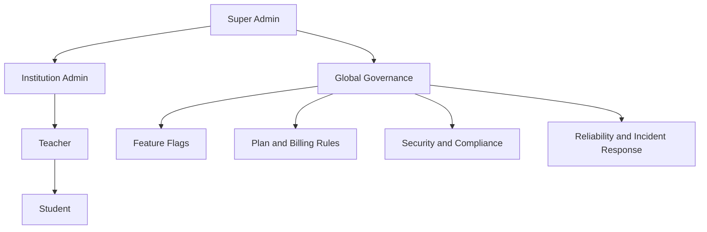
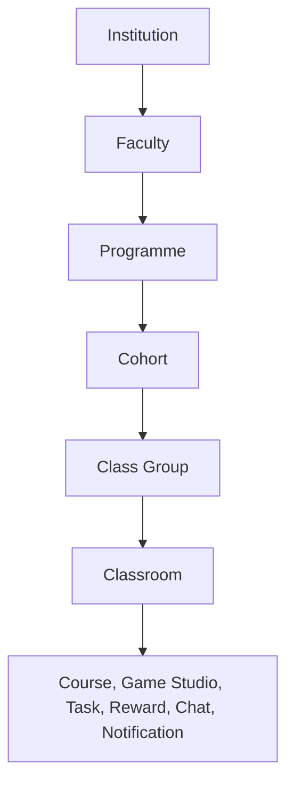

# Super Admin

Role: `super_admin`  
Scope: global platform governance across all institutions and modules.

## Mission

Super Admin owns platform structure, compliance, commercial controls, and tenant safety.  
Institution Admin and Teacher own delivery. Student owns participation.

This file is the top-level control plane for all module docs:

- `02_institution.md`
- `03_teacher.md`
- `04_student.md`
- `05_classroom.md`
- `06_note.md`
- `07_course.md`
- `08_game_studio.md`
- `09_task.md`
- `10_reward_system.md`
- `11_chat.md`
- `12_notification.md`
- `13_hetzner_infra.md`

---

## Platform ownership map (source of truth)

1. Super Admin

- Creates/suspends institutions, controls global feature flags, enforces GDPR and security baseline.
- Owns plan catalog, seat model, billing guardrails, and incident response.

2. Institution Admin

- Manages faculty/programme/cohort/class-group tree, teachers, students, licenses inside one tenant.
- Never accesses data from other institutions.

3. Teacher

- Creates classrooms, courses, games, tasks, and reviews progress inside assigned institution scope.

4. Student

- Consumes content, submits tasks, plays games, collaborates, and tracks personal progress.

### Visual: role and governance hierarchy

---

## Cross-module dependencies (must stay consistent)

1. Institution (`02`) is the tenant boundary for everything else.
2. Class Room (`05`) is the operational container linking Course (`07`), Game Studio (`08`), Task (`09`), Reward (`10`), Chat (`11`), and Notification (`12`).
3. Notes (`06`) can be personal or collaborative, but always inherit institution and role access rules.
4. Infrastructure (`13`) must enforce RLS, backups, encryption, logging, and recovery for all modules.

---

## Hierarchy ownership

Detailed academic hierarchy design is institution logic and is defined in `02_institution.md`.
`01_super_admin.md` stays at governance and cross-module policy level.

### Visual: academic structure hierarchy

---

## Super Admin functional areas

### 1) Tenant governance

- Create, update, suspend, and reactivate institutions.
- Enforce domain policy, region policy, and retention defaults.
- View institution health and growth trends without cross-tenant data leakage.

Institution health should be tracked with these platform-level signals:

- Access health: seat usage, account activation, login activity
- Learning health: course/game usage, task completion, overdue work, inactivity
- Operational health: storage pressure, license expiry risk, failed workflows
- Compliance health: export/delete workflow readiness, audit trail completeness

State model for institution health:

- Blue: healthy baseline, no immediate risk
- Orange: warning state, approaching limits or engagement drop
- Red: critical state, immediate action required

### 2) Commercial controls

- Manage plan definitions (EDU Basic, EDU Plus, etc.).
- Set seat and storage policy templates consumed by `02_institution.md`.
- Configure renewal, grace windows, and read-only fallback on expiry.

### 3) Global feature management

- Control rollout of major modules (Game Studio, Versus, Chat, advanced analytics).
- Support per-institution overrides while keeping secure defaults.
- Keep an immutable audit log for every feature-flag change.

### 4) Security and compliance

- Enforce GDPR Art. 32 TOM baseline platform-wide.
- Validate RLS isolation and privileged-access controls.
- Approve data export, deletion, and retention workflows for institution admins.

### 5) Reliability and operations

- Track uptime/SLO, queue health, webhook failures, and storage pressure.
- Ensure encrypted backups + tested restore drills.
- Maintain incident playbooks and 72-hour breach notification process.

---

## Guardrails that every module must respect

1. Tenant-first access

- Every row with user data must carry `institution_id`.
- No cross-tenant joins in product APIs.

2. Principle of least privilege

- Students: own data + assigned classroom resources.
- Teachers: own classrooms/content + assigned rosters.
- Institution admins: full tenant view, no global view.
- Super admins: global operational view, with audited elevated actions.

3. Data lifecycle

- Soft delete first, hard purge by policy.
- Export and delete flows must be scriptable and auditable.

4. Secure-by-default communications

- In-app + controlled email only.
- No unmanaged third-party messaging channels.

5. Analytics boundaries

- Institution analytics never expose raw personal data outside tenant.
- Global analytics are aggregated and anonymized for platform-level decisions.

---

## Module contract checklist (for docs review)

Use this checklist whenever updating `02` to `13`:

1. Role scope is explicit (who can read/write/delete).
2. Tenant scope is explicit (what `institution_id` gates).
3. Classroom interaction is explicit (how module binds to class context).
4. Compliance note is explicit (retention/export/deletion/logging).

---

## MVP rollout order (platform level)

1. Institution hierarchy and seat/storage enforcement (`02`).
2. Classroom lifecycle and assignment model (`05`).
3. Course + Game Studio publish flow to classroom (`07`, `08`).
4. Task collaboration and review loop (`09`).
5. Reward + notification loops (`10`, `12`).
6. Chat guardrails and moderation (`11`).
7. Harden infra and compliance evidence (`13`).

---

## Definition of done for structure consistency

The docs are considered structurally aligned when:

1. All module docs reference classroom scope and tenant scope consistently.
2. Terminology is unified: "Class Room" (file), "classroom" (product UI).
3. No module implies cross-tenant access.
4. Security and compliance responsibilities map cleanly from Super Admin to Institution Admin.
