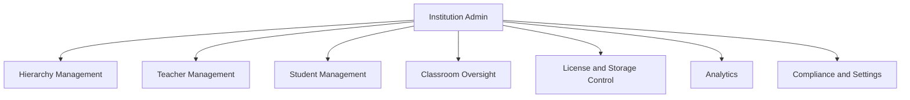
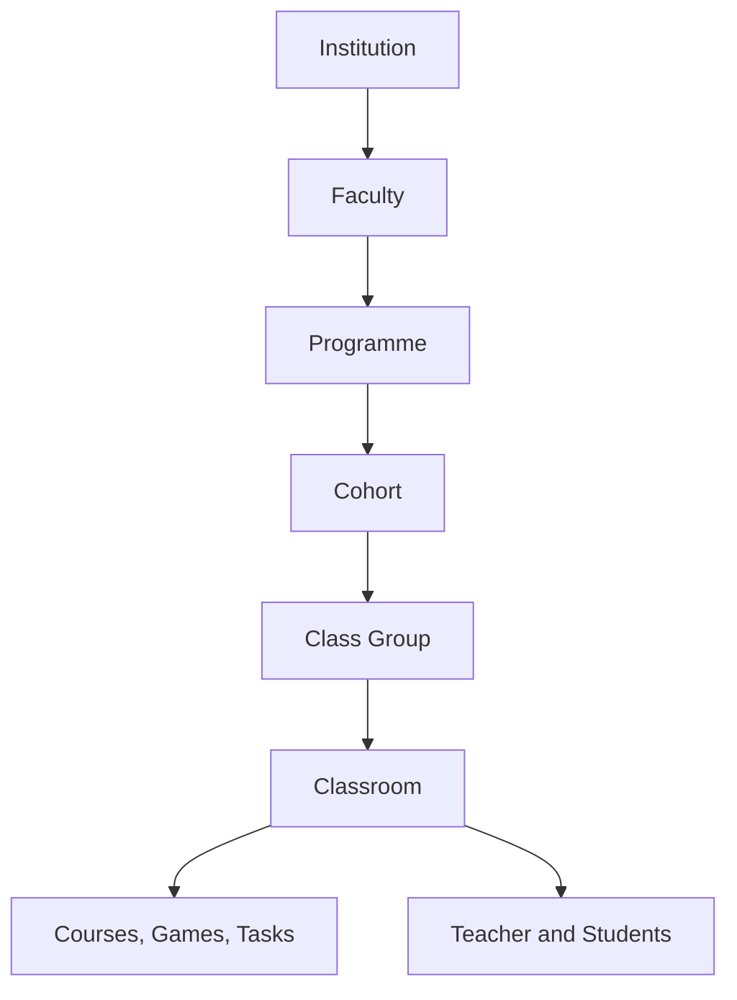

# Institution

## Functional feature map

This document defines what Institution Admin must implement for school operations:

1. Dashboard and institution health signals
2. Hierarchy management (faculty, programme, cohort, class group)
3. Class Room oversight
4. Teacher management
5. Student management
6. Course and game governance
7. Analytics and intervention signals
8. License and storage control
9. Billing operations
10. Settings and compliance

### Visual: institution admin control scope



---

## Functional areas

### 1) Dashboard

Purpose: fast health signal for the institution.

Must show:

- seat pressure
- storage pressure
- active/inactive users
- overdue classroom work signals
- expiry and renewal signals

Design principle: insight first, drill-down second.

### 2) Hierarchy management

Purpose: define the real-world school structure once, reuse everywhere.

Canonical access rule for institution LMS delivery:

- student entitlement is derived from `classroom_members + course_deliveries`
- `course_enrollments` and `classroom_course_links` are compatibility/history surfaces only

Canonical visual to show users how structure works:

```text
Schule für Farbe und Gestaltung
└── Ausbildung (faculty)
    ├── Maler & Lackierer (programme, 3yr, year_group)
    │   ├── Jahrgang 2022 (cohort, archived)
    │   ├── Jahrgang 2023 (cohort, active)
    │   │   ├── ML-3A (class group, 28 students)
    │   │   └── ML-3B (class group, 26 students)
    │   └── Jahrgang 2024 (cohort, active)
    │       └── ML-1A (class group, 30 students)
    └── GVM (programme, 3yr, year_group)
        └── ...
└── Berufskolleg (faculty)
    ├── TBK I (programme, 1yr, stage)
    │   └── TBK1-A (class group, 22 students)
    └── TBK II (programme, 1yr, stage)
        └── TBK2-A (class group, 20 students)
```

Managed entities:

- faculty
- programme
- cohort / year group
- class group

Expected capabilities:

- create, edit, archive lifecycle
- clear assignment boundaries
- cohort progression handling
- class-group movement for students

This is the highest-priority area because every classroom and enrollment depends on it.

### Visual: structural hierarchy



### 3) Class Room oversight

Purpose: observe and govern classrooms created by teachers.

Must support:

- filter by teacher, faculty, programme, class group
- view activity and assignment signals
- reassign classroom ownership when staffing changes
- deactivate classroom while preserving history

Institution Admin visibility is broad; editing classroom pedagogy remains teacher-led.

### 4) Teacher management

Purpose: ensure teaching capacity and correct access scope.

Must support:

- teacher invite and activation
- faculty/programme assignment
- role deactivation without data loss
- safe ownership transfer of classrooms/content

### 5) Student management

Purpose: maintain accurate learner roster quality.

Must support:

- manual add
- bulk import workflow
- class-group reassignment
- account deactivation and reactivation
- personal-data export and deletion requests

### 6) Courses and games oversight

Purpose: governance and safety, not day-to-day editing.

Must support:

- visibility into published and draft content
- emergency unpublish actions
- institution-level highlighting or curation controls
- storage impact visibility by content area

### 7) Analytics

Purpose: institution decisions, not raw data browsing.

Focus signals:

- engagement health
- completion health
- teacher activity and output consistency
- risk clusters (drop-off, inactivity, overdue work)

Output should guide interventions (which class, which teacher support, which student cohort).

### 8) License and storage control

Purpose: keep operations within purchased capacity.

Rules:

- seats are finite and role-scoped
- storage is institution-pooled
- hard-stop on institution storage exhaustion
- warning-first behavior on user-level soft thresholds

Must include clear warning states and escalation path before hard blocks are reached.

### 9) Billing operations

Purpose: local financial transparency and renewal workflow.

Must support:

- current plan visibility
- invoice history
- payment status clarity
- upgrade and downgrade request flows

Institution Admin triggers flows; payment processing remains externalized.

### 10) Settings and compliance

Purpose: legal and operational control plane for the institution.

Must support:

- profile and locale configuration
- retention policy selection
- data export and deletion workflows
- notification policy defaults
- institution-level feature toggles from allowed global catalog

---

## Tenant security and compliance rules

1. All operations remain scoped to one institution.
2. Institution Admin cannot access other tenant data.
3. Auditability is required for role, policy, and visibility changes.
4. GDPR operations must be executable and traceable.
5. Classroom and learner history must survive deactivation events unless legally deleted.

---

## Build priority

1. Hierarchy management
2. Teacher lifecycle and assignment
3. Student import and reassignment
4. Classroom oversight
5. Seat and storage enforcement
6. Institution dashboard insights
7. Compliance workflows (export/delete/retention)

---

## Concrete feature tree

### Hierarchy management

**Create faculty**

- Table: `faculties`
- Input: institution_id, name, description, sort_order
- RLS: institution_admin full CRUD; members read-only

**Create programme**

- Table: `programmes`
- Input: institution_id, faculty_id, name, duration_years, progression_type (year_group | stage), sort_order

**Create cohort**

- Table: `cohorts`
- Input: institution_id, programme_id, name, academic_year, sort_order

**Create class group**

- Table: `class_groups`
- Input: institution_id, cohort_id, name, description, sort_order
- Note: class_group is the stable identity; a new offering is created each academic year

**Create offering (programme / cohort / class_group)**

- Tables: `programme_offerings`, `cohort_offerings`, `class_group_offerings`
- Input: parent_id, status (draft | active | archived), starts_at, ends_at
- Used for: year-bound delivery; classrooms reference `class_group_offering_id`

**Archive / soft-delete any hierarchy node**

- Sets `deleted_at` on the row; children are not cascade-deleted but become orphaned from active tree
- Year rollover: create new cohort/class_group offerings; set old classrooms to status = inactive

---

### Teacher management

**Invite teacher by user_id**

- RPC: `invite_institution_member(institution_id, user_id, role = 'teacher')`
- Creates: `institution_memberships` row (status = invited)
- Teacher must call `activate_institution_invite()` to flip to active

**Invite teacher by email (no auth account yet)**

- RPC: `create_institution_invite_by_email(institution_id, email, role = 'teacher', expires_in)`
- Creates: `institution_invites` row with secret token
- Teacher redeems via `redeem_institution_invite(token)` after signing up

**Assign teacher to faculty / programme scope**

- Table: `institution_staff_scopes`
- Input: user_id, institution_id, faculty_id, programme_id
- Effect: teacher can see classrooms within that scope

**Suspend / remove teacher**

- Update `institution_memberships.status = suspended` or set `left_institution_at` + `leave_reason`
- Effect: teacher drops out of `app.member_institution_ids()` and loses all RLS access

---

### Student management

**Invite student by user_id or email**

- Same RPCs as teacher with `role = 'student'`
- Creates: `institution_memberships` (status = invited)

**Assign student to classroom**

- Table: `classroom_members`
- Input: institution_id, classroom_id, user_id, membership_role = student
- Effect: student gains access to all courses / games / tasks published to that classroom

**Withdraw student from classroom (year rollover / course change)**

- Set `classroom_members.withdrawn_at` + `leave_reason`
- Student loses classroom-scoped RLS access; insert new `classroom_members` row in new classroom

**Remove student from institution**

- Set `institution_memberships.left_institution_at` + `leave_reason`
- Student drops out of all `app.member_institution_ids()` checks

---

### Classroom management

**Create classroom**

- Table: `classrooms`
- Input: institution_id, class_group_id, class_group_offering_id, primary_teacher_id, title
- Status defaults to active

**Deactivate classroom**

- Sets `classrooms.status = inactive` + `deactivated_at`
- Used at year-end; classroom data is preserved for analytics

**Add co-teacher**

- Table: `classroom_members`
- Input: classroom_id, user_id, membership_role = co_teacher
- Effect: co-teacher gets roster read, can manage course links, reward settings

---

### Quota and license management

**View live usage**

- Table: `institution_quotas_usage`
- Fields: seats_used, storage_used_bytes (updated by AFTER trigger on cloud_files)

**View subscription caps**

- Table: `institution_subscriptions`
- Fields: seats_cap, storage_bytes_cap, billing_status, renewal_at, grace_ends_at

**View invoices**

- Table: `institution_invoice_records`
- Fields: amount_cents, currency, issued_at, due_at, paid_at, status (pending / paid / overdue / cancelled / refunded)

---

### Settings and compliance

**Configure institution settings**

- Table: `institution_settings`
- Fields: default_locale, timezone, retention_policy_code, notification_defaults (jsonb)

**Create GDPR data subject request**

- Table: `data_subject_requests`
- Input: subject_user_id, request_type (access | erasure | portability | rectification)
- Status lifecycle: pending → processing → completed | rejected

**Read audit trail**

- Via `audit.events` (read forwarded to super_admin; institution_admin sees own institution events)

---

## Schema visualization

```text
Schule für Farbe und Gestaltung  [institutions row]
├── institution_memberships (users × role × status)
├── institution_settings (locale, timezone, retention_policy, notification_defaults)
├── institution_quotas_usage (seats_used, storage_used_bytes)
├── institution_subscriptions (plan_id, billing_status, seats_cap, storage_bytes_cap)
├── institution_entitlement_overrides (feature_id → typed value override)
├── institution_invoice_records (billing history)
├── data_subject_requests (GDPR tracker)
│
└── Ausbildung  [faculties row]
    ├── Maler & Lackierer  [programmes row — 3yr, year_group]
    │   ├── programme_offerings (academic_year, status: draft|active|archived)
    │   ├── Jahrgang 2022  [cohorts row — archived]
    │   │   ├── cohort_offerings (status: archived)
    │   │   └── ML-3A 2022  [class_groups row]
    │   │       ├── class_group_offerings (status: archived)
    │   │       └── Farbgestaltung 2022  [classrooms row — status: inactive]
    │   │           └── classroom_members (withdrawn students)
    │   ├── Jahrgang 2023  [cohorts row — active]
    │   │   ├── cohort_offerings (status: active)
    │   │   ├── ML-3A  [class_groups row — 28 students]
    │   │   │   ├── class_group_offerings (status: active)
    │   │   │   └── Farbmischung  [classrooms row — status: active]
    │   │   │       ├── primary_teacher_id → teacher profile
    │   │   │       ├── classroom_members (28 students, enrolled_at, withdrawn_at?)
    │   │   │       ├── course_deliveries (linked course versions)
    │   │   │       ├── game_deliveries (published game versions)
    │   │   │       └── task_deliveries (active tasks with due dates)
    │   │   └── ML-3B  [class_groups row — 26 students]
    │   │       └── Farbgestaltung  [classrooms row — status: active]
    │   └── Jahrgang 2024  [cohorts row — active]
    │       └── ML-1A  [class_groups row — 30 students]
    │           └── Grundlagen Farbe  [classrooms row — status: active]
    └── GVM  [programmes row — 3yr, year_group]
        └── ...

institution_staff_scopes (teacher_id → faculty_id, programme_id)
institution_invites (email, role, token, expires_at, accepted_at)
```

### CRUD surface by role

| Operation                                                  | Institution Admin | Teacher    | Student    | Super Admin       |
| ---------------------------------------------------------- | ----------------- | ---------- | ---------- | ----------------- |
| Create / edit faculties, programmes, cohorts, class_groups | yes               | —          | —          | yes               |
| Create / manage classrooms                                 | yes               | —          | —          | yes               |
| Enroll / withdraw classroom members                        | yes               | —          | —          | yes               |
| Invite teachers / students                                 | yes               | —          | —          | yes               |
| Manage institution_settings                                | yes               | —          | —          | yes               |
| Read institution_quotas_usage                              | yes (read)        | —          | —          | yes               |
| Read institution_subscriptions                             | yes (read)        | —          | —          | yes (full CRUD)   |
| Manage data_subject_requests (GDPR)                        | yes               | —          | —          | yes               |
| Read audit.events                                          | —                 | —          | —          | yes (SELECT only) |
| Read org hierarchy                                         | yes               | yes (read) | yes (read) | yes               |
