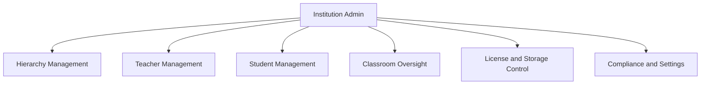
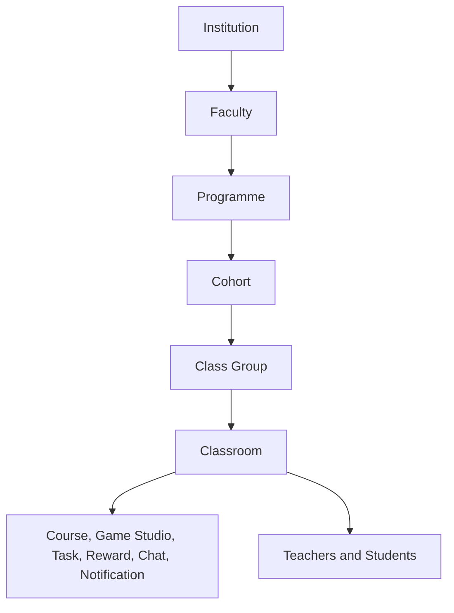

# Institution

Role: `institution_admin`
Scope: one institution — all teachers, students, classrooms, content, and compliance within that tenant.

## Mission and context

Institution Admin is the operational owner of a school. They define the academic structure, manage who belongs to it, oversee what happens inside classrooms, and are accountable for compliance within their tenant. They never see data from other institutions.

Institution Admin does not create learning content. They make it possible by building the hierarchy that classrooms, teachers, and students attach to — and by keeping the roster, capacity, and compliance state clean.

**Scope:** single institution — no cross-tenant visibility
**Accountability:** hierarchy, teacher and student lifecycle, classroom oversight, license capacity, GDPR operations, institution settings

**Role boundary within the institution:**

| Role              | What they own                            | What they cannot do                           |
| ----------------- | ---------------------------------------- | --------------------------------------------- |
| Institution Admin | Structure, roster, compliance, oversight | Create courses, games, tasks; deliver content |
| Teacher           | Classroom delivery, content authoring    | Manage hierarchy, invite members              |
| Student           | Learning, participation                  | Manage anything structural                    |



---

## Feature tree

### Hierarchy management

The academic structure is defined once and reused everywhere. Every classroom, course delivery, and student enrollment traces back to a node in this tree.



**Create faculty**

- Table: `faculties`
- Input: institution_id, name, description, sort_order
- All institution members can read; institution_admin full CRUD

**Create programme**

- Table: `programmes`
- Input: institution_id, faculty_id, name, duration_years, progression_type (year_group | stage), sort_order

**Create cohort**

- Table: `cohorts`
- Input: institution_id, programme_id, name, academic_year, sort_order

**Create class group**

- Table: `class_groups`
- Input: institution_id, cohort_id, name, description, sort_order
- Class group is the stable identity across years; a new offering is created each academic year

**Create offering (programme / cohort / class_group)**

- Tables: `programme_offerings`, `cohort_offerings`, `class_group_offerings`
- Input: parent_id, status (draft | active | archived), starts_at, ends_at
- Classrooms reference `class_group_offering_id` to bind to a specific academic year

**Archive / soft-delete hierarchy node**

- Sets `deleted_at` on the row; children are not cascade-deleted
- Year rollover: create new offerings for the new year; set old classrooms to `status = inactive`

---

### Teacher management

**Invite teacher (existing user)**

- RPC: `invite_institution_member(institution_id, user_id, role = 'teacher')`
- Creates: `institution_memberships` row (status = invited)
- Teacher activates via: `activate_institution_invite()`

**Invite teacher by email (no account yet)**

- RPC: `create_institution_invite_by_email(institution_id, email, role, expires_in)` — `role` may be `teacher`, `student`, or `institution_admin` (super_admin bootstrap uses the dedicated `create_institution_with_admin_email_invite` RPC, which creates the tenant and the pending admin invite in one step).
- Creates: `institution_invites` row with secret token
- Invitee redeems via: `redeem_institution_invite(token)` after sign-up (profile email must match the invite)

**Assign teacher to faculty / programme**

- Table: `institution_staff_scopes`
- Input: user_id, institution_id, faculty_id, programme_id
- Effect: teacher's classroom visibility is scoped to that faculty/programme

**Suspend teacher**

- Update: `institution_memberships.status = suspended`
- Effect: teacher loses all RLS access immediately; classroom content preserved

**Remove teacher from institution**

- Update: `institution_memberships.left_institution_at` + `leave_reason`
- Effect: teacher drops out of `app.member_institution_ids()`; classrooms should be reassigned first

---

### Student management

**Invite student (existing user or by email)**

- Same RPCs as teacher with `role = 'student'`
- Creates: `institution_memberships` (status = invited)

**Assign student to classroom**

- Table: `classroom_members`
- Input: institution_id, classroom_id, user_id, membership_role = student, enrolled_at
- Effect: student immediately gains access to all published course_deliveries, game_deliveries, task_deliveries for that classroom

**Withdraw student from classroom**

- Update: `classroom_members.withdrawn_at` + `leave_reason`
- Effect: student loses classroom-scoped RLS access; insert new row in new classroom for reassignment

**Remove student from institution**

- Update: `institution_memberships.left_institution_at` + `leave_reason`
- Effect: student drops out of all institution-scoped access

---

### Classroom management

**Create classroom**

- Table: `classrooms`
- Input: institution_id, class_group_id, class_group_offering_id, primary_teacher_id, title
- Status defaults to active; visible only to institution_admin, primary teacher, co-teachers, enrolled students

**Deactivate classroom**

- Update: `classrooms.status = inactive`, `deactivated_at = now()`
- Used at year-end; all data (progress, submissions, game runs) is preserved for analytics and compliance

**Reassign classroom ownership**

- Update: `classrooms.primary_teacher_id`
- Use when a teacher leaves or changes assignment; co-teacher row should be updated accordingly

---

### Quota and license management

**View live usage**

- Table: `institution_quotas_usage`
- Fields: seats_used (updated by app layer on membership changes), storage_used_bytes (updated by AFTER trigger on `cloud_files`)

**View subscription caps and billing state**

- Table: `institution_subscriptions`
- Fields: seats_cap, storage_bytes_cap, billing_status (active / trialing / past_due / suspended / canceled), renewal_at, grace_ends_at

**View invoice history**

- Table: `institution_invoice_records`
- Fields: amount_cents, currency, issued_at, due_at, paid_at, status (pending / paid / overdue / cancelled / refunded)
- Read-only for institution_admin; super_admin manages

---

### Settings and compliance

**Configure institution settings**

- Table: `institution_settings`
- Fields: default_locale, timezone, retention_policy_code, notification_defaults (jsonb)

**Create GDPR data subject request**

- Table: `data_subject_requests`
- Input: subject_user_id, request_type (access | erasure | portability | rectification)
- Status lifecycle: pending → processing → completed | rejected
- Institution admin executes the export or deletion; super_admin has oversight

**Read audit trail**

- Table: `audit.events`
- Institution_admin can read events scoped to their institution_id
- Super_admin has SELECT across all institutions

---

## Schema visualization

```text
Schule für Farbe und Gestaltung  [institutions row]
│
├── institution_memberships (user_id, membership_role, status, left_institution_at)
├── institution_settings (locale, timezone, retention_policy_code, notification_defaults)
├── institution_quotas_usage (seats_used, storage_used_bytes)  ← trigger-maintained
├── institution_subscriptions (plan_id, billing_status, seats_cap, storage_bytes_cap, renewal_at, grace_ends_at)
├── institution_entitlement_overrides (feature_id → typed value, reason, starts_at, ends_at)
├── institution_invoice_records (amount_cents, status, issued_at, paid_at)
├── institution_invites (email, role, token, expires_at, accepted_at)
├── institution_staff_scopes (teacher_id → faculty_id, programme_id)
└── data_subject_requests (subject_user_id, request_type, status)
│
└── Ausbildung  [faculties row]
    ├── Maler & Lackierer  [programmes — 3yr, year_group]
    │   ├── programme_offerings (status: active)
    │   ├── Jahrgang 2022  [cohorts — archived]
    │   │   ├── cohort_offerings (status: archived)
    │   │   └── ML-3A 2022  [class_groups]
    │   │       ├── class_group_offerings (status: archived)
    │   │       └── Farbgestaltung 2022  [classrooms — status: inactive]
    │   │           └── classroom_members (withdrawn_at set)
    │   ├── Jahrgang 2023  [cohorts — active]
    │   │   ├── cohort_offerings (status: active)
    │   │   ├── ML-3A  [class_groups — 28 students]
    │   │   │   ├── class_group_offerings (status: active)
    │   │   │   └── Farbmischung  [classrooms — status: active]
    │   │   │       ├── primary_teacher_id → Frau Müller
    │   │   │       ├── classroom_members (28 students, enrolled_at, withdrawn_at?)
    │   │   │       ├── course_deliveries (linked course versions, status: active)
    │   │   │       ├── game_deliveries (published game versions)
    │   │   │       └── task_deliveries (active tasks, due_at)
    │   │   └── ML-3B  [class_groups — 26 students]
    │   │       └── Farbgestaltung  [classrooms — status: active]
    │   └── Jahrgang 2024  [cohorts — active]
    │       └── ML-1A  [class_groups — 30 students]
    │           └── Grundlagen Farbe  [classrooms — status: active]
    └── GVM  [programmes — 3yr, year_group]
        └── ...

└── Berufskolleg  [faculties row]
    ├── TBK I  [programmes — 1yr, stage]
    │   └── TBK1-A  [class_groups — 22 students]
    └── TBK II  [programmes — 1yr, stage]
        └── TBK2-A  [class_groups — 20 students]
```

### CRUD surface by role

| Operation                                                  | Institution Admin    | Teacher    | Student    | Super Admin      |
| ---------------------------------------------------------- | -------------------- | ---------- | ---------- | ---------------- |
| Create / edit faculties, programmes, cohorts, class_groups | yes                  | —          | —          | yes              |
| Create offerings (year binding)                            | yes                  | —          | —          | yes              |
| Create / deactivate / reassign classrooms                  | yes                  | —          | —          | yes              |
| Invite / suspend / remove teachers                         | yes                  | —          | —          | yes              |
| Invite / withdraw / remove students                        | yes                  | —          | —          | yes              |
| Assign teacher to faculty / programme scope                | yes                  | —          | —          | yes              |
| Read org hierarchy                                         | yes                  | yes (read) | yes (read) | yes              |
| Manage institution_settings                                | yes                  | —          | —          | yes              |
| Read institution_quotas_usage                              | yes (read)           | —          | —          | yes              |
| Read institution_subscriptions                             | yes (read)           | —          | —          | yes (full CRUD)  |
| Read institution_invoice_records                           | yes (read)           | —          | —          | yes              |
| Manage data_subject_requests (GDPR)                        | yes                  | —          | —          | yes              |
| Read audit.events                                          | own institution only | —          | —          | all institutions |

---

## Constraints

1. **Tenant isolation** — institution_admin cannot read or write any data outside their institution_id. No cross-tenant joins are permitted in any product API.
2. **Classroom history survives deactivation** — setting `classrooms.status = inactive` or `classroom_members.withdrawn_at` never deletes progress, submissions, game runs, or attendance records. Hard purge is only executed as part of a completed GDPR erasure request.
3. **Membership drives all access** — `institution_memberships` (active, left_institution_at IS NULL) is the authoritative gate. `classroom_members` (withdrawn_at IS NULL) is the secondary gate for classroom-scoped delivery. Legacy `user_institutions` and `course_enrollments` are compatibility surfaces only.
4. **Canonical student entitlement** — student access to lessons, games, and tasks is derived from `classroom_members + course_deliveries / game_deliveries / task_deliveries`. `classroom_course_links` and `course_enrollments` are read-only history.
5. **Storage cap is hard** — `register_cloud_file_record` checks `storage_used_bytes + new_size ≤ storage_bytes_cap` before creating the file record. Institution admin cannot bypass this; only super_admin can raise the cap via `institution_subscriptions`.
6. **GDPR operations must be traceable** — every `data_subject_requests` state transition must be logged; export and deletion workflows must be scriptable and produce an audit record in `audit.events`.
