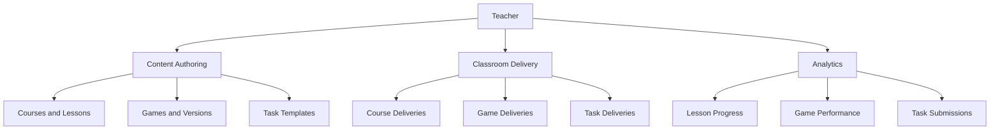

# Teacher

Role: `teacher`
Scope: assigned institution + owned classrooms — creates and delivers all learning content.

## Mission and context

Teacher is the primary content creator and classroom operator. They build courses, games, and tasks, publish them to classrooms, and monitor how students engage with them. Everything a student learns or submits traces back to something a teacher authored and delivered.

Teachers do not manage the institution structure. They work inside the hierarchy that Institution Admin defines — classrooms are assigned to them, not created by them. Their authority is deep within their own classrooms and content, not broad across the institution.

**Scope:** own content (courses, games, tasks) + assigned classrooms within one institution
**Accountability:** lesson quality, game design, task delivery, student progress monitoring, reward management, submission review



---

## Feature tree

### Course authoring

**Create course**

- Table: `courses`
- Input: institution_id, teacher_id (self), title, description, theme_id
- Starts unpublished (`is_published = false`)

**Add topic**

- Table: `topics`
- Input: course_id, title, description, order_index

**Add lesson**

- Table: `lessons`
- Input: topic_id, title, content (jsonb), pages (jsonb array of slides — each has id, order, content blocks), order_index, content_schema_version

**Publish course snapshot**

- Tables: `course_versions` → `course_version_topics` → `course_version_lessons`
- Input: course_id, version_no, change_note
- Result: immutable snapshot; source course can keep being edited independently

**Deliver course to classroom**

- Table: `course_deliveries`
- Input: classroom_id, course_id, course_version_id, status (draft | scheduled | active), starts_at, ends_at
- Effect: all active `classroom_members` can access lessons via `student_can_access_course_delivery()`

---

### Game authoring

**Create game**

- Table: `games`
- Input: institution_id, teacher_id (self), game_type, game_config (jsonb nodes/routing), course_id (optional)
- Trigger: if course_id is set, `games.institution_id` must match `courses.institution_id`

**Create game version**

- Table: `game_versions`
- Input: game_id, version_no, content (jsonb full node/routing snapshot), change_note, status = draft → published
- Draft rows are editable; published and archived are immutable

**Deliver game to classroom**

- Table: `game_deliveries`
- Input: game_id, game_version_id, classroom_id, course_delivery_id (optional), lesson_id (optional), status = draft → published

**Launch class game session**

- Table: `game_runs` (mode = classroom)
- Input: game_id, classroom_id, game_version_id, started_by (teacher)
- Lifecycle: lobby → started → completed | cancelled
- Creates: 1 `game_session` → N `game_session_participants` (all enrolled students)

---

### Task authoring and delivery

**Create task template**

- Table: `task_templates`
- Input: institution_id, teacher_id (self), title, description

**Publish task version**

- Table: `task_template_versions`
- Input: task_template_id, version_number, title, instructions (jsonb), rubric (jsonb), grading_settings (jsonb), attachments (jsonb)
- Status: draft → published (immutable after publish)

**Deliver task to classroom**

- Table: `task_deliveries`
- Input: task_template_id, task_template_version_id, classroom_id, course_delivery_id (optional), due_at
- State machine: draft → scheduled → active → closed | archived | canceled
- Every transition logged to `audit.events`

**Create task groups**

- Table: `task_groups` + `task_group_members`
- Input: task_delivery_id, group name, list of student user_ids
- Each group auto-creates a collaborative `notes` row (scope = collaborative)

**Review submission**

- Table: `task_submissions`
- Update: status = reviewed | returned, feedback (text), reviewed_at, reviewed_by (self)

---

### Classroom delivery view

**See assigned classrooms**

- Table: `classrooms` via `classrooms_scoped_read`
- Sees: classrooms where `primary_teacher_id = self` or has a `classroom_members` row with `membership_role = co_teacher`
- Fields visible: title, status (active | inactive), class_group_id, class_group_offering_id, institution_id

**See enrolled students (roster)**

- Table: `classroom_members` (withdrawn_at IS NULL)
- Sees: student user_id, enrolled_at, membership_role per classroom

**See active and scheduled course deliveries**

- Table: `course_deliveries` for own classrooms
- Sees: course_id, course_version_id, status (draft | scheduled | active | archived | canceled), starts_at, ends_at

**See game deliveries**

- Table: `game_deliveries` for own classrooms
- Sees: game_id, game_version_id, status, linked lesson_id or course_delivery_id (if set)

**See task deliveries**

- Table: `task_deliveries` for own classrooms
- Sees: task_template_id, task_template_version_id, status in delivery state machine, due_at, starts_at

**See attendance sessions and records**

- Table: `classroom_attendance_sessions`, `classroom_attendance_records`
- Sees: per-session attendance status (present | late | absent) for all enrolled students

**See reward settings**

- Table: `classroom_reward_settings`
- Sees: leaderboard_opt_in, joker_config (enabled jokers, cost, monthly_limit), level_thresholds

---

### Attendance

**Create attendance session (manual)**

- RPC: `create_classroom_attendance_session(classroom_id, course_id, title, session_date, starts_at, ends_at)` (SECURITY DEFINER)
- Gate: `app.caller_can_manage_classroom` — primary teacher, co-teacher, or super admin
- Creates: `classroom_attendance_sessions` row; `schedule_id` = NULL for manual one-off sessions
- Course must be linked to the classroom (`classroom_course_links`)

**Close attendance session**

- RPC: `close_classroom_attendance_session(attendance_session_id, ends_at)` (SECURITY DEFINER)
- Update: `classroom_attendance_sessions.ends_at` — marks session as closed; student self-check-in blocked after this

**Mark attendance record**

- RPC: `teacher_mark_attendance_record(attendance_session_id, student_id, status, source, check_in_time, check_out_time, note)` (SECURITY DEFINER)
- Status: `present | late | absent`; source: `manual | self_check_in | auto`
- Upserts on unique(attendance_session_id, student_id) — overrides any prior self-check-in
- Constraint: check_out_time ≥ check_in_time; student must be active `classroom_member`

**View attendance summary**

- RPC: `get_teacher_attendance_summary(classroom_id, course_id, from_date, to_date)`
- Returns per-student: present_count, late_count, absent_count, last_status, last_check_in_time
- Gate: `app.caller_can_manage_classroom`

---

### Recurring attendance schedule

**Create recurring schedule**

- RPC: `create_classroom_attendance_schedule(classroom_id, course_id, days_of_week[], start_time, end_time, timezone, active_from, active_until, is_active)` (SECURITY DEFINER)
- Table: `classroom_attendance_schedules`
- days_of_week: smallint array, 1=Mon … 7=Sun; must be non-empty and within 1–7
- timezone: IANA name (e.g. `Europe/Berlin`); end_time > start_time enforced by CHECK
- Gate: `app.caller_can_manage_attendance_schedule`

**Update schedule**

- RPC: `update_classroom_attendance_schedule(schedule_id, ...)` — patch any field; `p_clear_active_until = true` removes end date

**Archive schedule**

- RPC: `archive_classroom_attendance_schedule(schedule_id)`
- Sets `is_active = false`, trims `active_until` to today
- Deletes future session rows that have no attendance records yet

**Add schedule exception (skip or override)**

- RPC: `upsert_classroom_attendance_schedule_exception(schedule_id, exception_date, exception_type, override_start_time, override_end_time, note)` (SECURITY DEFINER)
- Table: `classroom_attendance_schedule_exceptions`
- exception_type = `skip` — removes this date from the generated series (no override times allowed)
- exception_type = `override` — replaces the base time window on this date (both override times required)
- Unique per (schedule_id, exception_date)

**Remove schedule exception**

- RPC: `delete_classroom_attendance_schedule_exception(exception_id)`

**Materialize sessions from schedule**

- RPC: `materialize_classroom_attendance_sessions(schedule_id, from_date, to_date)` (SECURITY DEFINER)
- Generates `classroom_attendance_sessions` rows for all applicable days in the date range
- Applies exceptions: skip dates are excluded; override dates use the exception time window
- Sessions with existing attendance records are not modified or deleted

---

### Topic availability gates

**Lock a topic**

- RPC: `teacher_lock_topic_for_course(course_id, topic_id)` (SECURITY DEFINER)
- Table: `topic_availability_rules` (upsert on course_id + topic_id)
- Sets `is_locked = true`; clears any prior unlock_at / unlocked_by / unlocked_at
- Gate: `app.caller_can_manage_course` — course owner or super admin

**Unlock a topic manually**

- RPC: `teacher_unlock_topic_for_course(course_id, topic_id)` (SECURITY DEFINER)
- Sets `is_locked = false`, `unlocked_by = self`, `unlocked_at = now()`

**Schedule a topic unlock**

- RPC: `teacher_schedule_topic_unlock(course_id, topic_id, unlock_at)` (SECURITY DEFINER)
- Sets `is_locked = true`, `unlock_at = p_unlock_at`
- Students gain access automatically once `now() >= unlock_at` (checked by `app.student_can_access_topic`)

---

### Reward management

**Award / deduct points manually**

- Table: `point_ledger`
- Input: user_id, classroom_id, points, source = manual_adjustment, description
- RLS: primary teacher or co-teacher of that classroom only

**Configure classroom reward settings**

- Table: `classroom_reward_settings`
- Fields: leaderboard_opt_in, joker_config (jsonb — code/name/cost/monthly_limit/enabled), level_thresholds (jsonb)

**Approve joker redemption**

- App layer: teacher receives joker request notification, confirms
- Result: negative `point_ledger` row inserted (source = joker code)

---

### Analytics (read)

**Lesson progress**

- Table: `lesson_progress` — policy `lp_teacher_read` (teacher_id on the course)
- Fields: user_id, lesson_id, last_position, completed_at

**Learning events**

- Table: `learning_events` — policy `le_teacher_read`
- Types: lesson_opened, lesson_completed, slide_viewed, slide_time_spent, slide_navigation

**Game performance**

- Table: `game_session_participants` — policy `gsp_teacher_read` (own games)
- Fields: score, scores_detail (jsonb per-node breakdown), is_personal_best, completed_at

---

## Schema visualization

```text
Frau Müller  [profiles.role = teacher]
│   institution_memberships → Schule für Farbe und Gestaltung  (status: active)
│
├── courses  (teacher_id = self)
│   ├── Grundlagen Farbe  [is_published: true]
│   │   ├── topics
│   │   │   ├── Farbenlehre  [order_index: 1]
│   │   │   │   ├── Primärfarben   [lesson, order_index: 1]
│   │   │   │   └── Sekundärfarben [lesson, order_index: 2]
│   │   │   └── Farbmischung  [order_index: 2]
│   │   │       └── Der Farbkreis  [lesson, order_index: 1]
│   │   │           topic_availability_rules: is_locked=true, unlock_at=2026-04-10
│   │   ├── course_versions
│   │   │   ├── v1  [status: archived]
│   │   │   └── v2  [status: published — immutable snapshot]
│   │   │       └── course_version_topics → course_version_lessons
│   │   └── course_deliveries
│   │       └── Farbmischung classroom + v2  [status: active, starts_at: 2023-09-01]
│   │
│   └── Aufbaukurs Farbe  [is_published: false — draft, not yet delivered]
│
├── games  (teacher_id = self)
│   ├── Farbkreis Quiz  [course_id → Grundlagen Farbe]
│   │   ├── game_versions
│   │   │   ├── v2  [status: archived]
│   │   │   └── v3  [status: published] ← current_published_version_id
│   │   ├── game_deliveries
│   │   │   └── Farbmischung classroom + v3  [status: published, lesson_id → Der Farbkreis]
│   │   └── game_runs
│   │       ├── mode=classroom  [status: completed, 2026-03-28]
│   │       │   └── game_session → 27 game_session_participants
│   │       └── mode=solo  [Anna Schmidt: score 675, is_personal_best: true]
│   │
│   └── Mischfarben Challenge  [standalone, no course_id]
│       └── game_versions: v1  [status: published]
│
├── task_templates  (teacher_id = self)
│   └── Farbpalette erstellen
│       ├── task_template_versions
│       │   └── v1  [status: published — instructions jsonb, rubric jsonb]
│       └── task_deliveries
│           └── Farbmischung classroom  [status: active, due_at: 2026-04-10]
│               ├── Gruppe A  [Anna Schmidt + Tom Weber]
│               │   ├── notes  (scope: collaborative, co-editing)
│               │   └── task_submissions  [status: submitted, 2026-04-08]
│               └── Gruppe B  [Lena Fischer + Jonas Meier]
│                   ├── notes  (scope: collaborative)
│                   └── task_submissions  [status: reviewed, feedback: "Gut strukturiert!"]
│
├── classrooms  (primary_teacher_id = self)
│   └── Farbmischung  [ML-3A, Jahrgang 2023, status: active]
│       ├── classroom_members
│       │   ├── Anna Schmidt   [student, enrolled_at: 2023-09-01]
│       │   ├── Tom Weber      [student, enrolled_at: 2023-09-01]
│       │   ├── Lena Fischer   [student, enrolled_at: 2023-09-01]
│       │   ├── Jonas Meier    [student, enrolled_at: 2023-09-01]
│       │   ├── Max Huber      [student, withdrawn_at: 2024-01-15, leave_reason: transfer]
│       │   └── Herr Bauer     [co_teacher, enrolled_at: 2023-09-01]
│       │
│       ├── classroom_attendance_schedules
│       │   └── Mo/Mi/Fr 08:00–09:30, Europe/Berlin, active_from: 2023-09-01
│       │       ├── exceptions
│       │       │   └── 2026-04-18  [exception_type: skip — public holiday]
│       │       └── classroom_attendance_sessions  (materialized)
│       │           ├── 2026-03-31 Mo 08:00–09:30  [schedule_id set]
│       │           │   └── classroom_attendance_records
│       │           │       ├── Anna Schmidt:  present, check_in: 08:02
│       │           │       ├── Tom Weber:     late,    check_in: 08:18
│       │           │       └── Lena Fischer:  present, check_in: 07:59
│       │           └── 2026-04-02 Mi 08:00–09:30  [no records yet — open]
│       │
│       └── classroom_reward_settings
│           ├── leaderboard_opt_in: true
│           ├── joker_config: [{Hausaufgaben-Joker, cost:200}, {Fehler-Joker, cost:300}]
│           └── level_thresholds: Einsteiger:0 | Lernprofi:500 | Wissensträger:1500 | ...
│
└── Analytics  (read — scoped to own content)
    ├── lesson_progress: Anna completed Primärfarben 2026-03-15; Tom last_position: page 2
    ├── learning_events: 847 rows across Grundlagen Farbe delivery (slide_viewed, time_spent …)
    └── game_run_stats_scoped: Anna best_score:675 | Tom best_score:420 | Lena best_score:580
```

### CRUD surface by role

| Domain                       | Teacher creates/owns           | Teacher reads  | Teacher cannot                           |
| ---------------------------- | ------------------------------ | -------------- | ---------------------------------------- |
| courses / topics / lessons   | yes (own)                      | yes            | read other teachers' unpublished content |
| course_versions + deliveries | yes (own courses)              | yes            | modify after publish                     |
| games + game_versions        | yes (own)                      | yes            | —                                        |
| game_deliveries + runs       | yes (own games)                | yes            | —                                        |
| task_templates + versions    | yes (own)                      | yes            | —                                        |
| task_deliveries + groups     | yes (own)                      | yes            | —                                        |
| task_submissions (review)    | yes (own tasks)                | yes            | —                                        |
| classrooms                   | read only (assigned)           | yes            | create or deactivate classrooms          |
| classroom_members roster     | read + manage own classroom    | yes            | modify other classrooms' rosters         |
| point_ledger                 | manual insert (own classrooms) | own classrooms | view other classrooms                    |
| notification_events          | via RPC only                   | own deliveries | emit without institution membership      |

---

## Constraints

1. **Content ownership** — teacher RLS is `teacher_id = auth.uid()`. A teacher cannot read, edit, or deliver another teacher's unpublished courses, games, or task templates.
2. **Classrooms are institution-admin territory** — teachers cannot create or deactivate classrooms. They are assigned as `primary_teacher_id`; they manage delivery and roster within that assignment.
3. **Publish is a one-way gate** — `course_versions`, `game_versions`, and `task_template_versions` are immutable after status = published. To change content, a new version must be created and a new delivery issued.
4. **Audit trail on task delivery** — every `task_deliveries` state transition triggers `audit.log_event()`. Teachers cannot skip or reorder states.
5. **Point ledger is append-only** — teachers insert new rows (positive or negative); they cannot update or delete existing ledger entries.
6. **Co-teacher scope** — co-teachers (via `classroom_members.membership_role = co_teacher`) can manage course links and reward settings for that classroom, but cannot remove the primary teacher or deactivate the classroom.
