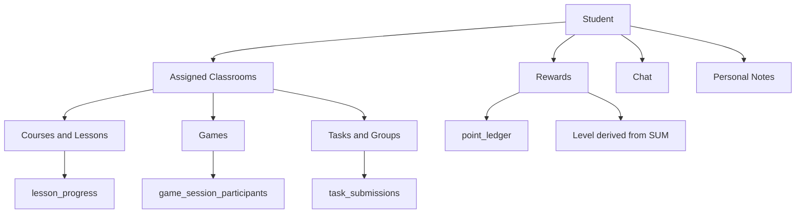

# Student

Role: `student`
Scope: assigned classrooms within one institution — consumes content, participates, earns rewards.

## Mission and context

Student is the learner. They access what their teacher has published to their classroom, play games, complete tasks collaboratively, earn points, and track their own progress. Everything they can see and do is scoped to the classrooms they are enrolled in.

Students do not create content, manage structure, or access other students' private work. Their authority is narrow and personal — own progress, own notes, own group's work, own rewards.

**Scope:** assigned classrooms only; no cross-classroom or cross-institution visibility
**Accountability:** own learning progress, group task collaboration, personal notes, reward balance



---

## Feature tree

### Content discovery

**See assigned classrooms**

- Table: `classrooms` via `classrooms_scoped_read`
- Condition: active `classroom_members` row (withdrawn_at IS NULL)

**See courses in classroom**

- Table: `course_deliveries` + `classroom_members`
- Access helper: `app.student_can_access_course_delivery(delivery_id)`
- Returns: active and scheduled deliveries for student's classrooms

**See published games**

- Table: `games` via `games_published_read`
- Returns: all published games in the institution (not classroom-restricted for solo play)

---

### Learning — courses and lessons

**Open a lesson**

- Table: `lessons` via `lessons_enrolled_read`
- Access: `app.student_can_access_lesson(lesson_id)` — lesson must be in a published delivery for student's classroom
- Inserts: `learning_events` row (event_type = lesson_opened)

**Navigate slides**

- Inserts: `learning_events` rows (slide_viewed, slide_navigation with direction, slide_time_spent with duration_ms)

**Complete a lesson**

- Upsert: `lesson_progress` (user_id, lesson_id, institution_id, completed_at = now(), last_position jsonb)
- Inserts: `learning_events` row (lesson_completed)
- Triggers reward: `point_ledger` row (source = lesson_complete) via app layer

**Resume a lesson**

- Reads: `lesson_progress.last_position` (e.g. `{"page_index": 2}`)

---

### Games

**Play solo game**

- Table: `game_runs` (mode = solo)
- Creates: 1 `game_session` → 1 `game_session_participants` row
- On complete: upserts `game_run_stats_scoped` (best_score, attempt_count, is_personal_best)
- Rewards: `point_ledger` rows (game_correct, game_speed_bonus, game_streak)

**Start versus game**

- Table: `game_runs` (mode = versus, invite_code generated)
- Challenger shares invite_code; opponent joins by code
- Creates: 1 `game_session` → 2 `game_session_participants`
- Winner earns: `point_ledger` row (source = game_versus_win, +25 rivalry points)

**Join class game session**

- Table: `game_session_participants` (classroom run started by teacher)
- Condition: active `classroom_members` for the classroom on the run
- View: live leaderboard from `game_session_participants.score`

**View personal game history**

- Table: `game_run_stats_scoped` — best_score, attempt_count, last_run_at per game/delivery

---

### Tasks

**View assigned tasks**

- Table: `task_deliveries` (status ≠ draft, classroom_id in `app.my_active_classroom_ids()`)

**View task group and collaborative note**

- Table: `task_groups`, `task_group_members`, `notes` (scope = collaborative, task_group_id set)
- RLS: student must have a `task_group_members` row for this group

**Co-edit group note**

- Update: `notes.content` (jsonb Yoopta blocks)
- Real-time via Supabase Realtime; Last Write Wins per block id

**Submit task**

- Table: `task_submissions`
- Insert: task_group_id, task_delivery_id, submitted_by (self), status = submitted, submitted_at = now()
- Triggers: notification to teacher (task_submitted)

**View teacher feedback**

- Read: `task_submissions.feedback`, `reviewed_at`, `status` (reviewed | returned)

---

### Personal notes

**Create personal note**

- Table: `notes` (scope = personal)
- Input: institution_id, owner_user_id (self), title, content (jsonb), lesson_id (optional slide-link)
- RLS: `notes_own` — owner only

**Pin / unpin note**

- Update: `notes.is_pinned`

**Soft-delete note**

- Update: `notes.deleted_at = now()`

---

### Rewards

**View own point balance**

- Table: `point_ledger` — SUM(points) where user_id = self, grouped by classroom
- Source breakdown visible (game_correct, lesson_complete, daily_streak, etc.)

**View classroom leaderboard**

- Table: `point_ledger` — `pl_member_read` policy: same classroom via `my_active_classroom_ids()`
- Only visible when `classroom_reward_settings.leaderboard_opt_in = true`

**Check level**

- Derived: SUM(points) for classroom compared to `classroom_reward_settings.level_thresholds` jsonb
- Levels: Einsteiger (0) → Lernprofi (500) → Wissensträger (1500) → Experte (3500) → Meister (7000)

**Request joker redemption**

- App layer: student selects joker type, submits request; teacher approves
- On approval: negative `point_ledger` row inserted (source = joker code)

---

### Communication

**Start a conversation**

- Table: `conversations` (type = direct | group)
- Insert: `conv_member_insert` — any institution member can create
- Note: student can initiate 1:1 with teacher; teacher cannot initiate with student first (app layer)

**Send a message**

- Table: `messages`
- Input: conversation_id, content (jsonb Lexical), attachments (jsonb array), reply_to_id (optional)
- RLS: `msg_member_insert` — must be active conversation member (left_at IS NULL)

**Mark conversation as read**

- Update: `conversation_members.last_read_at = now()`

---

## Schema visualization

```text
Anna Schmidt  [profiles.role = student]
│   institution_memberships → Schule für Farbe und Gestaltung  (status: active)
│
└── classroom_members  (withdrawn_at IS NULL — gates all access below)
    └── Farbmischung  [ML-3A, Jahrgang 2023]
        │
        ├── course_deliveries  (active in classroom)
        │   └── Grundlagen Farbe v2  [status: active, starts_at: 2023-09-01]
        │       └── lessons  (via student_can_access_lesson)
        │           ├── Primärfarben    → lesson_progress: completed_at: 2026-03-15
        │           ├── Sekundärfarben  → lesson_progress: last_position: {page_index: 1}
        │           └── Der Farbkreis   → topic_availability_rules: locked until 2026-04-10
        │               learning_events: 23 rows (slide_viewed, time_spent, lesson_opened)
        │
        ├── game_deliveries  (published in classroom)
        │   └── Farbkreis Quiz v3  [status: published]
        │       ├── game_run  mode=solo  [score: 675, is_personal_best: true, 2026-03-20]
        │       │   └── game_session_participants  [Anna's row — scores_detail jsonb]
        │       └── game_run_stats_scoped  [best_score: 675, attempt_count: 3]
        │
        ├── task_deliveries  (active in classroom)
        │   └── Farbpalette erstellen  [status: active, due_at: 2026-04-10]
        │       └── Gruppe A  (task_group_members: Anna + Tom Weber)
        │           ├── notes  (scope: collaborative, task_group_id set)
        │           │   └── [Anna and Tom co-editing — LWW per block]
        │           └── task_submissions  [status: submitted, submitted_at: 2026-04-08]
        │               └── feedback: pending review
        │
        ├── point_ledger  [Anna's classroom balance]
        │   ├── game_correct:    +100  (Farbkreis Quiz, node 1)
        │   ├── game_speed_bonus: +50  (answered in first 25%)
        │   ├── lesson_complete: +200  (Primärfarben + Sekundärfarben)
        │   ├── task_on_time:     +50  (Farbpalette submitted before due_at)
        │   └── SUM: 1350 pts → Level: Wissensträger  (threshold: 1500 not yet reached)
        │       classmates' totals visible (leaderboard_opt_in: true)
        │
        ├── notes  (scope: personal)
        │   ├── "Notizen zu Primärfarben"  [is_pinned: true, lesson_id → Primärfarben]
        │   └── "Farbmischung Ideen"       [deleted_at: null]
        │
        ├── conversations + conversation_members
        │   ├── direct: Anna ↔ Frau Müller  [Anna initiated; last_read_at: 2026-04-01]
        │   └── group: Gruppe A Chat        [left_at: null, is_muted: false]
        │       └── messages  [Anna: 12 sent, edit/delete own]
        │
        └── notification_deliveries  (channel: in_app)
            ├── task_due_soon  [read_at: 2026-04-08, dismissed_at: null]
            ├── level_up       [read_at: null — unread]
            └── notification_preferences
                └── base: task=enabled, reward=enabled, quiet_start: 22:00, quiet_end: 07:00
```

### CRUD surface by role (student)

| Domain                    | Student can                       | Student cannot              |
| ------------------------- | --------------------------------- | --------------------------- |
| lesson_progress           | upsert own                        | read others                 |
| learning_events           | insert own                        | read others                 |
| game_session_participants | write/read own + leaderboard      | write others                |
| game_run_stats_scoped     | read own                          | —                           |
| task_submissions          | submit own group                  | submit other groups         |
| notes (personal)          | full CRUD own                     | read others' personal notes |
| notes (collaborative)     | read/write own group              | access other groups         |
| point_ledger              | read own + classmates (if opt-in) | insert or modify            |
| conversations             | create, send, leave               | access outside institution  |
| notification_preferences  | manage own                        | manage others               |

---

## Constraints

1. **Classroom membership gates everything** — `classroom_members` (withdrawn_at IS NULL) is the single gate for course, game, task, and reward access. A student with no active classroom rows sees nothing except their personal notes and profile.
2. **Content access requires published delivery** — `student_can_access_lesson()` and `student_can_access_course_delivery()` require an active or scheduled `course_deliveries` row. Being enrolled in the institution is not enough.
3. **No self-enrollment** — students cannot insert their own `classroom_members` or `course_deliveries` rows. Institution Admin or teacher handles enrollment.
4. **Group work is group-scoped** — collaborative notes and task submissions are accessible only to members of the same `task_group`. A student cannot read another group's work within the same task delivery.
5. **Leaderboard is opt-in** — `classroom_reward_settings.leaderboard_opt_in` must be true for a student to read classmates' point_ledger rows. If false, students see only their own balance.
6. **Point ledger is read-only for students** — students never insert point_ledger rows directly. All point events are written by the app layer after game completion, lesson completion, or teacher approval.
