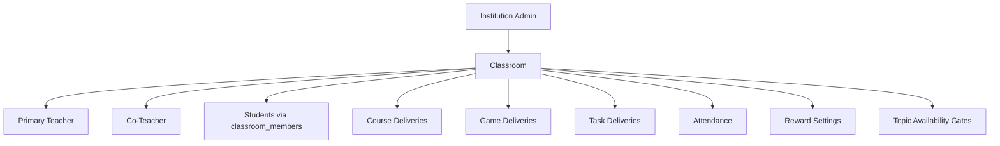

# Class Room

Role: operational delivery container — not a user role.
Scope: one classroom within one institution; binds a teacher, a student roster, and all learning content.

## Mission and context

The classroom is where teaching happens. It is the operational unit that links a teacher to a set of students and gives them a shared space to deliver courses, games, and tasks. Every piece of content a student can access traces back to a published delivery in a classroom they are enrolled in.

Classrooms are created and deactivated by Institution Admin. Teachers manage what happens inside them — content delivery, attendance, rewards. Students participate within the boundaries the classroom defines.

**Scope:** single classroom within one institution
**Accountability:** course/game/task delivery, attendance, roster, reward settings, topic gates

| Who               | What they do in a classroom                                        |
| ----------------- | ------------------------------------------------------------------ |
| Institution Admin | Create, deactivate, reassign ownership                             |
| Primary Teacher   | Deliver content, manage roster, run sessions, configure rewards    |
| Co-Teacher        | Deliver content, read roster, manage rewards (same classroom only) |
| Student           | Access published content, submit tasks, attend, earn rewards       |



---

## Feature tree

### Classroom lifecycle

**Create classroom**

- Table: `classrooms`
- Input: institution_id, class_group_id, class_group_offering_id, primary_teacher_id, title
- Status defaults to active
- Visible only to: institution_admin, primary teacher, co-teachers, enrolled students (`classrooms_scoped_read`)

**Deactivate classroom**

- Update: `classrooms.status = inactive`, `deactivated_at = now()`
- Data (progress, submissions, game runs, attendance) is preserved; no content is deleted

**Re-activate classroom**

- Update: `classrooms.status = active`, clear `deactivated_at`

**Reassign primary teacher**

- Update: `classrooms.primary_teacher_id`
- Old teacher loses primary_teacher RLS; update `classroom_members` co-teacher row as needed

---

### Roster management

**Enroll student**

- Table: `classroom_members`
- Input: institution_id, classroom_id, user_id, membership_role = student, enrolled_at = now()
- Effect: student immediately gains access to all published course_deliveries, game_deliveries, task_deliveries for this classroom

**Withdraw student**

- Update: `classroom_members.withdrawn_at = now()`, `leave_reason`
- Effect: student loses classroom-scoped RLS access immediately; all historical data is preserved

**Add co-teacher**

- Table: `classroom_members` (membership_role = co_teacher)
- Effect: co-teacher gets roster read, can manage course links, reward/point ledger

**Remove co-teacher**

- Update: `classroom_members.withdrawn_at = now()`

---

### Course delivery

**Assign course to classroom**

- Table: `course_deliveries`
- Input: classroom_id, course_id, course_version_id, status = draft → active, starts_at, ends_at
- Effect: all active classroom_members gain access to all version_lessons

**Archive / cancel delivery**

- Update: `course_deliveries.status = archived | canceled`

---

### Game delivery

**Assign game to classroom**

- Table: `game_deliveries`
- Input: classroom_id, game_id, game_version_id, course_delivery_id (optional), lesson_id (optional), status = draft → published

**Launch live class session**

- Table: `game_runs` (mode = classroom, started_by = teacher)
- All active classroom_members auto-included as participants
- Lifecycle: lobby → started → completed | cancelled

---

### Task delivery

**Assign task to classroom**

- Table: `task_deliveries`
- Input: classroom_id, task_template_id, task_template_version_id, due_at
- State machine: draft → scheduled → active → closed | archived | canceled

---

### Attendance

**Create attendance session**

- Table: `classroom_attendance_sessions`
- Input: institution_id, classroom_id, course_id, title, session_date, starts_at, ends_at

**Record attendance**

- Table: `classroom_attendance_records`
- Input: attendance_session_id, student_id, status (present | late | absent), source (manual | self_check_in | auto), check_in_time, check_out_time
- Constraint: unique(session, student); check_out_time ≥ check_in_time

**Set recurring schedule**

- Table: `classroom_attendance_schedules`
- Input: days_of_week (smallint array: 1=Mon…7=Sun), start_time, end_time, timezone (IANA), active_from, active_until

**Override schedule for a date**

- Table: `classroom_attendance_schedule_exceptions`
- Input: schedule_id, exception_date, exception_type (skip | override), override_start_time, override_end_time
- Constraint: unique(schedule, date); skip type has no override times

---

### Topic availability gates

**Lock a topic**

- Table: `topic_availability_rules`
- Input: course_id, topic_id, is_locked = true
- Effect: topic content is gated for students until unlocked

**Unlock a topic**

- Update: `topic_availability_rules.is_locked = false`, `unlock_at` (scheduled) or `unlocked_by` + `unlocked_at` (manual)

---

### Reward settings

**Configure classroom rewards**

- Table: `classroom_reward_settings`
- Fields: leaderboard_opt_in (bool), joker_config (jsonb — code/name/cost/monthly_limit/enabled per joker), level_thresholds (jsonb — level/name/min_points)
- RLS: primary teacher or co-teacher

---

## Schema visualization

```text
Farbmischung  [classrooms row]
├── institution_id → Schule für Farbe und Gestaltung
├── class_group_id → ML-3A  (stable identity)
├── class_group_offering_id → ML-3A Jahrgang 2023  (year-bound)
├── primary_teacher_id → Frau Müller
├── status: active | inactive
│
├── classroom_members
│   ├── Anna Schmidt   [student, enrolled_at: 2023-09-01, withdrawn_at: null]
│   ├── Tom Weber      [student, enrolled_at: 2023-09-01, withdrawn_at: null]
│   ├── Herr Bauer     [co_teacher, enrolled_at: 2023-09-01]
│   └── Max Huber      [student, withdrawn_at: 2024-01-15, leave_reason: transfer]
│
├── course_deliveries
│   ├── Grundlagen Farbe v2  [status: active, starts_at: 2023-09-01]
│   └── Farbmischung Aufbau v1  [status: scheduled, starts_at: 2024-02-01]
│
├── game_deliveries
│   ├── Farbkreis Quiz v3  [published]
│   └── Mischfarben Challenge v1  [published, lesson_id linked]
│
├── task_deliveries
│   ├── Farbpalette erstellen  [status: active, due_at: 2024-01-20]
│   │   └── task_groups
│   │       ├── Gruppe A  [Anna + Tom → collaborative note + task_submission]
│   │       └── Gruppe B  [...]
│   └── Gestaltungskonzept  [status: closed]
│
├── classroom_attendance_sessions
│   ├── 2024-01-15 Mo 08:00–09:30
│   │   └── classroom_attendance_records
│   │       ├── Anna: present, check_in: 08:02
│   │       ├── Tom: late, check_in: 08:15
│   │       └── Max: absent
│   └── [recurring via classroom_attendance_schedules — Mon/Wed/Fri 08:00–09:30]
│
├── classroom_reward_settings
│   ├── leaderboard_opt_in: true
│   ├── joker_config: [{Hausaufgaben-Joker, cost:200}, {Fehler-Joker, cost:300}, …]
│   └── level_thresholds: [Einsteiger:0, Lernprofi:500, Wissensträger:1500, …]
│
└── topic_availability_rules (course_id, topic_id, is_locked, unlock_at?)
    └── Kapitel 3 → locked until 2024-02-01
```

### CRUD surface by role

| Operation                                | Institution Admin | Primary Teacher | Co-Teacher | Student         |
| ---------------------------------------- | ----------------- | --------------- | ---------- | --------------- |
| Create / deactivate / reassign classroom | yes               | —               | —          | —               |
| Enroll / withdraw students               | yes               | yes             | —          | —               |
| Add / remove co-teacher                  | yes               | yes             | —          | —               |
| Deliver course                           | yes               | yes             | read       | —               |
| Deliver game                             | yes               | yes             | read       | —               |
| Deliver task                             | yes               | yes             | read       | —               |
| Launch class game session                | —                 | yes             | —          | —               |
| Manage attendance sessions + records     | yes               | yes             | —          | read own        |
| Configure recurring schedule             | yes               | yes             | —          | —               |
| Configure reward settings                | yes               | yes             | yes        | read            |
| View leaderboard                         | yes               | yes             | yes        | yes (if opt-in) |
| Lock / unlock topic                      | yes               | yes             | —          | —               |

---

## Constraints

1. **Classroom is institution-scoped** — `classrooms.institution_id` is set on creation and never changes. All content deliveries, attendance, and reward settings inherit this boundary.
2. **Deactivation preserves history** — `status = inactive` never deletes progress, submissions, game runs, or attendance. Hard purge happens only via a completed GDPR erasure.
3. **Roster drives access** — `classroom_members` (withdrawn_at IS NULL) is the gate for all student content access. Withdrawing a student is immediate; re-enrolling requires a new row.
4. **Canonical delivery path** — student lesson access is `classroom_members + course_deliveries`. `classroom_course_links` is a read-only legacy compatibility surface. New deliveries must go through `course_deliveries`.
5. **Attendance schedule exceptions are date-unique** — only one exception per (schedule, date). Skip type cannot have override times; override type requires both start and end times.
6. **Co-teacher scope is classroom-local** — co-teacher privileges (`ccl_teacher_manage`, reward manage, point ledger manage) apply only to the specific classroom where they have a `classroom_members` row. They have no cross-classroom authority.
