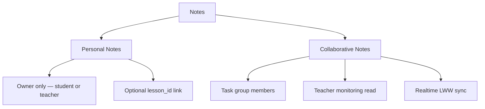

# Note

Role: content layer — personal and collaborative writing surface.
Scope: institution-scoped; personal notes are owner-only; collaborative notes are task-group-scoped.

## Mission and context

Notes are where students capture and develop ideas. Personal notes are private — linked optionally to lesson slides for in-context learning. Collaborative notes are provisioned automatically per task group and serve as the shared workspace for group assignments. The same block-based editor (Yoopta) powers both; only the access model and sync behaviour differ.

**Scope:** personal notes — owner only; collaborative notes — task group members + teacher read
**Accountability:** block-level content authoring, real-time group co-editing, lesson-slide context linking



---

## Feature tree

### Personal notes

**Create personal note**

- Table: `notes`
- Input: institution_id, owner_user_id (self), scope = personal, title, content (jsonb Yoopta blocks), content_schema_version
- Optional: lesson_id (links note to a lesson slide context)
- RLS: `notes_own` — only the owner can read/write

**Update note content**

- Update: `notes.content` (jsonb), `notes.updated_at`
- Autosave: 500ms debounce for text; structural block operations (add/delete) are immediate

**Pin / unpin note**

- Update: `notes.is_pinned = true | false`

**Duplicate note**

- Insert: new `notes` row with same content, owner_user_id, scope = personal, new title

**Soft-delete note**

- Update: `notes.deleted_at = now()`
- Excluded from list queries; not physically removed

**Link note to lesson slide**

- Update: `notes.lesson_id` (FK to lessons)
- Also creates `learning_events` row: event_type = note_created_from_slide, metadata includes slide_index + note_id

---

### Collaborative notes (task-scoped)

**Access group note**

- Table: `notes` (scope = collaborative, task_group_id set)
- RLS: `notes_collaborative_access` — all members of the `task_group` can read/write
- Created automatically when teacher creates a `task_group` (one note per group)

**Co-edit group note in real-time**

- Mechanism: Supabase Realtime subscription on `notes.content` + block-level JSONB updates
- Conflict resolution: Last Write Wins (LWW) per block id
- Offline: changes queued locally, flushed on reconnect

**Teacher monitors group note**

- RLS: `notes_teacher_read` — teacher who owns the task delivery can read collaborative notes for all task groups in that delivery

---

## Schema visualization

```text
notes  (institution_id: Schule für Farbe und Gestaltung)
│
├── scope = personal
│   ├── "Notizen zu Primärfarben"
│   │   owner_user_id: Anna Schmidt
│   │   lesson_id → Primärfarben  (slide-context link)
│   │   is_pinned: true
│   │   content: jsonb Yoopta blocks  [heading + 3 paragraph blocks]
│   │   content_schema_version: 2
│   │   deleted_at: null
│   │
│   ├── "Farbmischung Ideen"
│   │   owner_user_id: Anna Schmidt
│   │   lesson_id: null
│   │   is_pinned: false
│   │   deleted_at: null
│   │
│   └── "Unterrichtsvorbereitung KW14"
│       owner_user_id: Frau Müller  (teachers have personal notes too)
│       is_pinned: true
│       deleted_at: null
│
└── scope = collaborative
    ├── "Gruppe A — Farbpalette erstellen"
    │   owner_user_id: Frau Müller  (created with task group)
    │   task_group_id → Gruppe A  (Anna Schmidt + Tom Weber)
    │   content: jsonb Yoopta blocks  [last edit: Anna, 2026-04-08 14:32]
    │   [notes_collaborative_access: all task_group_members read/write]
    │   [notes_teacher_read: Frau Müller reads for monitoring]
    │
    └── "Gruppe B — Farbpalette erstellen"
        owner_user_id: Frau Müller
        task_group_id → Gruppe B  (Lena Fischer + Jonas Meier)
        content: jsonb Yoopta blocks  [status: reviewed]
```

### CRUD surface by role

| Operation                | Student (own)   | Student (collaborative) | Teacher               | Institution Admin |
| ------------------------ | --------------- | ----------------------- | --------------------- | ----------------- |
| Create personal note     | yes             | —                       | yes                   | —                 |
| Read own notes           | yes             | —                       | yes                   | —                 |
| Edit own notes           | yes             | —                       | yes                   | —                 |
| Soft-delete own notes    | yes             | —                       | yes                   | —                 |
| Read collaborative note  | if group member | yes                     | yes (all task groups) | read-only         |
| Write collaborative note | if group member | yes                     | yes                   | —                 |

---

## Constraints

1. **Scope is immutable after creation** — `notes.scope` is set on insert and never changed. A personal note cannot be converted to collaborative or vice versa.
2. **One collaborative note per task group** — `task_groups` auto-provisions exactly one `notes` row per group on creation. Teachers cannot manually insert a second collaborative note for the same group.
3. **Collaborative access is group-scoped** — `notes_collaborative_access` requires a `task_group_members` row for the caller. A student cannot read another group's note within the same task delivery.
4. **Soft delete, not hard purge** — `deleted_at` preserves the row for audit and GDPR export; physical removal only via completed GDPR erasure.
5. **LWW conflict resolution only** — collaborative editing uses Last Write Wins per block id. No CRDT or merge strategy. Concurrent edits to the same block id may overwrite each other.
6. **lesson_id link is optional** — personal notes may exist without any lesson context. When lesson_id is set, the associated learning_events row is created by the app layer, not a DB trigger.
