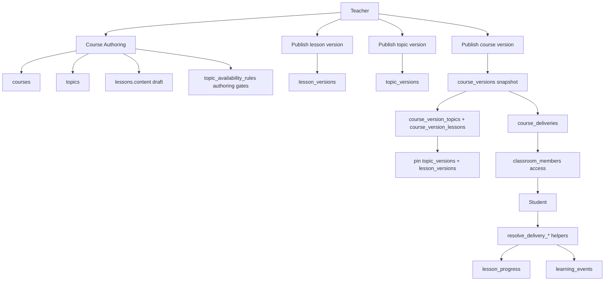

# Course

Role: structured learning content — authoring, versioning, and classroom delivery.
Scope: institution-scoped; teacher owns courses; students access via published deliveries in enrolled classrooms.

## Mission and context

The course is the primary learning unit. Teachers author a course once as a mutable draft — topics and lessons — then publish a version snapshot to lock the structure for delivery. A delivery binds that snapshot to a classroom and gives enrolled students access to every lesson in it. Progress and events are tracked per delivery, not per course, so the same lesson can be tracked separately across classrooms and re-deliveries.

Versioning is **three-layered**:

1. **Mutable authoring** — `courses`, `topics`, `lessons` (draft edits; `lessons.content` is canonical Lexical JSONB — see [17_lesson_authoring.md](17_lesson_authoring.md))
2. **Per-entity published versions** — `topic_versions`, `lesson_versions` (immutable shells and content snapshots with major/patch semantics)
3. **Course snapshot + rollout** — `course_versions` → `course_version_*` → `course_deliveries` (classroom binding)

**Scope:** teacher's own courses (authoring); enrolled classroom (student access)
**Accountability:** lesson quality, version publishing, delivery lifecycle, student progress tracking, learning event analytics



---

## Feature tree

### Course authoring (mutable layer)

**Create course**

- Table: `courses`
- Input: institution_id, teacher_id (self), title, description, theme_id
- Starts unpublished (`is_published = false`)

**Add topic**

- Table: `topics`
- Input: course_id, title, description, order_index

**Add lesson**

- Table: `lessons`
- Input: topic_id, title, description, content (Lexical JSONB — default `app.empty_lesson_lexical_state()`), pages (slide JSONB where used by player), order_index, content_schema_version
- Teacher CRUD may use bounded RPCs (`create_teacher_lesson`, `update_teacher_lesson`, …) to avoid RLS recursion — see `20260517090000_lessons_rls_break_recursion.sql`
- Lesson body authoring details: [17_lesson_authoring.md](17_lesson_authoring.md)

**Reorder topics / lessons**

- Update: `order_index` on affected rows

**Edit lesson content**

- Update: `lessons.content`; bump `content_schema_version` on breaking schema changes
- Does **not** automatically update active deliveries — publish a `lesson_version` (patch or major) first

**Configure topic gates (authoring)**

- Table: `topic_availability_rules`
- Input: course_id, topic_id, is_locked, unlock_at
- Teacher-side configuration; student enforcement uses delivery-resolved `topic_versions` (see below)

---

### Topic versioning (published shell layer)

**Publish topic version**

- Table: `topic_versions`
- Input: institution_id, topic_id, version_major (aligns with `course_versions.version_no` at baseline), version_patch, change_kind (`editorial_patch` | `availability_patch` | `structural_major`), title, description, order_index, is_locked, unlock_at, published_by
- Immutable after insert; patches increment `version_patch` within the same `version_major`
- `structural_major` never auto-applies to active deliveries

**Resolve topic for a delivery**

- Helper: `app.resolve_delivery_topic_version(delivery_id, source_topic_id)` — returns pinned row or latest eligible patch when `resolution_mode = auto_patch`
- Gate check: `app.topic_gate_allows_access(is_locked, unlock_at)`
- Access: `app.student_can_access_topic_for_delivery(delivery_id, source_topic_id)`

---

### Lesson versioning (published content layer)

**Publish lesson version**

- RPC: `app.publish_lesson_version(lesson_id, change_kind, change_note?)`
- Table: `lesson_versions`
- Captures `lessons.content` into immutable `lexical_state` JSONB
- `change_kind`:
  - `editorial_patch`, `safe_content_patch` → increment `version_patch` within current `version_major` (eligible for auto-patch)
  - `structural_major`, `assessment_major` → increment `version_major`, reset patch to 0; marks linked `course_versions.has_pending_changes = true`
- Writes `audit.events` (`lesson.published`)

**Resolve lesson for a delivery**

- Helper: `app.resolve_delivery_lesson_version(delivery_id, lesson_id)`
- Uses `course_version_lessons.resolution_mode` (`pinned` | `auto_patch`) and `allow_auto_patch`
- Pinned → always `source_lesson_version_id`; auto_patch → latest active editorial/safe patch within same major

---

### Course versioning (snapshot layer)

**Publish course version**

- Table: `course_versions`
- Input: course_id, version_no (unique per course), status = draft → published, published_at
- Creates snapshot rows:
  - `course_version_topics` (source_topic_id, title, description, order_index, **pinned_topic_version_id**, **resolution_mode**)
  - `course_version_lessons` (source_lesson_id, title, content, pages, order_index, content_schema_version, **source_lesson_version_id**, **resolution_mode**, **allow_auto_patch**)
- Pins current `topic_versions` and `lesson_versions` at publish time
- Published versions are immutable; source course can be edited and re-published as v2, v3…
- `has_pending_changes` signals when a major lesson publish requires a new course version

**Archive old version**

- Update: `course_versions.status = archived`

---

### Classroom delivery

**Create course delivery**

- Table: `course_deliveries`
- Input: institution_id, classroom_id, course_id, course_version_id, status (draft | scheduled | active | archived | canceled), starts_at, ends_at
- Effect: active `classroom_members` gain access when delivery is published (`published_at IS NOT NULL`) and status is `active` or `scheduled`

**Activate / archive / cancel delivery**

- Update: `course_deliveries.status`, `published_at` as needed
- Soft delete: `course_deliveries.deleted_at = now()` (delivery no longer grants access)

---

### Student learning flow

**Access course in classroom**

- Helper: `app.student_can_access_course_delivery(delivery_id)` — active `classroom_members` row, published non-deleted delivery, status `active` or `scheduled`, institution membership

**Open lesson**

- Read: resolved content via `app.resolve_delivery_lesson_version(delivery_id, lesson_id)` → `lesson_versions.lexical_state`
- Snapshot membership: `app.lesson_in_course_delivery_version(lesson_id, delivery_id)`
- Access gate: `app.student_can_access_lesson(lesson_id)` — lesson in a published delivery snapshot **and** resolved `topic_versions` gate allows the parent topic
- Inserts: `learning_events` (event_type = `lesson_opened`, `lesson_version_id`, `course_delivery_id`)

**Navigate pages / blocks**

- Inserts: `learning_events` (`page_viewed`, `page_time_spent` with `duration_ms`, `page_navigation` with `direction` = forward | backward | jump)
- Optional block analytics: `block_type`, `block_index` (top-level index in draft JSON — see [17_lesson_authoring.md](17_lesson_authoring.md))
- Column `slide_index` holds the page index within the lesson player

**Complete lesson**

- Upsert: `lesson_progress` (user_id, lesson_id, course_delivery_id, lesson_version_id, completed_at = now(), last_position jsonb)
- Inserts: `learning_events` (`lesson_completed`)
- Uniqueness: `(user_id, lesson_id, course_delivery_id)` — same lesson tracked separately per delivery

**Resume lesson**

- Read: `lesson_progress.last_position` (e.g. `{"page_index": 2}`)

---

## Schema visualization

```text
Grundlagen Farbe  [courses row — Frau Müller, Schule für Farbe und Gestaltung]
│   is_published: true
│
├── topics  (mutable — Frau Müller edits here)
│   ├── Farbenlehre  [order_index: 1]
│   │   ├── Primärfarben    [lesson, order_index: 1, lessons.content Lexical draft]
│   │   └── Sekundärfarben  [lesson, order_index: 2]
│   └── Farbmischung  [order_index: 2]
│       └── Der Farbkreis   [lesson, order_index: 1]
│
├── topic_availability_rules  (authoring gates — teacher configures)
│   └── Farbmischung: is_locked=true, unlock_at=2026-04-10
│
├── topic_versions  (immutable published shells)
│   └── Farbmischung v2.0  [version_major: 2, patch: 0, is_locked, unlock_at copied at publish]
│
├── lesson_versions  (immutable published content)
│   ├── Primärfarben v2.3  [lexical_state, change_kind: editorial_patch]
│   └── Der Farbkreis v2.0 [lexical_state, change_kind: structural_major]
│
├── course_versions
│   ├── v1  [status: archived]
│   └── v2  [status: published, has_pending_changes: false — immutable snapshot]
│       ├── course_version_topics
│       │   ├── Farbenlehre    [pinned_topic_version_id → topic_versions, resolution_mode: pinned]
│       │   └── Farbmischung   [pinned_topic_version_id, resolution_mode: auto_patch]
│       └── course_version_lessons
│           ├── Primärfarben   [source_lesson_version_id → lesson_versions, allow_auto_patch: true]
│           └── Der Farbkreis  [source_lesson_version_id, resolution_mode: pinned]
│
└── course_deliveries
    └── Farbmischung classroom + v2  [status: active, published_at set, starts_at: 2023-09-01]
        │
        ├── classroom_members  (28 active students — gates delivery access)
        │
        ├── lesson_progress  (unique per user_id + lesson_id + course_delivery_id)
        │   ├── Anna Schmidt  Primärfarben    lesson_version_id: v2.3, completed_at: 2026-03-15
        │   └── Tom Weber     Primärfarben    lesson_version_id: v2.2, last_position: {page_index:2}
        │
        └── learning_events
            ├── Anna  lesson_opened    Primärfarben  lesson_version_id: v2.3
            ├── Anna  page_viewed      slide_index:0
            ├── Anna  page_navigation  direction:forward
            ├── Anna  lesson_completed Primärfarben
            └── … 847 total rows across classroom

RLS / access helpers:
  app.student_can_access_course_delivery(delivery_id)
  app.resolve_delivery_topic_version(delivery_id, source_topic_id)
  app.student_can_access_topic_for_delivery(delivery_id, source_topic_id)
  app.student_can_access_topic(topic_id)
  app.resolve_delivery_lesson_version(delivery_id, lesson_id)
  app.student_can_access_lesson(lesson_id)
  app.lesson_in_course_delivery_version(lesson_id, course_delivery_id)
```

### CRUD surface by role

| Operation                   | Teacher (own)     | Student                        | Institution Admin | Super Admin |
| --------------------------- | ----------------- | ------------------------------ | ----------------- | ----------- |
| Create / edit course        | yes               | —                              | —                 | yes         |
| Create topics / lessons     | yes               | —                              | —                 | yes         |
| Publish lesson_version      | yes (RPC)         | —                              | —                 | yes         |
| Publish topic_version       | yes               | —                              | —                 | yes         |
| Publish course_version      | yes               | —                              | —                 | yes         |
| Create delivery             | yes               | —                              | yes (full CRUD)   | yes         |
| Read published course       | yes               | if delivery active             | yes (read)        | yes         |
| Read topic/lesson snapshots | yes               | via delivery + resolve helpers | yes (read)        | yes         |
| Write lesson_progress       | —                 | yes (own)                      | —                 | yes         |
| Read lesson_progress        | yes (own courses) | own only                       | yes (read)        | yes         |
| Insert learning_events      | —                 | yes                            | —                 | yes         |
| Read learning_events        | yes (own courses) | own only                       | yes (read)        | yes         |

---

## Constraints

1. **Publish is one-way** — `course_versions.status = published` is irreversible. To update structure, a new version must be authored and a new delivery issued. Published snapshots are the permanent record of what students received.
2. **Delivery ties a specific version** — `course_deliveries.course_version_id` is set on creation and does not change. Reassigning a newer version requires creating a new delivery.
3. **Progress is delivery-scoped** — `lesson_progress` uniqueness is `(user_id, lesson_id, course_delivery_id)`. Both `lesson_progress` and `learning_events` require `course_delivery_id` (NOT NULL). Progress in one delivery is independent of progress in another for the same lesson.
4. **Version audit trail** — `lesson_progress.lesson_version_id` and `learning_events.lesson_version_id` record the exact resolved `lesson_versions` row the student saw.
5. **Major lesson changes need course republish** — `structural_major` / `assessment_major` lesson publishes set `course_versions.has_pending_changes = true` on linked versions; auto-patch does not apply across majors.
6. **Auto-patch is opt-in per snapshot row** — `course_version_lessons.allow_auto_patch` and `resolution_mode = auto_patch` must both be set; only `editorial_patch` / `safe_content_patch` (lessons) or `editorial_patch` / `availability_patch` (topics) propagate.
7. **Topic gates are delivery-resolved** — students are gated by `topic_versions` resolved for their delivery (`resolve_delivery_topic_version`), not live `topic_availability_rules`. Authoring rules feed into the next topic version publish.
8. **Legacy bridge is read-only** — `classroom_course_links` remains for historical rows. New deliveries must use `course_deliveries`; `classroom_course_links` is not updated for new content.
9. **Student access requires published delivery** — helpers require active `classroom_members`, `course_deliveries.published_at IS NOT NULL`, `deleted_at IS NULL`, status `active` or `scheduled`, and lesson/topic membership in the bound `course_version` snapshot. Institution membership alone is not sufficient.
10. **Teacher content ownership** — RLS on `courses`, `topics`, and `lessons` is scoped to `teacher_id = auth.uid()` (via `app.teacher_can_manage_*` helpers). A teacher cannot read, edit, or deliver another teacher's unpublished content.

---

## Related migrations (reference)

| Migration                                               | Purpose                                                    |
| ------------------------------------------------------- | ---------------------------------------------------------- |
| `20260329000001_course_delivery_01_types.sql`           | `course_version_status`, `course_delivery_status` enums    |
| `20260329000002_course_delivery_02_tables.sql`          | `course_versions`, `course_version_*`, `course_deliveries` |
| `20260329000006_course_delivery_06_functions_rpcs.sql`  | Delivery access helpers                                    |
| `2026032900000501–0503_*`                               | `course_delivery_id` on progress/events + uniqueness       |
| `2026032600000402_attendance_topic_gates_02_tables.sql` | `topic_availability_rules` (authoring gates)               |
| `20260515140000_topic_versions_01_types_tables.sql`     | `topic_versions`, pin columns on `course_version_topics`   |
| `20260515140002_topic_versions_03_functions.sql`        | Topic resolution + updated access helpers                  |
| `20260515140100–15140700_lesson_versions_*`             | `lesson_versions`, publish/resolve RPCs, RLS               |
| `20260516000000–00003_lesson_draft_jsonb_*`             | `lessons.content` canonical; retire `lesson_blocks`        |
| `20260517090000_lessons_rls_break_recursion.sql`        | Teacher lesson RPCs                                        |

Lexical editor and draft persistence: [17_lesson_authoring.md](17_lesson_authoring.md)
