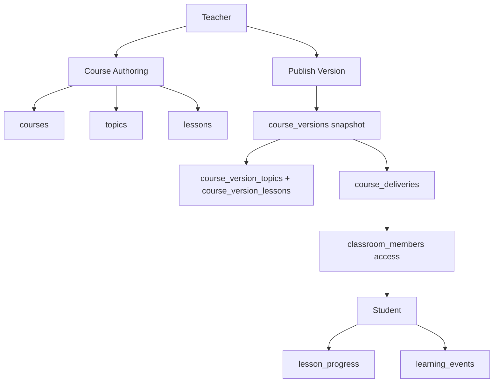

# Course

Role: structured learning content — authoring, versioning, and classroom delivery.
Scope: institution-scoped; teacher owns courses; students access via published deliveries in enrolled classrooms.

## Mission and context

The course is the primary learning unit. Teachers author a course once as a mutable draft — topics and lessons — then publish a version snapshot to lock the content for delivery. A delivery binds that snapshot to a classroom and gives enrolled students access to every lesson in it. Progress and events are tracked per delivery, not per course, so the same lesson can be tracked separately across classrooms and re-deliveries.

**Scope:** teacher's own courses (authoring); enrolled classroom (student access)
**Accountability:** lesson quality, version publishing, delivery lifecycle, student progress tracking, learning event analytics



---

## Feature tree

### Course authoring (mutable layer)

**Create course**

- Table: `courses`
- Input: institution_id, teacher_id (self), title, description, theme_id
- Starts unpublished (`is_published = false`)

**Add topic**

- Table: `topics`
- Input: course_id, title, description, order_index

**Add lesson**

- Table: `lessons`
- Input: topic_id, title, content (jsonb), pages (jsonb array — each page has id, order, content blocks), order_index, content_schema_version

**Reorder topics / lessons**

- Update: `order_index` on affected rows

**Edit lesson content**

- Update: `lessons.content`, `lessons.pages`; bump `content_schema_version` on breaking schema changes

**Soft-delete course / topic / lesson**

- Update: `deleted_at = now()`

---

### Course versioning (snapshot layer)

**Publish course version**

- Table: `course_versions`
- Input: course_id, version_no (unique per course), status = draft → published, change_note
- Creates snapshot rows:
  - `course_version_topics` (source_topic_id, title, description, order_index)
  - `course_version_lessons` (source_lesson_id, title, content, pages, order_index, content_schema_version)
- Published versions are immutable; source course can be edited and re-published as v2, v3…

**Archive old version**

- Update: `course_versions.status = archived`

---

### Classroom delivery

**Create course delivery**

- Table: `course_deliveries`
- Input: institution_id, classroom_id, course_id, course_version_id, status (draft | scheduled | active), starts_at, ends_at
- Effect: all active `classroom_members` gain access to all version_lessons via `student_can_access_course_delivery()`

**Activate / archive / cancel delivery**

- Update: `course_deliveries.status`

---

### Student learning flow

**Access course in classroom**

- Helper: `app.student_can_access_course_delivery(delivery_id)` — confirms student has active `classroom_members` row for the delivery's classroom

**Open lesson**

- Table: `lessons` via `lessons_enrolled_read`
- Helper: `app.student_can_access_lesson(lesson_id)` — lesson must appear in a published delivery version
- Inserts: `learning_events` (event_type = lesson_opened)

**Navigate slides**

- Inserts: `learning_events` (slide_viewed, slide_time_spent with duration_ms, slide_navigation with direction = forward | backward | jump)

**Complete lesson**

- Upsert: `lesson_progress` (user_id, lesson_id, course_delivery_id, completed_at = now(), last_position jsonb)
- Inserts: `learning_events` (lesson_completed)
- Uniqueness: (user_id, lesson_id, course_delivery_id) — same lesson tracked separately per delivery

**Resume lesson**

- Read: `lesson_progress.last_position` (e.g. `{"page_index": 2}`)

---

## Schema visualization

```text
Grundlagen Farbe  [courses row — Frau Müller, Schule für Farbe und Gestaltung]
│   is_published: true
│
├── topics  (mutable — Frau Müller edits here)
│   ├── Farbenlehre  [order_index: 1]
│   │   ├── Primärfarben    [lesson, order_index: 1, pages: 4 slides, schema_v2]
│   │   └── Sekundärfarben  [lesson, order_index: 2, pages: 3 slides, schema_v2]
│   └── Farbmischung  [order_index: 2]
│       └── Der Farbkreis   [lesson, order_index: 1, pages: 5 slides, schema_v2]
│           topic_availability_rules: is_locked=true, unlock_at=2026-04-10
│
├── course_versions
│   ├── v1  [status: archived, change_note: "initial release"]
│   └── v2  [status: published, change_note: "added Farbmischung topic" — immutable]
│       ├── course_version_topics
│       │   ├── Farbenlehre snapshot    [source_topic_id, order_index: 1]
│       │   │   ├── Primärfarben snapshot    [source_lesson_id, pages jsonb, schema_v2]
│       │   │   └── Sekundärfarben snapshot  [source_lesson_id, pages jsonb, schema_v2]
│       │   └── Farbmischung snapshot   [source_topic_id, order_index: 2]
│       │       └── Der Farbkreis snapshot   [source_lesson_id, pages jsonb, schema_v2]
│       └── [no further modifications allowed]
│
└── course_deliveries
    └── Farbmischung classroom + v2  [status: active, starts_at: 2023-09-01, ends_at: null]
        │
        ├── classroom_members  (28 active students — gates lesson access)
        │
        ├── lesson_progress  (unique per user_id + lesson_id + course_delivery_id)
        │   ├── Anna Schmidt  Primärfarben    completed_at: 2026-03-15, last_position: {page_index:3}
        │   ├── Anna Schmidt  Sekundärfarben  completed_at: null,       last_position: {page_index:1}
        │   └── Tom Weber     Primärfarben    completed_at: null,       last_position: {page_index:2}
        │
        └── learning_events
            ├── Anna  lesson_opened    Primärfarben  2026-03-10 09:01
            ├── Anna  slide_viewed     slide_index:0 duration_ms:47000
            ├── Anna  slide_navigation direction:forward
            ├── Anna  lesson_completed Primärfarben  2026-03-15 09:28
            └── … 847 total rows across classroom

RLS helpers:
  app.student_can_access_course_delivery(delivery_id)
  app.student_can_access_topic(topic_id)  ← checks topic_availability_rules
  app.student_can_access_lesson(lesson_id)
  app.lesson_in_course_delivery_version(lesson_id, course_delivery_id)
```

### CRUD surface by role

| Operation               | Teacher (own)     | Student            | Institution Admin | Super Admin |
| ----------------------- | ----------------- | ------------------ | ----------------- | ----------- |
| Create / edit course    | yes               | —                  | —                 | yes         |
| Create topics / lessons | yes               | —                  | —                 | yes         |
| Publish version         | yes               | —                  | —                 | yes         |
| Create delivery         | yes               | —                  | yes (full CRUD)   | yes         |
| Read published course   | yes               | if delivery active | yes (read)        | yes         |
| Read topics / lessons   | yes               | if delivery active | yes (read)        | yes         |
| Write lesson_progress   | —                 | yes (own)          | —                 | yes         |
| Read lesson_progress    | yes (own courses) | own only           | yes (read)        | yes         |
| Insert learning_events  | —                 | yes                | —                 | yes         |
| Read learning_events    | yes (own courses) | own only           | yes (read)        | yes         |

---

## Constraints

1. **Publish is one-way** — `course_versions.status = published` is irreversible. To update content, a new version must be authored and a new delivery issued. Published snapshots are the permanent record of what students received.
2. **Delivery ties a specific version** — `course_deliveries.course_version_id` is set on creation and does not change. Reassigning a newer version requires creating a new delivery.
3. **Progress is delivery-scoped** — `lesson_progress` uniqueness is `(user_id, lesson_id, course_delivery_id)`. Progress in one delivery is independent of progress in another for the same lesson.
4. **Legacy bridge is read-only** — `classroom_course_links` remains for historical rows. New deliveries must use `course_deliveries`; `classroom_course_links` is not updated for new content.
5. **Student access requires active delivery** — `student_can_access_lesson()` requires both an active `classroom_members` row and the lesson appearing in the active `course_version` snapshot. Institution membership alone is not sufficient.
6. **Teacher content ownership** — RLS on `courses`, `topics`, and `lessons` is `teacher_id = auth.uid()`. A teacher cannot read, edit, or deliver another teacher's unpublished content.
