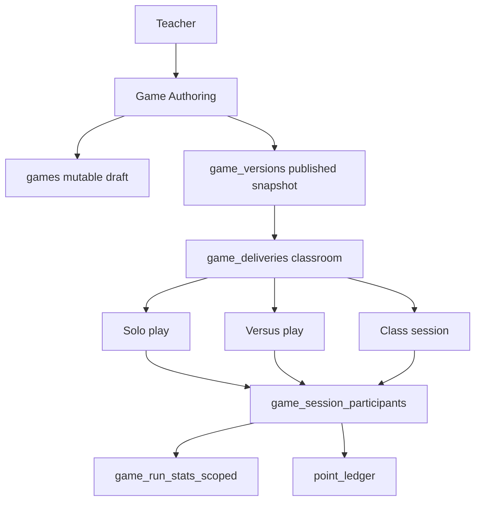

# Game Studio

Role: game authoring and session delivery — teacher creates, student plays.
Scope: institution-scoped; game versions are published snapshots; sessions are classroom or institution-scoped.

## Mission and context

Game Studio lets teachers build node-based knowledge games and deliver them to classrooms. A game is authored as a mutable draft — a node graph with routing and scoring config — then published as a version snapshot for delivery. Students play solo, challenge each other in versus mode, or join a teacher-launched class session. Scoring is a single consistent model: base points per node, speed bonus, streak multiplier, and a versus rivalry bonus. All session data flows into analytics readable by the teacher.

**Scope:** teacher's own games (authoring); institution members (published play); classroom (class sessions)
**Accountability:** game design, version publishing, delivery, session lifecycle, per-student score analytics



---

## Feature tree

### Game authoring

**Create game**

- Table: `games`
- Input: institution_id, teacher_id (self), game_type, game_config (jsonb — nodes, routing, metadata), course_id (optional)
- Trigger: if course_id is set, `games.institution_id` must match `courses.institution_id`

**Edit game content**

- Update: `games.game_config` (mutable; publish a new version to freeze a snapshot)

**Link game to course**

- Update: `games.course_id` — at most one course; NULL = standalone library game

**Archive game**

- Update: `games.archived_at = now()`

---

### Game versioning

**Create draft version**

- Table: `game_versions`
- Input: game_id, version_no (unique per game), content (jsonb — full node/routing snapshot), change_note
- status = draft (editable)

**Publish version**

- Update: `game_versions.status = published`
- Update: `games.current_published_version_id` → this version
- Published rows are immutable

**Archive old version**

- Update: `game_versions.status = archived`

---

### Classroom delivery

**Deliver game to classroom**

- Table: `game_deliveries`
- Input: game_id, game_version_id, classroom_id, course_delivery_id (optional), lesson_id (optional), status = draft → published
- Effect: students in the classroom can access this game version

**Archive / cancel delivery**

- Update: `game_deliveries.status = archived | canceled`

---

### Game sessions

**Solo play**

- Table: `game_runs` (mode = solo)
- Input: game_id, institution_id, game_version_id, game_delivery_id (optional)
- Creates: 1 `game_session` → 1 `game_session_participants` (started_by = student)
- On complete: upserts `game_run_stats_scoped` (best_score, attempt_count, is_personal_best)
- Inserts `point_ledger` rows: source = game_correct (+100/node), game_speed_bonus (+50/+25), game_streak (×1.5/×2.0)

**Versus play**

- Table: `game_runs` (mode = versus)
- Input: game_id, invite_code (short lobby code)
- Creates: 1 `game_session` → 2 `game_session_participants`
- Winner earns: `point_ledger` (source = game_versus_win, +25 rivalry points)
- Sync: both players see same node simultaneously via Supabase Realtime

**Teacher class session**

- Table: `game_runs` (mode = classroom)
- Input: classroom_id, game_id, game_version_id, started_by = teacher
- Lifecycle: lobby → started → completed | cancelled
- Creates: 1 `game_session` → N `game_session_participants` (all enrolled students auto-included)
- Live leaderboard derived from `game_session_participants.score` via Supabase Realtime

---

### Analytics (teacher read)

**Per-game stats**

- Table: `game_run_stats_scoped` — best_score, attempt_count, last_run_at, is_personal_best per (user, game, delivery)
- Table: `game_session_participants.scores_detail` — jsonb array per node: `{node_id, correct, time_ms, base, bonus, multiplier, total}`

---

## Schema visualization

```text
Farbkreis Quiz  [games row — Frau Müller, Schule für Farbe und Gestaltung]
│   course_id → Grundlagen Farbe
│   archived_at: null
│
├── game_versions
│   ├── v2  [status: archived, change_note: "added speed bonus nodes"]
│   └── v3  [status: published — immutable] ← current_published_version_id
│       content: jsonb  [5 nodes: 3× MultipleChoice, 1× TrueFalse, 1× ImagePin]
│
├── game_deliveries
│   └── Farbmischung classroom + v3
│       [status: published, lesson_id → Der Farbkreis, course_delivery_id → Grundlagen Farbe v2]
│
└── game_runs
    ├── mode = classroom  [status: completed, 2026-03-28 08:10, started_by: Frau Müller]
    │   └── game_session → 27 game_session_participants
    │       ├── Anna Schmidt   score:675  is_personal_best:true
    │       ├── Tom Weber      score:420  is_personal_best:false
    │       └── Lena Fischer   score:580  is_personal_best:true
    │       [live leaderboard via Supabase Realtime during session]
    │
    ├── mode = solo  [Anna Schmidt, 2026-03-20]
    │   └── game_session → 1 game_session_participants
    │       score:675  scores_detail:[{node_id, correct:true, time_ms:6200, base:100, bonus:50, …}]
    │       → game_run_stats_scoped upsert: best_score:675, attempt_count:3, is_personal_best:true
    │
    └── mode = versus  [Anna vs Tom, 2026-03-25, invite_code: "FQ-9X2"]
        └── game_session → 2 game_session_participants
            ├── Anna Schmidt  score:540  [winner — +25 rivalry points to point_ledger]
            └── Tom Weber     score:390

Mischfarben Challenge  [games row — standalone, no course_id]
└── game_versions: v1  [status: published]
    └── game_deliveries: Farbmischung classroom  [status: published]

point_ledger inserts after session  (app layer)
  source: game_correct | game_speed_bonus | game_streak | game_versus_win
```

### CRUD surface by role

| Operation                       | Teacher (own)   | Student           | Institution Admin | Super Admin |
| ------------------------------- | --------------- | ----------------- | ----------------- | ----------- |
| Create / edit game              | yes             | —                 | —                 | yes         |
| Create game version             | yes             | —                 | —                 | yes         |
| Publish version                 | yes             | —                 | —                 | yes         |
| Create game delivery            | yes             | —                 | yes (full CRUD)   | yes         |
| Start solo run                  | yes (test)      | yes               | —                 | yes         |
| Start class session             | yes             | —                 | —                 | yes         |
| Write game_session_participants | —               | yes (own)         | —                 | yes         |
| Read game_session_participants  | yes (own games) | own + leaderboard | yes (read)        | yes         |
| Read game_run_stats_scoped      | yes (own games) | own only          | yes (read)        | yes         |

---

## Constraints

1. **Publish is one-way** — `game_versions.status = published` is irreversible. Draft is the only editable state; to change content, create a new version.
2. **Session mode is fixed at creation** — `game_runs.mode` (solo | versus | classroom) is set when the run is created and cannot be changed.
3. **Class session auto-includes roster** — When a teacher launches a classroom run, all active `classroom_members` are added as participants. Students cannot join a class run they are not enrolled in.
4. **Versus is institution-scoped** — The invite_code is valid only within the same institution. No cross-institution versus sessions.
5. **game_run_stats_scoped is upsert-only** — Stats are maintained via upsert (best_score, is_personal_best). Historical attempt detail lives in `game_session_participants`; the stats row is a derived summary, not a full log.
6. **game → course link is optional and single** — A game can be linked to at most one course (via `games.course_id`). Institution coherence is enforced by trigger: game and course must share the same `institution_id`.
