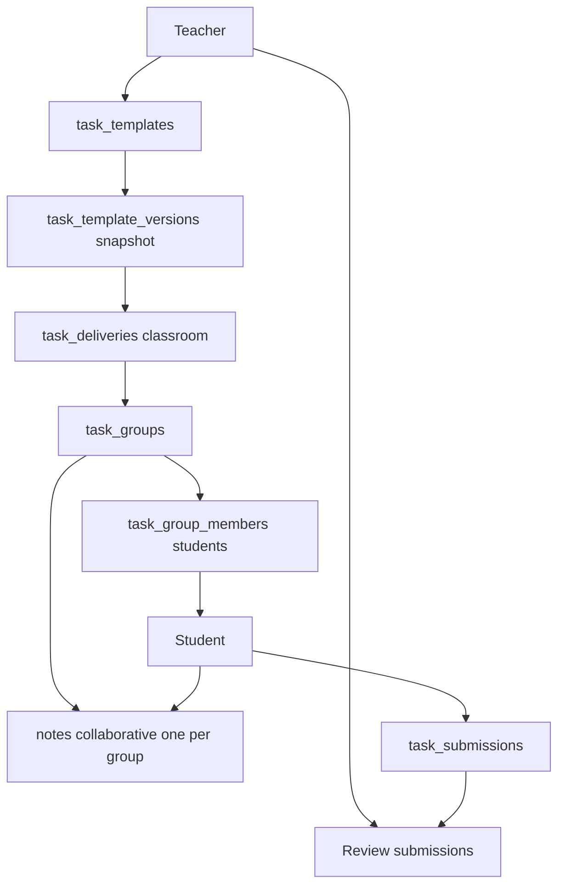

# Task

Role: structured assignment layer — teacher authors, delivers, and reviews; students collaborate and submit.
Scope: institution-scoped; delivery is classroom-scoped; group work is task-group-scoped.

## Mission and context

Tasks connect learning material to collaborative group work. A teacher creates a reusable template, publishes a version snapshot with instructions and rubric, then delivers it to a classroom. Each group gets their own collaborative note as a shared workspace. Students co-edit and submit; the teacher reviews, gives feedback, and optionally returns for revision. Every state transition is audit-logged.

**Scope:** teacher's own templates (authoring); assigned classroom (delivery); task group (student collaboration)
**Accountability:** template versioning, delivery state machine, group management, submission review, audit trail



---

## Feature tree

### Task template authoring

**Create task template**

- Table: `task_templates`
- Input: institution_id, teacher_id (self), title, description

**Publish task version (snapshot)**

- Table: `task_template_versions`
- Input: task_template_id, version_number (unique per template), title, instructions (jsonb), rubric (jsonb), grading_settings (jsonb), attachments (jsonb)
- Status: draft → published → archived
- Published rows are immutable; create a new version to update

---

### Task delivery

**Deliver task to classroom**

- Table: `task_deliveries`
- Input: task_template_id, task_template_version_id, classroom_id, course_delivery_id (optional), teacher_id (self), due_at, starts_at
- Status lifecycle: **draft → scheduled → active → closed | archived | canceled**
- Every state transition logged to `audit.events` via trigger `audit_task_delivery_state_change`

**Archive / cancel delivery**

- Update: `task_deliveries.status = archived | canceled`

---

### Group management

**Create task groups**

- Table: `task_groups`
- Input: task_delivery_id, name
- Auto-creates: one shared collaborative `notes` row per group (scope = collaborative, task_group_id = this group)

**Assign students to groups**

- Table: `task_group_members`
- Input: task_group_id, task_delivery_id, user_id
- Unique: (task_delivery_id, user_id) — a student belongs to one group per delivery

---

### Student task flow

**View assigned task**

- Table: `task_deliveries` (status ≠ draft, classroom_id in `app.my_active_classroom_ids()`)

**View group and collaborative note**

- Table: `task_groups`, `task_group_members`, `notes` (scope = collaborative)
- RLS: student must have a `task_group_members` row for this group

**Co-edit group note**

- Update: `notes.content` (jsonb Yoopta blocks)
- Real-time via Supabase Realtime; LWW conflict resolution per block id

**Submit task**

- Table: `task_submissions`
- Insert: task_group_id, task_delivery_id, submitted_by (self), status = submitted, submitted_at = now()
- Triggers: notification event for teacher (event_type = task_submitted)

**View teacher feedback**

- Read: `task_submissions.feedback`, `reviewed_at`, `status` (reviewed | returned)

---

### Teacher review flow

**Monitor submissions**

- Read: `task_submissions` for all groups in own task deliveries

**Give feedback and mark reviewed**

- Update: `task_submissions.status = reviewed`, feedback (text), reviewed_at = now(), reviewed_by (self)

**Return for revision**

- Update: `task_submissions.status = returned`
- Student group must re-submit

---

## Schema visualization

```text
Farbpalette erstellen  [task_templates row — Frau Müller, Schule für Farbe und Gestaltung]
│
└── task_template_versions
    └── v1  [status: published — immutable]
        │   instructions: "Erstelle eine Farbpalette mit 12 Farbtönen …" (jsonb)
        │   rubric: {criteria: ["Farbauswahl", "Beschriftung", "Kreativität"]} (jsonb)
        │   grading_settings: {max_score: 10} (jsonb)
        │
        └── task_deliveries
            └── Farbmischung classroom + v1  [status: active, due_at: 2026-04-10]
                │   course_delivery_id → Grundlagen Farbe v2
                │   [every status change → audit.events]
                │
                ├── Gruppe A
                │   ├── task_group_members
                │   │   ├── Anna Schmidt   [unique per task_delivery]
                │   │   └── Tom Weber
                │   ├── notes  (scope: collaborative — auto-provisioned on group creation)
                │   │   └── content: jsonb  [last edit: Anna 2026-04-08 14:32, LWW per block]
                │   └── task_submissions
                │       submitted_by: Anna Schmidt   submitted_at: 2026-04-08 14:45
                │       status: submitted            feedback: null  (awaiting review)
                │
                └── Gruppe B
                    ├── task_group_members
                    │   ├── Lena Fischer
                    │   └── Jonas Meier
                    ├── notes  (scope: collaborative — auto-provisioned)
                    └── task_submissions
                        submitted_by: Lena Fischer   submitted_at: 2026-04-07 16:20
                        status: reviewed             reviewed_by: Frau Müller
                        reviewed_at: 2026-04-09 10:00
                        feedback: "Gut strukturiert! Beschriftung könnte präziser sein."

audit.events  (task_deliveries state transitions)
  ├── draft → scheduled  actor: Frau Müller  2026-03-20 11:00
  ├── scheduled → active actor: Frau Müller  2026-03-25 08:00
  └── … future: active → closed  (after due_at)
```

### CRUD surface by role

| Operation                | Teacher (own)    | Student                     | Institution Admin | Super Admin |
| ------------------------ | ---------------- | --------------------------- | ----------------- | ----------- |
| Create task template     | yes              | —                           | —                 | yes         |
| Publish task version     | yes              | —                           | —                 | yes         |
| Create task delivery     | yes              | —                           | yes (full CRUD)   | yes         |
| Create groups            | yes              | —                           | yes (full CRUD)   | yes         |
| Assign group members     | yes              | —                           | yes (full CRUD)   | yes         |
| Read task delivery       | yes              | yes (active, own classroom) | yes               | yes         |
| Submit task              | —                | yes (own group)             | —                 | yes         |
| Review submission        | yes (own tasks)  | read-only (feedback)        | yes (full CRUD)   | yes         |
| Read collaborative note  | yes (monitoring) | yes (own group)             | yes (read)        | yes         |
| Write collaborative note | yes              | yes (own group)             | —                 | yes         |

---

## Constraints

1. **Publish is one-way** — `task_template_versions.status = published` is irreversible. A new version must be created to change instructions, rubric, or attachments.
2. **State machine is enforced** — `task_deliveries` transitions only proceed in the defined order: draft → scheduled → active → closed | archived | canceled. Skipping or reversing states is not permitted; every transition is logged to `audit.events`.
3. **One group per student per delivery** — `task_group_members` has a unique constraint on `(task_delivery_id, user_id)`. A student cannot be in two groups for the same delivery.
4. **One collaborative note per group** — `task_groups` auto-provisions exactly one collaborative `notes` row. This note is linked via `task_groups.note_id`; teachers cannot manually create a second note for the same group.
5. **Group work is group-scoped** — `notes_collaborative_access` requires a `task_group_members` row. A student cannot read or write another group's note within the same task delivery.
6. **Audit trail is mandatory** — `audit_task_delivery_state_change` trigger fires on every status update to `task_deliveries`. State changes cannot be made without producing an audit record.
