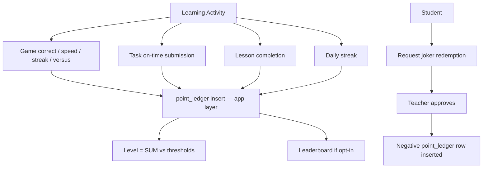

# Reward System

Role: motivation layer — points earned through learning activity convert into classroom privileges.
Scope: classroom-scoped; each classroom has independent settings, point balance, and leaderboard.

## Mission and context

The reward system turns learning activity into visible progress. Points accumulate per classroom from games, tasks, and lesson completions. Teachers configure which jokers (privileges) students can redeem and at what cost. Students spend points to unlock real classroom benefits — skipping homework, choosing a seat, using notes during a quiz. Levels are derived from point totals; no separate level table exists. The leaderboard is opt-in per classroom and shows personal bests, not raw rank, to keep the pressure off students who are still catching up.

**Scope:** single classroom; no cross-classroom point totals or leaderboards
**Accountability:** point ledger append-only integrity, joker approval flow, teacher-controlled reward config



---

## Feature tree

### Point earning (automatic via app layer)

**Game: correct answer**

- Table: `point_ledger`
- Insert: source = game_correct, points = 100 per correct node
- Ref: game_delivery_id + game_session_participants row

**Game: speed bonus**

- Insert: source = game_speed_bonus
- Points: +50 if answered in first 25% of time window; +25 if 25–50%

**Game: streak multiplier**

- Insert: source = game_streak
- Multiplier applied: ×1.5 at 3 consecutive correct; ×2.0 at 5; wrong answer resets to ×1.0

**Game: versus win**

- Insert: source = game_versus_win, points = +25 rivalry points

**Task: on-time submission**

- Insert: source = task_on_time; ref: task_delivery_id

**Lesson: full completion**

- Insert: source = lesson_complete; ref: course_delivery_id + lesson_progress

**Daily streak**

- Insert: source = daily_streak
- Triggered by app logic when student has consecutive-day activity

**Personal best**

- Insert: source = personal_best
- Triggered when `game_run_stats_scoped.is_personal_best = true`

---

### Manual adjustment (teacher)

**Award or deduct points**

- Table: `point_ledger`
- Input: user_id, classroom_id, points (positive = award, negative = deduct), source = manual_adjustment, description
- RLS: primary teacher or co-teacher of that classroom only

---

### Joker redemption (student request → teacher approval)

**Student requests joker**

- App layer: student selects joker type (Hausaufgaben-Joker, Fehler-Joker, Open-Notes-Joker, Platzwahl-Joker, 5-Minuten-Joker)
- Checks: `classroom_reward_settings.joker_config` for cost + monthly_limit per joker type

**Teacher approves**

- Insert: `point_ledger` row (negative points, source = joker code, description = joker type)
- Student receives notification: joker_approved

---

### Level calculation (derived, not stored)

**Compute student level**

- Source: `SUM(point_ledger.points)` WHERE user_id = student AND classroom_id = classroom
- Compared against: `classroom_reward_settings.level_thresholds` jsonb
  - Einsteiger: 0 pts
  - Lernprofi: 500 pts
  - Wissensträger: 1500 pts
  - Experte: 3500 pts
  - Meister: 7000 pts
- No separate level table; level is computed at read time

---

### Classroom reward settings (teacher configures)

**Configure reward settings**

- Table: `classroom_reward_settings`
- Fields: leaderboard_opt_in (bool), joker_config (jsonb array: code, name, cost, monthly_limit, enabled per joker), level_thresholds (jsonb array: level, name, min_points)
- RLS: primary teacher or co-teacher; institution_admin full CRUD

---

## Schema visualization

```text
Farbmischung  [classroom — Schule für Farbe und Gestaltung]
│
├── classroom_reward_settings
│   ├── leaderboard_opt_in: true
│   ├── joker_config
│   │   ├── {code: hausaufgaben, name: "Hausaufgaben-Joker", cost: 200, monthly_limit: 1, enabled: true}
│   │   ├── {code: fehler,       name: "Fehler-Joker",       cost: 300, monthly_limit: 1, enabled: true}
│   │   └── {code: open_notes,  name: "Open-Notes-Joker",   cost: 400, monthly_limit: 1, enabled: false}
│   └── level_thresholds
│       Einsteiger:0 | Lernprofi:500 | Wissensträger:1500 | Experte:3500 | Meister:7000
│
└── point_ledger  (append-only)
    │
    ├── Anna Schmidt  [SUM: 1350 pts  →  Wissensträger  (next: 1500)]
    │   ├── game_correct      +100  Farbkreis Quiz, node 1         2026-03-20
    │   ├── game_speed_bonus   +50  answered in first 25%          2026-03-20
    │   ├── game_streak        +75  x1.5 at 3 consecutive correct  2026-03-20
    │   ├── game_versus_win    +25  vs Tom Weber                   2026-03-25
    │   ├── lesson_complete   +100  Primärfarben                   2026-03-15
    │   ├── lesson_complete   +100  Sekundärfarben                 2026-03-28
    │   ├── task_on_time       +50  Farbpalette erstellen           2026-04-08
    │   └── manual_adjustment +850  "Tolle Mitarbeit"  — Frau Müller
    │
    ├── Tom Weber  [SUM: 620 pts  →  Lernprofi]
    │   ├── game_correct      +100  2026-03-20
    │   ├── lesson_complete   +100  Primärfarben  2026-03-22
    │   └── task_on_time       +50  Farbpalette   2026-04-08
    │
    └── Lena Fischer  [SUM: 1520 pts  →  Wissensträger — joker pending]
        ├── … point rows …
        └── joker request: hausaufgaben  cost:200  awaiting Frau Müller approval
            on approval → INSERT point_ledger  points=-200  source=joker_hausaufgaben

Level = SUM(point_ledger.points) WHERE classroom_id = Farbmischung AND user_id = student
        compared against classroom_reward_settings.level_thresholds at read time
        [no level table — always derived]
```

### CRUD surface by role

| Operation                         | Teacher                 | Student                         | Institution Admin | Super Admin |
| --------------------------------- | ----------------------- | ------------------------------- | ----------------- | ----------- |
| Read own point_ledger             | yes (classroom)         | yes (own)                       | yes (all)         | yes         |
| Read classmates' points           | —                       | yes (same classroom, if opt-in) | yes               | yes         |
| Insert point (auto via app layer) | yes (manual_adjustment) | —                               | —                 | yes         |
| Configure reward settings         | yes (own classroom)     | —                               | yes               | yes         |
| Approve joker                     | yes                     | —                               | —                 | yes         |

---

## Constraints

1. **Point ledger is append-only** — No UPDATE or DELETE on `point_ledger` rows. Corrections are made by inserting a new compensating row (positive or negative). Historical records are permanent.
2. **Students cannot insert points** — All `point_ledger` inserts are made by the app layer after game completion, lesson completion, task submission, or teacher approval. Students have no direct write access.
3. **Leaderboard is classroom-local and opt-in** — `classroom_reward_settings.leaderboard_opt_in = true` is required for students to read classmates' point rows. If false, students see only their own balance. Leaderboard never crosses classroom boundaries.
4. **Level is derived, not stored** — There is no `levels` table. Level is always computed at query time as `SUM(points)` compared to `level_thresholds`. This means the thresholds can be changed by the teacher without migrating level data.
5. **Joker redemption requires teacher approval** — Negative point rows for jokers are only inserted after teacher approval. The student cannot deduct their own points.
6. **Co-teacher scope applies** — A co-teacher can insert `manual_adjustment` rows and configure `classroom_reward_settings` only for the specific classroom where they have a `classroom_members` row with `membership_role = co_teacher`.
