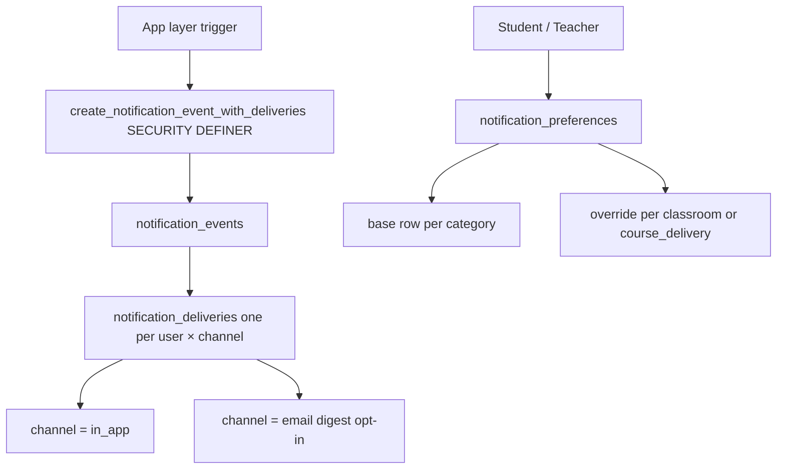

# Notification

Role: async alert delivery — keeps students on track and teachers informed.
Scope: institution-scoped; requires institution_id on every event; super admin is not reachable.

## Mission and context

Notifications keep students aware of deadlines, feedback, and rewards, and alert teachers to submissions, overdue groups, and joker requests. Every notification starts as a canonical event emitted via a SECURITY DEFINER RPC — no client can insert directly. The event fans out into per-user, per-channel delivery rows. Students and teachers manage their own preferences per category, with optional classroom or course-delivery overrides and quiet hours. Email is opt-in digest only; no per-event email spam. WhatsApp and SMS are excluded (DSGVO Art. 32).

> **Super admin gap:** `notification_events` requires a non-null `institution_id`. Super admin is platform-level with no institution scope. No event_type exists for operational alerts (quota exceeded, billing failure, security incident). Super admins must monitor `audit.events` and institution health tables manually. A platform-level alerting channel is not yet designed.

**Scope:** single institution per event; no platform-level notification for super admin
**Accountability:** event emission gating, delivery fan-out, preference enforcement, channel compliance



---

## Feature tree

### Emit notification event (app layer / SECURITY DEFINER)

**Emit a notification event**

- RPC: `create_notification_event_with_deliveries(...)` (SECURITY DEFINER — no direct INSERT from clients)
- Input: institution_id, event_type, category, actor_user_id, title, body, link_payload (jsonb for UI routing), dedupe_key (optional), context FKs (classroom_id, course_delivery_id, task_delivery_id, game_session_id, conversation_id)
- Creates: 1 `notification_events` row + N `notification_deliveries` rows (one per recipient × channel)
- Deduplication: partial unique index on (institution_id, dedupe_key) when dedupe_key is set
- Caller gate: `app.notification_user_can_emit_for_institution` — must be institution member, admin, or super admin

**Event types (student)**

- task_due_soon, task_overdue, task_feedback_received, lesson_published, game_published
- streak_milestone, level_up, badge_earned, joker_approved, new_dm, announcement
- game_session_starting (class session lobby), versus_challenge_received

**Event types (teacher)**

- task_submitted, group_overdue, student_inactive_alert, joker_requested

---

### Reading notifications (student / teacher)

**View in-app notification inbox**

- Table: `notification_deliveries` (channel = in_app, user_id = self, dismissed_at IS NULL)
- Joined to `notification_events` for title, body, link_payload

**Mark notification as read**

- Update: `notification_deliveries.read_at = now()`

**Dismiss notification**

- Update: `notification_deliveries.dismissed_at = now()`

---

### Notification preferences

**Set category preference (base)**

- Table: `notification_preferences`
- Input: user_id, institution_id, category (learning | task | reward | social | system), enabled (bool), email_digest (daily | weekly | never), quiet_start (time), quiet_end (time)
- Base row: classroom_id = NULL, course_delivery_id = NULL

**Override for specific classroom**

- Same table with classroom_id set
- Partial unique: (user_id, institution_id, category, classroom_id)

**Override for specific course delivery**

- Same table with course_delivery_id set
- Partial unique: (user_id, institution_id, category, course_delivery_id)

**Mute temporarily**

- Update: `notification_preferences.mute_until = timestamptz`

**Institution-level fallback**

- `institution_settings.notification_defaults` (jsonb) used when student has no preference row

---

### Institution admin monitoring

**View notification activity**

- Tables: `notification_events` (read), `notification_deliveries` (read)
- Policies: `notification_events_select_institution_admin`, `notification_deliveries_select_institution_admin`

---

## Schema visualization

```text
Schule für Farbe und Gestaltung  [institution_id scopes all rows]
│
├── notification_events  (written only via SECURITY DEFINER RPC)
│   │
│   ├── event_type: task_submitted   category: task    actor: Anna Schmidt  2026-04-08 14:45
│   │   title: "Gruppe A hat eingereicht"
│   │   task_delivery_id → Farbpalette erstellen
│   │   dedupe_key: null
│   │   → notification_deliveries
│   │       Frau Müller  channel: in_app  delivered_at: 2026-04-08 14:45  read_at: 2026-04-08 15:10
│   │
│   ├── event_type: task_due_soon    category: task    actor: system  2026-04-09 08:00
│   │   title: "Farbpalette fällig in 24h"
│   │   task_delivery_id → Farbpalette erstellen
│   │   dedupe_key: "task_due_soon:task_delivery_id:2026-04-09"
│   │   → notification_deliveries
│   │       Anna Schmidt  channel: in_app  delivered_at: 2026-04-09 08:00  read_at: 2026-04-09 08:05
│   │       Tom Weber     channel: in_app  delivered_at: 2026-04-09 08:00  read_at: null  [unread]
│   │
│   └── event_type: joker_approved   category: reward  actor: Frau Müller  2026-04-10 09:30
│       title: "Dein Hausaufgaben-Joker wurde genehmigt"
│       classroom_id → Farbmischung
│       → notification_deliveries
│           Lena Fischer  channel: in_app  delivered_at: 2026-04-10 09:30  dismissed_at: null
│
└── notification_preferences  (per user — institution_id = Schule für Farbe und Gestaltung)
    │
    ├── Anna Schmidt
    │   ├── base row  category: task    enabled: true   email_digest: never
    │   │   quiet_start: 22:00  quiet_end: 07:00  mute_until: null
    │   ├── base row  category: reward  enabled: true   email_digest: never
    │   └── classroom override  category: learning  classroom_id: Farbmischung  mute_until: null
    │
    └── Frau Müller
        ├── base row  category: task    enabled: true   email_digest: daily
        └── base row  category: system  enabled: true   email_digest: weekly
```

### CRUD surface by role

| Operation                          | Teacher      | Student      | Institution Admin | Super Admin |
| ---------------------------------- | ------------ | ------------ | ----------------- | ----------- |
| Emit notification event            | via RPC only | via RPC only | via RPC only      | yes         |
| Read own deliveries                | yes          | yes          | yes               | yes         |
| Mark read / dismiss                | yes (own)    | yes (own)    | —                 | yes         |
| Manage own preferences             | yes          | yes          | yes               | yes         |
| Read all institution notifications | —            | —            | yes (read)        | yes         |

---

## Constraints

1. **SECURITY DEFINER emission only** — Clients cannot INSERT directly into `notification_events` or `notification_deliveries`. All emission goes through `create_notification_event_with_deliveries`, which validates caller membership before inserting.
2. **institution_id is mandatory** — Every `notification_events` row requires a non-null `institution_id`. There is no platform-level notification type. Super admin has no notification inbox.
3. **Category is a CHECK-constrained enum** — Adding a new category value requires a migration to update the CHECK constraint on both `notification_events.category` and `notification_preferences.category`.
4. **Dedupe key prevents duplicate emission** — When dedupe_key is provided, a partial unique index on (institution_id, dedupe_key) prevents a second emission for the same logical event within the same institution.
5. **Preferences are scoped hierarchically** — A course_delivery override takes precedence over a classroom override, which takes precedence over the base category row, which takes precedence over `institution_settings.notification_defaults`.
6. **No WhatsApp or SMS** — Only in_app, email (digest), and push channels are permitted. DSGVO Art. 32 compliance requires no unmanaged third-party messaging channels.

## What's missing

Super admin has no notification inbox. The system cannot emit platform-level operational alerts (quota threshold exceeded, billing failure, institution health critical, security incident) because `notification_events` enforces `institution_id NOT NULL`. A separate platform alerting mechanism or a super-admin-specific event store is not yet designed.
