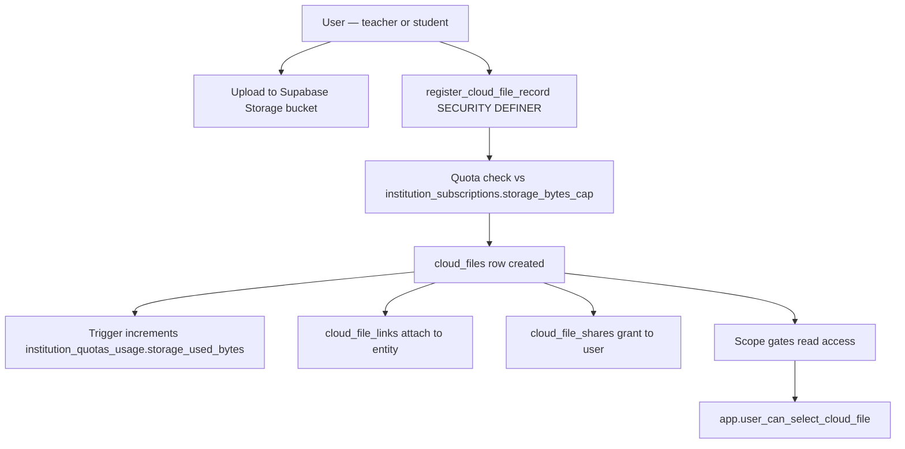

# Cloud Storage

Role: file metadata and access control — Postgres holds meaning and access; Supabase Storage holds bytes.
Scope: institution-scoped; every file and folder carries institution_id and a scope that governs read access.

## Mission and context

Cloud storage ties uploaded files to the product's entity model. Teachers and students upload files to Supabase Storage; a corresponding `cloud_files` row is registered via a SECURITY DEFINER RPC that enforces quota and assigns a canonical storage key. Folders are optional organizational containers. Files can be linked to product entities (lessons, tasks, notes, messages, game versions) and shared directly with other users. Access is governed by scope — personal, institution, classroom, course, lesson, task, game, or chat — each resolved by RLS helper functions.

**Scope:** institution-scoped; storage paths are `{institution_id}/files/{file_id}`
**Accountability:** quota enforcement (hard cap via register_cloud_file_record), scope-based read access, file lifecycle



---

## Feature tree

### Folder management

**Create folder**

- Table: `cloud_folders`
- Input: institution_id, owner_user_id (self), name, parent_folder_id (nested), scope (personal | institution | classroom | course | lesson | task | game | chat)
- Anchor FKs depend on scope: classroom_id, course_id, lesson_id, task_id (= task_delivery_id), conversation_id, game_version_id
- Non-anchor FKs must be NULL (CHECK constraint enforced)

**Rename / move folder**

- Update: `cloud_folders.name` | `cloud_folders.parent_folder_id`

**Delete folder**

- Physical delete via app (no soft-delete column on folders)

---

### File upload and registration

**Upload file to Supabase Storage**

- Bucket: `cloud` (default)
- Path: `{institution_id}/files/{file_id}` (canonical new format)
- Legacy path: `{institution_id}/{role}/{user_uuid}/filename` (still supported via Storage RLS)

**Register file metadata**

- RPC: `register_cloud_file_record(...)` (SECURITY DEFINER)
- Input: institution_id, owner_user_id, folder_id (optional), storage_object_name (unique per bucket), scope + anchor FKs, mime_type, size_bytes, original_name
- Checks: `institution_quotas_usage.storage_used_bytes + size_bytes ≤ institution_subscriptions.storage_bytes_cap`
- Creates: `cloud_files` row (status = active)
- Trigger (AFTER INSERT, status = active): increments `institution_quotas_usage.storage_used_bytes`

**Archive file**

- Update: `cloud_files.status = archived`
- Effect: archived files do not count toward storage quota (trigger subtracts on status change away from active)

**Delete file**

- Update: `cloud_files.status = deleted`
- Physical removal from Storage bucket is a separate app step

---

### File linking (attach to product entities)

**Link file to entity**

- Table: `cloud_file_links`
- Input: cloud_file_id, link_entity_type (lesson | task | message | note | game | classroom | course | conversation), entity_id, link_purpose (attachment | reference | etc.)
- Unique: (cloud_file_id, link_entity_type, entity_id, link_purpose)

**Remove link**

- Delete: `cloud_file_links` row (does not delete the file itself)

---

### File sharing (direct user grants)

**Share file with user**

- Table: `cloud_file_shares`
- Input: cloud_file_id, shared_with_user_id, shared_by_user_id (self), permission (read | edit)
- Unique: (cloud_file_id, shared_with_user_id)

**Revoke share**

- Delete: `cloud_file_shares` row

---

### Access helpers (RLS functions)

- `app.user_can_select_cloud_file(file_id)` — owner, institution member within matching scope, or has a read/edit share (SECURITY DEFINER)
- `app.user_can_manage_cloud_file(file_id)` — owner, institution admin, or has edit share
- `app.user_can_select_cloud_folder(folder_id)` / `app.user_can_manage_cloud_folder(folder_id)` — same logic for folders

**Scope → read access rules**

| Scope       | Who can read                                                             |
| ----------- | ------------------------------------------------------------------------ |
| personal    | Owner; institution admin; super admin; share recipient                   |
| institution | Any active institution member                                            |
| classroom   | Active classroom_members for classroom_id                                |
| course      | Course teacher or student_can_access_course                              |
| lesson      | student_can_access_lesson                                                |
| task        | Task teacher or student with active classroom in my_active_classroom_ids |
| game        | user_can_select_game_version                                             |
| chat        | Active conversation_members (left_at IS NULL) for conversation_id        |

---

## Schema visualization

```text
Schule für Farbe und Gestaltung  [institution_id scopes all rows]
│   institution_quotas_usage: storage_used_bytes: 1_420_800  /  storage_bytes_cap: 10_737_418_240
│
├── cloud_folders
│   ├── "Unterrichtsmaterial"  [scope: institution, owner: Frau Müller]
│   │   ├── "Farbenlehre Folien"  [scope: course, course_id → Grundlagen Farbe]
│   │   └── "Referenzbilder"      [scope: classroom, classroom_id → Farbmischung]
│   │
│   └── "Meine Notiz-Anhänge"   [scope: personal, owner: Anna Schmidt]
│
├── cloud_files
│   ├── "farbkreis_vorlage.pdf"
│   │   owner: Frau Müller    scope: lesson   lesson_id → Der Farbkreis
│   │   storage_object_name: {institution_id}/files/{file_uuid}
│   │   mime_type: application/pdf   size_bytes: 204_800   status: active
│   │   [trigger incremented storage_used_bytes +204_800 on INSERT]
│   │   └── cloud_file_links
│   │       link_entity_type: lesson   entity_id → Der Farbkreis   purpose: attachment
│   │
│   ├── "gruppeA_skizze.jpg"
│   │   owner: Anna Schmidt   scope: task   task_id → Farbpalette erstellen
│   │   storage_object_name: {institution_id}/files/{file_uuid}
│   │   mime_type: image/jpeg   size_bytes: 512_000   status: active
│   │   └── cloud_file_links
│   │       link_entity_type: note   entity_id → Gruppe A collaborative note   purpose: attachment
│   │
│   └── "alte_aufgabe.pdf"
│       owner: Frau Müller   scope: personal   status: archived
│       [trigger decremented storage_used_bytes on status → archived]
│
└── cloud_file_shares
    └── "farbkreis_vorlage.pdf" shared with Tom Weber
        shared_by: Frau Müller   permission: read
        [app.user_can_select_cloud_file → true for Tom via share row]
```

### CRUD surface by role

| Operation              | Owner | Shared user           | Institution Admin        | Super Admin |
| ---------------------- | ----- | --------------------- | ------------------------ | ----------- |
| Upload + register file | yes   | —                     | yes                      | yes         |
| Read file metadata     | yes   | if shared (read/edit) | yes (all in institution) | yes         |
| Edit file              | yes   | if shared (edit)      | yes                      | yes         |
| Archive / delete file  | yes   | —                     | yes                      | yes         |
| Create folder          | yes   | —                     | yes                      | yes         |
| Link file to entity    | yes   | —                     | yes                      | yes         |
| Share file with user   | yes   | —                     | yes                      | yes         |

---

## Constraints

1. **Quota is hard** — `register_cloud_file_record` checks `storage_used_bytes + new_size ≤ storage_bytes_cap` before creating the file row. No file can be registered if the institution is over quota. Only super admin can raise the cap via `institution_subscriptions`.
2. **Canonical storage path** — New files use `{institution_id}/files/{file_id}`. Legacy paths (`{institution_id}/{role}/{user_id}/...`) are still supported via Storage RLS but should be migrated over time.
3. **Scope ↔ anchor coherence** — CHECK constraints on `cloud_folders` and `cloud_files` enforce that only the anchor FK matching the scope is non-null. A classroom-scoped file must have classroom_id set and all other anchor FKs null.
4. **Status = active is the quota gate** — `institution_quotas_usage.storage_used_bytes` counts only `status = active` files. Archiving or deleting a file removes it from the quota counter via AFTER trigger.
5. **Removing a link does not delete the file** — Deleting a `cloud_file_links` row detaches the file from the entity. The `cloud_files` row and Storage object remain until explicitly archived or deleted.
6. **GDPR / health imagery** — Uploads containing identifiable health imagery are high-risk. Retention, minimization, and audit requirements apply. Physical removal from Storage is a separate step after `status = deleted` and must be part of GDPR erasure workflows.
