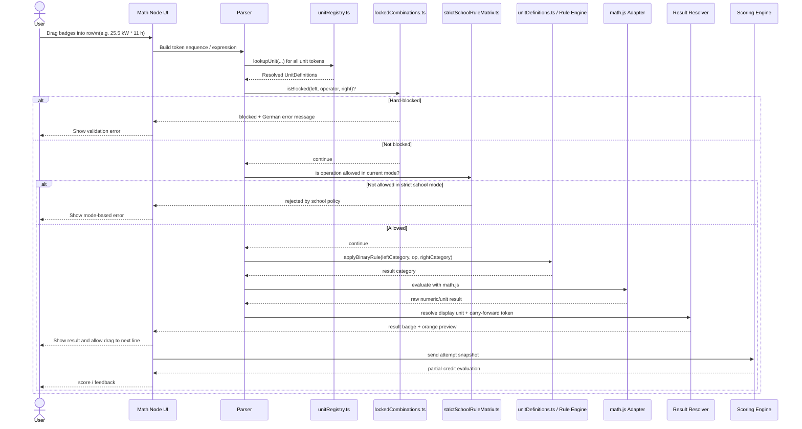
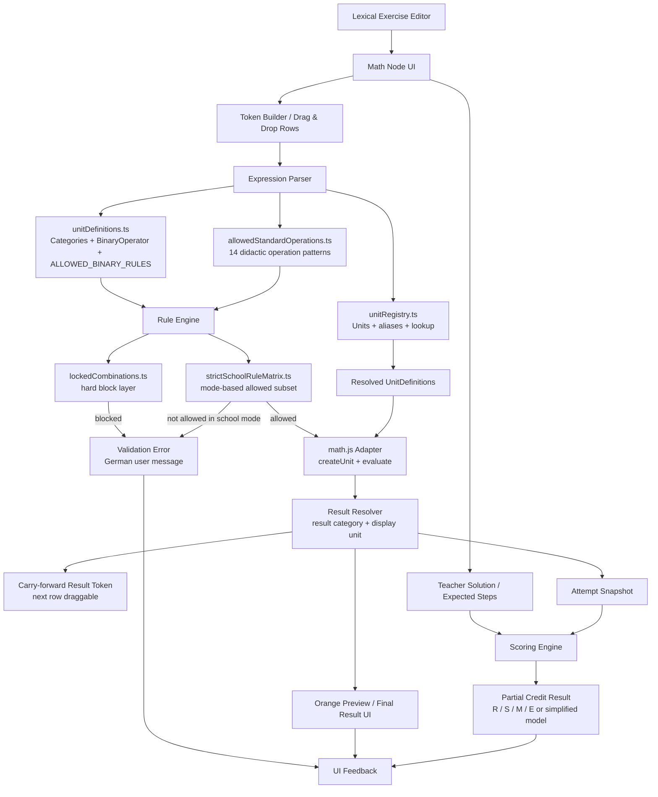

# Drag & drop math — module reference

Aligned with [principle_clean_code.md](../../../../docs/architecture/principle_clean_code.md) and [principle_frontend.md](../../../../docs/architecture/principle_frontend.md).

---

## Module layout

| Folder        | Responsibility                                                                                                     |
| ------------- | ------------------------------------------------------------------------------------------------------------------ |
| `components/` | UI only — editors, palette, canvas rows, XYFlow node/dialog shells. Subfolder `canvas/` for DnD row UI.            |
| `hooks/`      | React state — `useMathDropNodeEditor`, `useDropNodeEditor`, `useDragDropMathCanvasRows`.                           |
| `types/`      | Schemas and DnD/canvas payload types (`drag-drop-math.schema.ts`, `canvas.types.ts`, …).                           |
| `constants/`  | Static config — palette presets, CVA variants, DnD id helpers.                                                     |
| `utils/`      | Pure functions — `evaluateMathExpression`, `tokenLayer`, `validationLayer`, `mathEquationRow`, canvas DnD helpers. |

**Public API:** import only from the root barrel `@/features/game-studio/nodes/drag-drop-math`. Do not deep-import from `components/` or `hooks/` from outside this folder.

---

## Data flow: Enter key → result badge

```
DropMathNode (keydown Enter)
  └─► useMathDropNodeEditor
        └─► evaluateMathExpression(rawString)
              └─► tokenizeMathInput → toMathExpr → mathjs.evaluate()
                    └─► onCommit(MathEquationCommitPayload)
                          └─► useDragDropMathCanvasRows.commitMathEquation
                                └─► applyMathEquationCommitToRow
                                      └─► row tokens: [equation…] [=] [result]
                                            rendered by CanvasRowNode / DropMathStaticNode
```

## Architecture diagrams

### Runtime validation and scoring sequence



### System component flow



**Unit-aware pipeline** (TokenLayer + ValidationLayer, wired before commit):

```
raw badges[]
  └─► buildTokens()          — TokenLayer: normalize glyphs, classify each badge
        └─► validateTokens() — ValidationLayer: check sequence + unit-category rules
              └─► evaluateMathEquation() — numeric eval via scoped mathjs
                    └─► onCommit → row state (+ optional `=` / result badges)
```

### Typed equations (no unit palette)

Authors drag **Mathe Block** / **Textbaustein** only. Students type units directly (e.g. `40 * 8.5€`, `120 km / 2 h`). On **Enter**, the registry resolves symbols/aliases to `displaySymbol` (e.g. `40 × 8.50 €` → result `340 €`).

### Instant color feedback on Enter

| Setting                                             | Default | Behaviour                                                                                   |
| --------------------------------------------------- | ------- | ------------------------------------------------------------------------------------------- |
| `instantColorFeedback` (node + `DropMathNode` prop) | `true`  | On **Enter**, equation chip turns **blue** when evaluation succeeds, **red** when it fails. |
| `instantColorFeedback: false`                       | —       | No blue/red shell; commit still runs (errors still persist `mathShell: 'error'`).           |

Pipeline in `useMathDropNodeEditor`: `evaluateMathEquation()` → set local shell → `onCommit` with `equationShell: 'success'` when enabled.

Author toggle: **Game settings → Instant color feedback** (`DragDropMathSettings`).

---

## Evaluation rules

### Scoring equation (weighted model)

When the weighted rubric model is active, the final score is:

$$
S = \left(0.50 \cdot R + 0.30 \cdot T + 0.15 \cdot M + 0.05 \cdot E\right) \times P_{\max}
$$

Where:

- `R`: result correctness
- `T`: token/operator correctness
- `M`: method/step quality
- `E`: explanation quality
- `P_max`: maximum points for the task

### Partical Scroing Carry Algorithm PSCA equations (formal)

The PSCA scorer computes four normalized components and combines them with configured weights:

$$
\text{score} = w_R \cdot R + w_S \cdot S + w_M \cdot M + w_E \cdot E,\quad
w_R + w_S + w_M + w_E = 1
$$

Current default full-weight profile:

$$
\text{score} = 0.50 \cdot R + 0.30 \cdot S + 0.15 \cdot M + 0.05 \cdot E
$$

Points mapping:

$$
\text{awardedPoints} = \text{score} \cdot P_{\max}
$$

Result component (`R`) for final node:

$$
R =
\begin{cases}
1, & |\Delta| \le \varepsilon \\
0, & |\Delta| > \varepsilon \land \text{graceful} = \text{false} \\
\max\left(0,\;1-\frac{|\Delta|}{|y^*|}\right), & |\Delta| > \varepsilon \land \text{graceful} = \text{true}
\end{cases}
$$

where $\Delta = y - y^*$, $y$ is student final value, and $y^*$ is teacher final expected value.

Step component (`S`) for each step $i$:

$$
s_i =
\begin{cases}
1, & |a_i - \hat{a}_i| \le \varepsilon_i \\
0, & \text{otherwise}
\end{cases},
\qquad
S=\frac{1}{N}\sum_{i=1}^{N} s_i
$$

Method component (`M`) and error-free component (`E`) are averaged per-step:

$$
M=\frac{1}{N}\sum_{i=1}^{N} m_i,\qquad
E=\frac{1}{N}\sum_{i=1}^{N} e_i
$$

Scoring mode:

$$
\text{mode} \in \{carry,\ strict\}
$$

Bei `strict` wird die erwartete Schrittberechnung durch die Musterlosungs-Operanden ersetzt; bei `carry` werden Folgeoperanden aus den bisherigen Schulerergebnissen aufgelost.

### What `math.evaluate()` is called on

| Rule                                                      | Detail                                                       | Result                        | Example                                                                                |
| --------------------------------------------------------- | ------------------------------------------------------------ | ----------------------------- | -------------------------------------------------------------------------------------- |
| ✅ Per row, individually                                  | Each canvas row is evaluated in isolation.                   | One `=` badge per row         | Row 1: `3 × 4 = 12` · Row 2: `12 + 5 = 17` (separate commits)                          |
| ✅ Only tokens the student explicitly placed              | Palette chips on the row — nothing injected.                 | Student-built expression only | `[15][h][×][30]` → `450 h`                                                             |
| ✅ Result token from a previous row = fixed value         | Carried-over results are frozen numbers, not re-evaluated.   | Fixed carry token             | Row 1 result `127.5` dragged to row 2 as `[127.5][€][÷][15][Stk]`                      |
| ❌ Never across multiple rows                             | No cross-row expression chaining.                            | Blocked                       | Row 1 `= 12` cannot auto-feed `+ 5` on row 2 as one evaluate                           |
| ❌ Never with automatic unit simplification between steps | Units are tracked categorically; `mathjs` sees only numbers. | No silent conversion          | `1000 ml + 1 l` stays categorical until a rule allows it; no auto `→ 2 l` between rows |

### Allowed standard operations

| #   | Pattern                   | Result category | Example                              |
| --- | ------------------------- | --------------- | ------------------------------------ |
| 1   | Same-category addition    | same category   | `3 cm + 5 m` → `8 m` (length)        |
| 2   | Same-category subtraction | same category   | `10 l − 3 ml` → `9.997 l` (capacity) |
| 3   | Unit × number             | same category   | `15 h × 30` → `450 h`                |
| 4   | Number × unit             | same category   | `3 × 4 m` → `12 m`                   |
| 5   | Unit ÷ number             | same category   | `100 km ÷ 2` → `50 km`               |
| 6   | length × length           | area            | `4 m × 3 m` → `12 m²`                |
| 7   | area × length             | volume          | `6 m² × 2 m` → `12 m³`               |
| 8   | mass ÷ volume             | density         | `8 kg ÷ 2 m³` → `4 kg/m³`            |
| 9   | length ÷ time             | speed           | `120 km ÷ 2 h` → `60 km/h`           |
| 10  | power × time              | energy          | `5 kW × 3 h` → `15 kWh`              |
| 11  | money ÷ quantity          | rate            | `540 € ÷ 90 kg` → `6 €/kg`           |
| 12  | rate × quantity           | money           | `8.50 €/Stk × 15 Stk` → `127.50 €`   |
| 13  | money × percentage        | money           | `400 € × 24 %` → `96 €`              |
| 14  | quantity × ratio          | same category   | `500 kg × 0.8` → `400 kg`            |

### Blocked combinations

| #   | Pattern                                 | Reason                              | Example                                    |
| --- | --------------------------------------- | ----------------------------------- | ------------------------------------------ |
| 1   | Cross-category addition                 | Dimensionally meaningless           | `m + m²`, `kg + l`, `h + €`                |
| 2   | Didactically unsupported multiplication | No rule defined                     | `€ × €`, `kg × h`, `m² × kg`, `m² × m²`    |
| 3   | Ambiguous division                      | Only when a surface-rate is taught  | `50 m² ÷ 8 h` (no `area/time → rate` rule) |
| 4   | Temperature arithmetic                  | Scale vs. physical temperature trap | `20 °C × 2` (blocked by default)           |
| 5   | Currency mixing                         | Requires explicit exchange rate     | `100 EUR + 50 USD`                         |
| 6   | Consecutive operators                   | ValidationLayer structure check     | `3 × ÷ 5`                                  |
| 7   | Starts or ends with operator            | Structural error                    | `× 5`, `3 ×`                               |

---

## Unit registry

All entries are defined in `utils/unitDefinitions.ts`. Lookup is O(1) via a pre-built alias index.

| Category      | Symbols (aliases in parentheses)                                                    |
| ------------- | ----------------------------------------------------------------------------------- |
| `length`      | mm, cm, dm, m, km, lfdm (lfm)                                                       |
| `area`        | mm², cm², dm², m², a, ha, km²                                                       |
| `volume`      | mm³, cm³, dm³, m³                                                                   |
| `capacity`    | ml, cl, dl, l                                                                       |
| `mass`        | mg, g, kg, t (tonne)                                                                |
| `time`        | s, min, h, d, Wo (week/Woche), Mon (month/Monat)                                    |
| `energy`      | J, kJ, MJ, Wh, kWh                                                                  |
| `power`       | W, kW                                                                               |
| `temperature` | °C (celsius), K                                                                     |
| `money`       | € (EUR), ct (cent), $ (USD)                                                         |
| `percentage`  | % (percent), ‰ (permille)                                                           |
| `angle`       | ° (deg), rad                                                                        |
| `speed`       | km/h _(derived)_, m/s                                                               |
| `density`     | kg/m³ _(derived)_, g/cm³ _(derived)_                                                |
| `count`       | Stück (stk/STK), Paar, Einheit (LE), Dutzend                                        |
| `ratio`       | η / phi                                                                             |
| `rate`        | €/kg, €/m², €/kWh, €/lfdm, €/Stück, €/h, €/t, €/l, €/m, €/km, €/min _(all derived)_ |

> Units marked **derived** cannot be entered as standalone input badges — they only appear as inferred result categories.

---

## Binary rules matrix

Rows = left operand category. Columns = operator. Entries = result category (blank = blocked).

Additive ops (`+` / `−`) follow one rule: **same category only**, except the explicit exceptions below. Multiplicative ops require an explicit entry in the table.

### Explicit `+` / `−` exceptions

| Left     | Op  | Right    | Result | Example                             |
| -------- | --- | -------- | ------ | ----------------------------------- |
| capacity | +   | volume   | volume | `500 ml + 0.5 l` → `1 l` (volume)   |
| volume   | +   | capacity | volume | `2 m³ + 500 l` → combined as volume |

### `×` rules

| Left       | Right      | Result | Example                            |
| ---------- | ---------- | ------ | ---------------------------------- |
| length     | length     | area   | `4 m × 3 m` → `12 m²`              |
| length     | area       | volume | `2 m × 6 m²` → `12 m³`             |
| area       | length     | volume | `6 m² × 2 m` → `12 m³`             |
| length     | rate       | money  | `10 m × 6 €/m` → `60 €`            |
| time       | speed      | length | `2 h × 60 km/h` → `120 km`         |
| speed      | time       | length | `60 km/h × 2 h` → `120 km`         |
| power      | time       | energy | `5 kW × 3 h` → `15 kWh`            |
| time       | power      | energy | `3 h × 5 kW` → `15 kWh`            |
| density    | volume     | mass   | `4 kg/m³ × 2 m³` → `8 kg`          |
| density    | capacity   | mass   | `4 kg/l × 2 l` → `8 kg`            |
| volume     | density    | mass   | `2 m³ × 4 kg/m³` → `8 kg`          |
| rate       | mass       | money  | `6 €/kg × 90 kg` → `540 €`         |
| rate       | area       | money  | `6 €/m² × 50 m²` → `300 €`         |
| rate       | capacity   | money  | `3 €/l × 40 l` → `120 €`           |
| rate       | energy     | money  | `0.8 €/kWh × 100 kWh` → `80 €`     |
| rate       | length     | money  | `6 €/m × 10 m` → `60 €`            |
| rate       | time       | money  | `25 €/h × 8 h` → `200 €`           |
| rate       | count      | money  | `8.50 €/Stk × 15 Stk` → `127.50 €` |
| rate       | volume     | money  | `5 €/m³ × 60 m³` → `300 €`         |
| count      | rate       | money  | `15 Stk × 8.50 €/Stk` → `127.50 €` |
| time       | rate       | money  | `8 h × 25 €/h` → `200 €`           |
| length     | rate       | money  | `10 m × 6 €/m` → `60 €`            |
| energy     | rate       | money  | `100 kWh × 0.8 €/kWh` → `80 €`     |
| money      | percentage | money  | `400 € × 24 %` → `96 €`            |
| percentage | money      | money  | `24 % × 400 €` → `96 €`            |
| money      | ratio      | money  | `400 € × 1.24` → `496 €`           |
| ratio      | money      | money  | `1.24 × 400 €` → `496 €`           |
| mass       | ratio      | mass   | `500 kg × 0.8` → `400 kg`          |
| ratio      | mass       | mass   | `0.8 × 500 kg` → `400 kg`          |
| length     | ratio      | length | `10 m × 1.1` → `11 m`              |
| ratio      | length     | length | `1.1 × 10 m` → `11 m`              |
| area       | ratio      | area   | `50 m² × 0.9` → `45 m²`            |
| ratio      | area       | area   | `0.9 × 50 m²` → `45 m²`            |
| count      | ratio      | count  | `100 Stk × 0.95` → `95 Stk`        |
| ratio      | count      | count  | `0.95 × 100 Stk` → `95 Stk`        |
| power      | ratio      | power  | `10 kW × η` → effective power      |
| ratio      | power      | power  | `η × 10 kW` → effective power      |
| energy     | ratio      | energy | `15 kWh × 0.9` → `13.5 kWh`        |
| ratio      | energy     | energy | `0.9 × 15 kWh` → `13.5 kWh`        |

### `÷` rules

| Left   | Right    | Result  | Example                        |
| ------ | -------- | ------- | ------------------------------ |
| area   | length   | length  | `12 m² ÷ 3 m` → `4 m`          |
| volume | length   | area    | `12 m³ ÷ 3 m` → `4 m²`         |
| volume | area     | length  | `12 m³ ÷ 4 m²` → `3 m`         |
| mass   | volume   | density | `8 kg ÷ 2 m³` → `4 kg/m³`      |
| mass   | capacity | density | `8 kg ÷ 2 l` → `4 kg/l`        |
| mass   | density  | volume  | `8 kg ÷ 4 kg/m³` → `2 m³`      |
| length | time     | speed   | `120 km ÷ 2 h` → `60 km/h`     |
| energy | time     | power   | `15 kWh ÷ 3 h` → `5 kW`        |
| money  | mass     | rate    | `540 € ÷ 90 kg` → `6 €/kg`     |
| money  | area     | rate    | `300 € ÷ 50 m²` → `6 €/m²`     |
| money  | capacity | rate    | `120 € ÷ 40 l` → `3 €/l`       |
| money  | energy   | rate    | `80 € ÷ 100 kWh` → `0.8 €/kWh` |
| money  | length   | rate    | `60 € ÷ 10 m` → `6 €/m`        |
| money  | time     | rate    | `200 € ÷ 8 h` → `25 €/h`       |
| money  | count    | rate    | `540 € ÷ 15 Stk` → `36 €/Stk`  |
| money  | volume   | rate    | `300 € ÷ 60 m³` → `5 €/m³`     |
| count  | time     | rate    | `120 Stk ÷ 8 h` → `15 Stk/h`   |

---

## Security

> **Never let a student's raw string reach `math.evaluate()` directly.**

All input goes through the whitelist pipeline before arithmetic evaluation:

```
raw DOM input (string)
  └─► tokenizeMathInput()    — splits into discrete tokens
        └─► buildTokens()    — classifies each badge (number / operator / unit / unknown)
              └─► validateTokens() — blocks unknown tokens, bad sequences, invalid unit combos
                    └─► toMathExpr()    — assembles a clean numeric string (digits + operators only)
                          └─► mathEvaluate() — scoped mathjs instance (utils/mathInstance.ts)
```

| Threat                           | Mitigation                                                                                                                                               |
| -------------------------------- | -------------------------------------------------------------------------------------------------------------------------------------------------------- |
| **Expression injection**         | Only `[0-9+\-*/(). ]+` reaches `mathEvaluate()`. Letters are rejected by `MATHJS_EXPRESSION_PATTERN` before evaluation.                                  |
| **Unknown function calls**       | `tokenizeMathInput` splits on known single/multi-char tokens only. Anything unrecognised becomes an `unknown` badge and is blocked by `validateTokens`.  |
| **XSS via rendered result**      | The result is a `number` from `toFiniteNumber()`. It is stringified with `formatMathResult()` before rendering — never injected as raw HTML.             |
| **Prototype / global pollution** | Use only the scoped `math` instance from `utils/mathInstance.ts`, not the global `mathjs` singleton. The scoped instance has a controlled unit registry. |
| **HMR double-registration**      | `defineIfMissing()` wraps `math.createUnit()` in a try/catch so hot-reload cycles during development do not throw.                                       |

### mathjs custom unit registry (`utils/mathInstance.ts`)

mathjs does not know about EUR, ha, permille, etc. by default. The scoped instance registers them once at module load:

```ts
// Money
math.createUnit('EUR')
math.createUnit('ct', { definition: '0.01 EUR', aliases: ['cent'] })
math.createUnit('USD', { definition: '0.92 EUR' })

// Agrarian area
math.createUnit('a', { definition: '100 m^2' })
math.createUnit('ha', { definition: '10000 m^2' })

// Percentage
math.createUnit('permille', { definition: '0.001', aliases: ['‰'] })
```

> The `USD` rate (`0.92 EUR`) is a static fallback. Currency conversion is **not** the purpose of this node — the ValidationLayer blocks `EUR + USD` at the category level. The registration exists so mathjs does not throw on unit parsing; actual exchange rates require an explicit teacher-defined conversion factor.

---

## Adding new rules

1. Add or update entries in `utils/unitDefinitions.ts` — `ALLOWED_BINARY_RULES` array.
2. If a new category is needed, extend the `UnitCategory` union type first.
3. Run `npm run type-check` — the exhaustive tuple type will catch typos.
4. Document the new combination in the tables above.

---

## Implementation files

| File                                 | Purpose                                                                                                        |
| ------------------------------------ | -------------------------------------------------------------------------------------------------------------- |
| `utils/unitDefinitions.ts`           | `UnitCategory`, `UnitDefinition`, `UNIT_DEFINITIONS` (72 entries), `ALLOWED_BINARY_RULES`, `applyBinaryRule()` |
| `utils/tokenLayer.ts`                | `buildTokens()` — normalize glyphs, classify raw badge strings into typed `MathToken[]`                        |
| `utils/validationLayer.ts`           | `validateTokens()` — structural + unit-category validation, returns `ValidationResult` with `resultCategory`   |
| `utils/evaluateMathExpression.ts`    | `evaluateMathExpression()` — arithmetic evaluation via `mathjs`                                                |
| `utils/mathEquationRow.ts`           | Row mutation helpers — commit, equals token, result token, group extraction                                    |
| `hooks/useMathDropNodeEditor.ts`     | Keyboard handling, `instantColorFeedback`, commit pipeline                                                     |
| `utils/evaluateMathEquation.ts`      | TokenLayer → ValidationLayer → `evaluateMathExpression`                                                        |
| `utils/mathInstance.ts`              | Scoped mathjs + custom units                                                                                   |
| `hooks/useDragDropMathCanvasRows.ts` | Canvas row state, `commitMathEquation`                                                                         |
