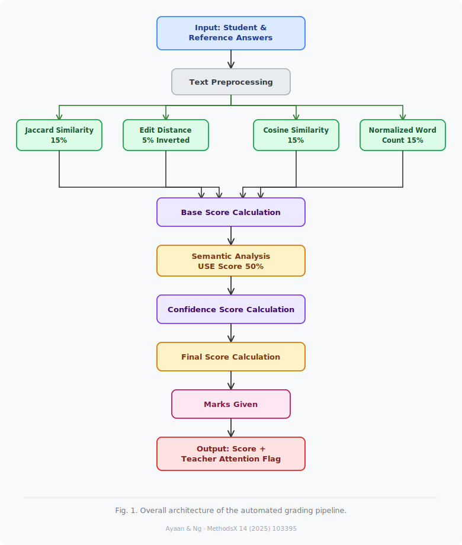
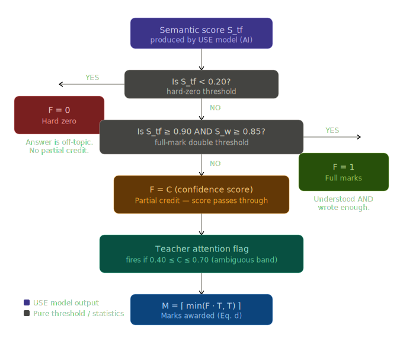

# Open Question Scoring Algorithm

This document explains the automated grading pipeline used for open-question answers.
It follows the NLP + semantic approach described in:

- Ayaan, A., Ng, K.-W. _Automated grading using natural language processing and semantic analysis_ ([paper PDF](https://pmc.ncbi.nlm.nih.gov/articles/PMC12171532/pdf/main.pdf))

## Pipeline Assets

- Interactive explainer: [nlp_scoring_pipeline_interactive.html](../../../../../docs/html/nlp_scoring_pipeline_interactive.html)
- Pipeline diagrams:




## Metric Inputs

The model combines five signals:

- `S_j`: Jaccard similarity (surface vocabulary overlap)
- `S_e`: Edit distance signal (inverted in equation a)
- `S_c`: Cosine similarity (surface semantic similarity)
- `S_w`: Normalized word-count completeness
- `S_tf`: deep semantic similarity from Universal Sentence Encoder (USE)

Constants:

- `w_j = 0.15`
- `w_e = 0.05`
- `w_c = 0.15`
- `w_w = 0.15`
- `w_tf = 0.50`
- Teacher-review band: `0.40 <= C <= 0.70`

## The Four Equations

### Equation (a): Base NLP Score `C_nlp`

$$
C_{nlp} = \operatorname{clamp}\left(w_j S_j + w_e \frac{1}{S_e} + w_c S_c + w_w S_w,\;0,\;1\right)
$$

Where `clamp(x, 0, 1) = min(max(0, x), 1)`.

Why this matters:

- Clamp prevents out-of-range values from overweight signals.
- The four surface metrics contribute exactly `0.50` total weight.
- This is the "text-surface" half of confidence.

### Equation (b): Confidence Score `C`

$$
C = \operatorname{clamp}\left(w_{tf} S_{tf} + (1 - w_{tf}) C_{nlp},\;0,\;1\right)
$$

With `w_tf = 0.50`, this is a convex combination:

- 50% deep semantic understanding (`S_tf`)
- 50% NLP surface evidence (`C_nlp`)

As long as `0 < w_tf < 1`, `C` stays between the two inputs.

### Equation (c): Final Score `F` (piecewise rule)

This is a decision tree, not a single algebraic expression:

- If `S_tf < 0.20` -> `F = 0` (hard zero)
- Else if `S_tf >= 0.90` and `S_w >= 0.85` -> `F = 1` (full marks)
- Else -> `F = C` (partial credit)

### Equation (d): Awarded Marks `M`

$$
M = \left\lceil \min(F \cdot T,\; T) \right\rceil
$$

Where:

- `T` = max marks for the question
- `ceil` avoids rounding down fractional achievement
- `min(..., T)` guarantees no overshoot beyond max marks

Example: `F = 0.51`, `T = 4` -> `M = ceil(2.04) = 3`.

## Branch Logic (Dissected)

### Branch 1: Hard Zero (`S_tf < 0.20`)

Meaning:

- USE embeddings are nearly orthogonal (semantically off-topic).
- Surface overlap cannot rescue the answer.

Why 0.20:

- Approximate upper noise-floor fence for unrelated text similarity.
- Below this threshold, treat answer as semantically irrelevant.

Source of `S_tf`:

- 100% from USE model inference on 512D embeddings.
- Not a handcrafted statistical formula.

### Branch 2: Full Marks (`S_tf >= 0.90` AND `S_w >= 0.85`)

Meaning:

- High semantic correctness plus sufficient answer completeness.
- AND gate prevents:
  - short lucky semantic matches
  - long but off-topic keyword-heavy responses

`S_w` in this pipeline:

- Statistical completeness signal (non-neural), normalized and clamped.
- Reference implementation currently uses ratio-style normalization with threshold `0.85`.

### Branch 3: Partial Credit (`F = C`)

Meaning:

- If neither extreme branch fires, use blended confidence directly.
- No additional transformation is applied.

Teacher attention band:

- Flag for manual review when `0.40 <= C <= 0.70`.
- This is the ambiguity zone where model confidence is less decisive.

## Reference Pseudocode

```ts
type ScoreInputs = {
  Sj: number
  Se: number
  Sc: number
  Sw: number
  Stf: number
  totalMarks: number
}

const W = { j: 0.15, e: 0.05, c: 0.15, w: 0.15, tf: 0.5 } as const
const ATTN_LOW = 0.4
const ATTN_HIGH = 0.7

const clamp01 = (x: number) => Math.min(1, Math.max(0, x))

export function scoreOpenQuestion(input: ScoreInputs) {
  const C_nlp = clamp01(
    W.j * input.Sj + W.e * (1 / Math.max(input.Se, 0.01)) + W.c * input.Sc + W.w * input.Sw,
  )

  const C = clamp01(W.tf * input.Stf + (1 - W.tf) * C_nlp)

  let F: number
  let branch: 'hard-zero' | 'full-marks' | 'partial'

  if (input.Stf < 0.2) {
    F = 0
    branch = 'hard-zero'
  } else if (input.Stf >= 0.9 && input.Sw >= 0.85) {
    F = 1
    branch = 'full-marks'
  } else {
    F = C
    branch = 'partial'
  }

  const M = Math.ceil(Math.min(F * input.totalMarks, input.totalMarks))
  const needsTeacherReview = C >= ATTN_LOW && C <= ATTN_HIGH

  return { C_nlp, C, F, M, branch, needsTeacherReview }
}
```

## Implementation Notes

- Keep all intermediate values in `[0, 1]` when possible.
- Guard against divide-by-zero in `1/S_e` (small epsilon floor).
- Persist branch + review flag for auditability in grading logs.
- Expose `C`, `F`, and `M` in teacher UI so scoring is explainable.

## All Equations - Grading Pipeline

---

### 1. Jaccard Similarity

How many keywords the student and reference **share** divided by all unique keywords combined.

$$
S_j = \frac{|A \cap B|}{|A \cup B|}
$$

$A$ = student keyword set, $B$ = reference keyword set. Result $\in [0, 1]$. Weight: $w_j = 0.15$.

---

### 2. Edit Distance (Inverted)

Character-level similarity - how many single-character changes are needed. **Inverted** so that a perfect match gives a high contribution, not a low one.

$$
S_e^{-1} = \frac{1}{S_e}, \quad S_e = \frac{\text{editDistance}(\text{student}, \text{reference})}{\max(|\text{student}|, |\text{reference}|)}
$$

$S_e \in (0, 1]$, so $S_e^{-1} \in [1, \infty)$. The outer clamp in Eq.(a) keeps the final sum in $[0,1]$. Weight: $w_e = 0.05$.

---

### 3. Cosine Similarity

Angle between two TF-IDF word-frequency vectors. Detects synonyms and paraphrasing even when exact words differ.

$$
S_c = \frac{\vec{u} \cdot \vec{v}}{\|\vec{u}\| \cdot \|\vec{v}\|}
$$

$\vec{u}$ = student TF-IDF vector, $\vec{v}$ = reference TF-IDF vector. Result $\in [0, 1]$. Weight: $w_c = 0.15$.

---

### 4. Normalized Word Count

Ratio of how much the student wrote relative to the reference. Penalizes answers that are too short; tolerates verbose answers.

$$
S_w = \frac{\text{keywordCount}(\text{reference})}{\text{keywordCount}(\text{student})}
$$

Can exceed $1.0$ if student wrote less than the reference. Weight: $w_w = 0.15$.

---

### 5. Semantic Score (USE - AI, not statistics)

Cosine similarity between two 512-dimensional sentence embeddings produced by TensorFlow's Universal Sentence Encoder. **This is the only step that involves a neural model.** Everything else is pure arithmetic.

$$
S_{tf} = \frac{\vec{e}_{\text{student}} \cdot \vec{e}_{\text{reference}}}{\|\vec{e}_{\text{student}}\| \cdot \|\vec{e}_{\text{reference}}\|}
\quad \text{where } \vec{e} \in \mathbb{R}^{512}
$$

Result $\in [0, 1]$. Weight: $w_{tf} = 0.50$.

---

### 6. Base Score - Equation (a)

Weighted sum of the four **statistical** NLP metrics, clamped to $[0,1]$.

$$
C_{nlp} = \min\!\left(\max\!\left(0,\; w_j \cdot S_j + w_e \cdot S_e^{-1} + w_c \cdot S_c + w_w \cdot S_w\right), 1\right)
$$

Weights sum to $0.50$. The clamp prevents the inverted edit term from blowing up on near-zero $S_e$.

---

### 7. Confidence Score - Equation (b)

**Convex combination** of the base NLP score and the USE semantic score. Because $w_{tf} + (1 - w_{tf}) = 1$, the result is always between the two input scores.

$$
C = \min\!\left(\max\!\left(0,\; w_{tf} \cdot S_{tf} + (1 - w_{tf}) \cdot C_{nlp}\right), 1\right)
$$

With $w_{tf} = 0.50$ this simplifies to $C = \dfrac{S_{tf} + C_{nlp}}{2}$.

---

### 8. Final Score - Equation (c)

Piecewise decision function. Not a formula - a three-branch gatekeeper.

$$
F =
\begin{cases}
0 & \text{if } S_{tf} < 0.20 \quad \text{(semantic noise floor - off-topic)} \\
1 & \text{if } S_{tf} \geq 0.90 \;\land\; S_w \geq 0.85 \quad \text{(full understanding + sufficient length)} \\
C & \text{otherwise} \quad \text{(partial credit via confidence score)}
\end{cases}
$$

---

### 9. Teacher Attention Flag

Fires when the confidence score falls in the **ambiguous middle band** - the zone where NLP and semantic signals disagree.

$$
\text{flag} =
\begin{cases}
\text{true} & \text{if } 0.40 \leq C \leq 0.70 \\
\text{false} & \text{otherwise}
\end{cases}
$$

---

### 10. Marks Given - Equation (d)

Scale $F$ to any point system and **ceiling-round**. Works for any $T$ (10, 40, 100, 250...).

$$
M = \left\lceil \min(F \cdot T,\; T) \right\rceil
$$

$\lceil \cdot \rceil$ is the ceiling function. The $\min$ guards against IEEE-754 float overflow where $F = 1.000\ldots0002$.

---

### 11. Custom Point Mapping (your 40-point system)

Direct application of Eq.(d) with $T = 40$.

$$
M = \left\lceil F \times 40 \right\rceil
$$

Examples: $F = 0.4 \Rightarrow \lceil 16 \rceil = 16$ pts. $\quad F = 0.83 \Rightarrow \lceil 33.2 \rceil = 34$ pts. $\quad F = 0.0 \Rightarrow 0$ pts.

---

### Weight Summary

$$
w_j + w_e + w_c + w_w + w_{tf} = 0.15 + 0.05 + 0.15 + 0.15 + 0.50 = 1.00
$$

The first four weights (statistical NLP) sum to $0.50$ - exactly equal to the single USE semantic weight. The model and the math each carry half the total decision.

## Part A — Libraries & Wozu

```bash
pip install tensorflow==2.13.0
```

**Universal Sentence Encoder Backend** — TensorFlow ist das Laufzeitsystem das das USE-Modell (512-dim Sentence Embeddings) ausführt. Ohne TF läuft kein USE-Modell.

---

```bash
pip install tensorflow-hub
```

**USE Modell laden** — `hub.load("/opt/wq-models/use_v4")` lädt das self-hosted Modell vom lokalen Hetzner-Pfad. Kein Internet-Call in Production → DSGVO-konform.

---

```bash
pip install nltk==3.8.1
```

**3 Aufgaben gleichzeitig:**

- `edit_distance(a, b)` → berechnet \( S_e \) (Edit Distance zwischen zwei Texten)
- `word_tokenize(text)` → zerlegt Satz in Tokens für Jaccard \( S_j \)
- `stopwords.words("german")` → entfernt „die", „der", „und" vor der Berechnung

---

```bash
pip install scikit-learn==1.3.2
```

**TF-IDF Cosine Similarity** → berechnet \( S_c \):

- `TfidfVectorizer` wandelt Text in gewichtete Wortvektoren um
- `cosine_similarity(vec_a, vec_b)` → gibt \( S_c \in [0,1] \) zurück

---

```bash
pip install numpy==1.24.3
```

**Vektor-Arithmetik** — `np.dot()`, `np.linalg.norm()` für alle manuellen Cosine-Berechnungen mit dem USE-Embedding-Vektor \( S\_{tf} \).

---

```bash
pip install pandas==2.0.3
```

**Datenverwaltung** — Kriterien + Schülerantworten als DataFrame, Score-Outputs tabellarisch speichern und an Supabase zurückgeben.

---

## Komplett in einer Zeile

```bash
pip install tensorflow==2.13.0 tensorflow-hub nltk==3.8.1 scikit-learn==1.3.2 numpy==1.24.3 pandas==2.0.3
```

---

## `requirements.txt` Part A

```
# Part A — Automatic Short-Answer Scoring (Paper: PMC12171532)
tensorflow==2.13.0        # USE Model Runtime
tensorflow-hub==0.16.1    # Self-hosted Model Loader (DSGVO)
nltk==3.8.1               # Tokenisierung, Edit Distance, Stopwords
scikit-learn==1.3.2       # TF-IDF + Cosine Similarity
numpy==1.24.3             # Vektor-Operationen
pandas==2.0.3             # Score-Tabellen, DataFrame I/O
```
